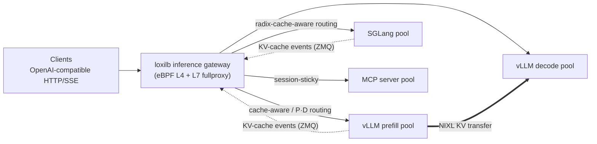

[](https://www.loxilb.io) [](https://ebpf.io/projects#loxilb)      
 [![Info][docs-shield]][docs-url] [](https://www.loxilb.io/members)

> 🌐 이 문서는 [README.md](README.md)의 한국어 번역본입니다. 최신 내용은 영문 원본을 기준으로 합니다.

## loxilb-inference-gateway란 무엇인가

loxilb-inference-gateway는 [loxilb-io/loxilb](https://github.com/loxilb-io/loxilb)에서
포크된 **LLM 서빙 플릿을 위한 추론 인식(inference-aware) L4/L7 로드 밸런서**입니다.
검증된 loxilb의 GoLang/eBPF 데이터 경로 위에 LLM 서빙 엔진(vLLM, SGLang)을 위한 AI 추론
라우팅을 추가하여, 단일 게이트웨이로 클래식 클라우드 네이티브 트래픽과 최신 AI 추론
트래픽을 모두 서비스할 수 있습니다.

[loxilb](https://github.com/loxilb-io/loxilb)는 GoLang/eBPF 기반의 오픈 소스 클라우드
네이티브 로드 밸런서로, 온-프레미스, 퍼블릭 클라우드 또는 하이브리드 K8s 환경 전반에
걸친 호환성 달성을 목표로 하며, 텔코, 모빌리티, 엣지 컴퓨팅에서의 클라우드 네이티브
기술 채택을 지원하기 위해 개발되고 있습니다.

loxilb-inference-gateway는 여전히 **완전히 동작하는 loxilb**입니다 — 모든 AI 기능은
로드 밸런서 규칙별로 옵트인(opt-in)되며, 아무것도 활성화하지 않으면 업스트림 loxilb와
정확히 동일하게 동작합니다. 기본 클라우드 네이티브 로드 밸런서만 필요하다면
[업스트림 loxilb](https://github.com/loxilb-io/loxilb)를 직접 사용하고, LLM 서빙 플릿을
구축하거나 운영한다면 이 저장소가 추론 인식 라우팅이 내장된 동일한 로드 밸런서를
제공합니다.

## loxilb-inference-gateway의 AI 추론 라우팅

최신 LLM 서빙은 클래식 L4/L7 정책이 볼 수 없는 로드 밸런싱 문제를 야기합니다: KV-cache
지역성(locality)이 첫 토큰까지의 시간(TTFT)을 좌우하고, prefill과 decode 단계는 서로
다르게 확장되며, 요청 비용은 프롬프트 내용에 따라 수십 배 이상 차이가 납니다.
loxilb-inference-gateway는 이를 게이트웨이 수준에서 해결합니다:



- **KV-cache 인식 라우팅**(prefix-cache 인식 라우팅) — 각 요청을 프롬프트의 가장 긴
  프리픽스를 이미 자신의 vLLM/SGLang KV-cache에 보유한 엔드포인트로 라우팅합니다. 두 가지
  계층: 엔진 변경이 전혀 필요 없는 **prefix-hash 어피니티(CHWBL)**, 그리고 엔진 자체의
  KV-cache 이벤트 스트림으로 구동되는 **엔진 정확(engine-exact)** 라우팅(block-hash 계약,
  용량 가중 bounded-load 분산으로 인기 프리픽스가 트래픽을 몰리게 하지 않음).
- **Prefill/Decode(P/D) 분리(disaggregation)** — NIXL KV-transfer 조정, 세션 어피니티,
  서킷 브레이킹, 엔드포인트 상태 추적과 함께 prefill 및 decode 엔드포인트 풀에 걸쳐
  L7 인식 요청을 분할합니다.
- **TTFT 적응형 로드 밸런싱** — 관측된 첫 토큰까지의 시간으로부터 라우팅 가중치를
  지속적으로 조정하는 선택적 피드백 컨트롤러.
- **SGLang 지원** — 멀티 랭크 데이터 병렬 이벤트 피드를 포함하여, SGLang의 radix-tree
  캐시에 대해 동일한 캐시 인식 라우팅을 수행합니다.
- **AI 관측성(observability)** — 엔드포인트별 추론 메트릭, 토크나이저 정확 프롬프트 회계,
  Prometheus/Grafana 내보내기.
- **AI 게이트웨이 제어** — API 키 관리, 테넌트별 속도 제한, 모델명 라우팅, SSE 스트림
  쿼터를 모두 L7 프록시에서 적용합니다.
- **MCP 게이트웨이 및 최신 L7** — 세션 스티키니스, HTTP/2 + gRPC, mTLS, URL 프리픽스
  라우팅을 갖춘 Model Context Protocol(Streamable HTTP) 프록싱으로 AI 애플리케이션
  트래픽을 처리합니다.

📖 **여기서 시작하세요:** [`docs/load-balancing/README.md`](docs/load-balancing/README.md) —
L4/L7/TLS, AI 게이트웨이, KV-cache 인식 라우팅, SGLang 구성을 위한 전체 가이드 모음입니다.

## 왜 loxilb-inference-gateway를 선택해야 하는가?

- **양쪽 세계를 위한 하나의 게이트웨이** — 클래식 K8s/텔코 로드 밸런싱(loxilb에서 상속)과
  LLM 플릿을 위한 추론 인식 라우팅을 동일한 엔진 아래에서 제공
- 아키텍처 전반에서 동급 최고를 이끄는 loxilb의 eBPF 데이터 경로에서 `동작`
  ([싱글 노드](https://loxilb-io.github.io/loxilbdocs/perf-single/) ·
  [멀티 노드](https://loxilb-io.github.io/loxilbdocs/perf-multi/) ·
  [ARM](https://www.loxilb.io/post/running-loxilb-on-aws-graviton2-based-ec2-instance))
- `엔진 정확` 캐시 계약 — 휴리스틱이 아니라 vLLM과의 block-hash 패리티, SGLang과의
  radix-tree 패리티
- 모든 AI 기능은 `LB 규칙별 옵트인` — 점진적으로 도입하고, 서비스별로 롤백 가능
- `모든` Kubernetes 배포판/CNI와 호환(k8s / k3s / k0s / kind / OpenShift + Calico,
  Flannel, Cilium, Weave, Multus 등) — 업스트림 loxilb에서 상속
- `모든` 클라우드(퍼블릭 클라우드 / 온-프레미스) 또는 `독립형` 환경에서 실행

## 사용 사례별 시작하기

게이트웨이를 실행하고(`ghcr.io/loxilb-io/loxilb-inference-gateway`로 게시됨), 사용 사례로
바로 이동하세요:

```bash
docker run -u root --cap-add SYS_ADMIN --restart unless-stopped --privileged \
  -dit --net=host -v /dev/log:/dev/log -v /opt/loxilb/config:/etc/loxilb \
  --name loxilb ghcr.io/loxilb-io/loxilb-inference-gateway:latest
```

> ⚠️ **`/etc/loxilb`를 호스트 경로에 마운트하세요**(위의 `-v /opt/loxilb/config:/etc/loxilb`).
> 게이트웨이는 구성 스냅샷(`/etc/loxilb/snapshot.json`)을 이곳에 지속 저장하고 부팅 시
> 자동으로 복원합니다. 마운트하지 않으면 구성은 컨테이너 *재시작*은 견디지만 **컨테이너가
> 재생성될 때 손실**됩니다 — 이는 이미지 업그레이드 시 정확히 발생하는 상황입니다.
> [설정 지속성](#설정-지속성-및-스냅샷)을 참조하세요.

| 상황 | 사용 사례 |
|---|---|
| 동일한 vLLM 레플리카 풀 | [1 — vLLM, 비분리형](#사용-사례-1--vllm-서빙-비분리형) |
| 분리된 prefill / decode vLLM 풀 (NIXL) | [2 — vLLM P/D 분리](#사용-사례-2--vllm-prefilldecode-pd-분리) |
| SGLang 워커 (radix 캐시, DP 랭크) | [3 — SGLang 캐시 인식 라우팅](#사용-사례-3--sglang-캐시-인식-라우팅) |
| 하나의 엔드포인트 뒤의 MCP 서버 | [4 — MCP 게이트웨이](#사용-사례-4--mcp-게이트웨이) |
| 멀티 팀 / 멀티 테넌트 OpenAI 호환 API | [5 — AI 게이트웨이 제어](#사용-사례-5--멀티-테넌트-ai-게이트웨이-제어) |
| 클래식 K8s / L4 / 텔코 로드 밸런싱 | [6 — loxilb가 하는 모든 것](#사용-사례-6--클래식-로드-밸런싱) |

아래의 모든 규칙은 게이트웨이(`:11111/netlox/v1/config/loadbalancer`)에 대한 하나의 REST
호출입니다. 두 가지 관례: `mode: 4`는 L7 fullproxy를 선택하며(모든 AI 기능에 필요),
`sel`은 엔드포인트 선택 정책을 지정합니다.

<details>
<summary><b>📖 필드 해설 — 아래 사용 사례에서 사용된 모든 옵션</b></summary>

| 필드 | 의미 |
|---|---|
| `mode` | `4` = L7 fullproxy — **모든 AI/L7 기능에 필수**(다른 값은 L4 NAT 모드) |
| `sel` | 엔드포인트 선택: `0` 라운드 로빈 · `3` source-persist · `8` CHWBL(일관 해시, bounded load) · `10` 가중 CHWBL |
| `security` | 프런트엔드 TLS: 생략 = 평문 HTTP · `1` = 게이트웨이에서 TLS 종료 · `2` = 엔드-투-엔드 HTTPS(백엔드로 재암호화) |
| `host` | VIP 주소 — 게이트웨이 노드에 로컬이어야 함(L7 프록시가 바인딩) |
| `chwbl_prefix_hash_level` | prefix 해시가 커버하는 프롬프트 세그먼트 수(깊을수록 세밀한 어피니티) |
| `chwbl_mean_load_factor` | bounded-load 분산 임계값, 평균 부하 대비 %(`125` = 1.25배에서 분산) |
| `chwbl_replication` | 해시 링에서 엔드포인트당 가상 노드 수 |
| `pd_disagg_mode` | `true` = 각 요청을 prefill + decode 레그로 분할 |
| `pd_cache_aware_mode` | `true` = 캐시 어피니티 prefill 선택(트라이 기반) |
| `ep_role` *(엔드포인트별)* | `1` = prefill 풀 · `2` = decode 풀 · 생략/`0` = 일반 |
| `nixl_port` *(엔드포인트별)* | 해당 워커의 NIXL 사이드 채널 — 워커의 `VLLM_NIXL_SIDE_CHANNEL_PORT`와 일치해야 함 |
| `kvExactMode` | 엔진 정확 KV 라우팅의 **토폴로지**(엔진이 아님 — 엔진은 `kvEngineType`): `1` = P/D 풀, `pd_disagg_mode: true` 필수 · `3` = 역할 없는 단일 풀, `mode: 4` 및 P/D 비활성 필수 |
| `kvZmqPort` | 엔진 KV-cache 이벤트 스트림의 베이스 포트(`--kv-events-config` 엔드포인트); 랭크 *N*은 `kvZmqPort`+*N* |
| `kvBlockSize` | vLLM `--block-size` / SGLang `--page-size`와 같아야 함 |
| `kvHashAlgo` | block-hash 계약 — **생략하세요**. 엔진 기본값이 적용됩니다(`vllm` ⇒ `sha256_cbor`, `sglang` ⇒ `sha256_sglang`). vLLM의 `"xxhash_cbor"`를 고정할 때만 지정하며, `kvEngineType`과 모순되는 값은 거부됩니다 |
| `kvEngineType` | `"vllm"`(기본값) 또는 `"sglang"` — block-hash 계약을 선택(생성 후 불변) |
| `kvDpRankCount` | SGLang 데이터 병렬 랭크(= `--dp-size`); 랭크 *N*은 `kvZmqPort`+*N*에서 게시 |
| `kvWarmupSec` | KV-exact 선택이 동작하기 전의 유예 기간 |
| `sse_mode` | `true` = SSE 인식 스트리밍(스트림이 유휴 타임아웃을 견디고 `[DONE]` 감지); AI 게이트웨이 키/제한 적용도 활성화 |
| `max_stream_duration_sec` | 스트림당 하드 wall-clock 상한(폭주 방지) |
| `backend_keepalive_interval_sec` | 긴 스트림 동안 백엔드로의 TCP keepalive |
| `session_header_name` | 헤더 기반 스티키니스 — MCP는 `"mcp-session-id"`, 채팅은 `"X-Conversation-Id"` |
| `trace_type` | `"mcp"`는 프록시 트레이스를 MCP 트래픽으로 태깅 |
| `model_name` + `path_prefix`/`path_match_mode` | 요청 모델(`X-Model` 헤더 또는 본문 `model`)로 라우팅; `""` = 캐치올 |
| `monitor`, `probetype`, `probeport`, `probereq` | 엔드포인트 상태 프로빙(예: HTTP GET `/health` 또는 `/v1/models`) |

> ⚠️ **필드 대소문자가 중요합니다**: `pd_disagg_mode`, `ep_role`, `nixl_port`, `security`는
> snake_case이고, `kvExactMode`, `kvZmqPort`, `kvHashAlgo`, `kvBlockSize`는 camelCase입니다.
> 대소문자가 틀린 필드는 조용히 무시됩니다.

전체 참조: [REST API 참조](docs/load-balancing/05-rest-api-reference.md) ·
[KV/P·D 튜닝 가이드](docs/load-balancing/11-hierarchical-kv-routing-config-tuning.md) ·
[SGLang 필드](docs/load-balancing/17-sglang-config-tuning.md) ·
[MCP 필드](docs/load-balancing/18-mcp-gateway.md) ·
[게이트웨이 제어 필드](docs/load-balancing/19-ai-gateway-controls.md).

</details>

### 사용 사례 1 — vLLM 서빙 (비분리형)

하나의 OpenAI 호환 VIP 뒤에 있는 동일한 vLLM 레플리카 풀. **prefix-hash 어피니티(CHWBL)**는
프리픽스를 공유하는 프롬프트를 동일한 레플리카에 유지하여 — vLLM의 prefix-cache 적중률을
높이고 TTFT를 줄이며 — **vLLM 변경 없이** 동작합니다:

```bash
curl -s -X POST http://127.0.0.1:11111/netlox/v1/config/loadbalancer \
  -H 'Content-Type: application/json' -d '{
  "serviceArguments": {
    "externalIP": "10.10.10.254", "port": 8080, "protocol": "tcp",
    "sel": 8, "mode": 4, "host": "10.10.10.254",
    "chwbl_prefix_hash_level": 2, "chwbl_mean_load_factor": 125, "chwbl_replication": 100 },
  "endpoints": [
    { "endpointIP": "31.31.31.1", "targetPort": 8000, "weight": 1 },
    { "endpointIP": "32.32.32.1", "targetPort": 8000, "weight": 1 } ]}'
```

`sel: 8`은 CHWBL입니다 — bounded load를 갖춘 일관 해싱으로, 인기 프리픽스가 몰리는 대신
다음 레플리카로 분산됩니다. 변형: 이기종 GPU를 위한 가중 CHWBL은 `sel: 10`; 게이트웨이에서
TLS를 종료하려면 `"security": 1` 추가; HTTP 상태 프로브는 `"monitor": true,
"probetype": "http", "probereq": "/v1/models"` 추가.

▶ 실행 가능: [`cicd/vllm-httpproxy`](cicd/vllm-httpproxy) · [`cicd/vllm-fullproxy`](cicd/vllm-fullproxy) · WRR 변형 — 실제 CPU-vLLM 백엔드, GPU 불필요.
📖 심화: [AI 게이트웨이 L7](docs/load-balancing/04-ai-gateway-l7.md), [KV-cache 인식 라우팅](docs/load-balancing/08-kv-cache-aware-routing.md).
prefix 해싱 대신 엔진의 KV-cache 이벤트 스트림으로 구동되는 **엔진 정확** KV 라우팅은
P/D 토폴로지(`kvExactMode: 1`)의 경우 사용 사례 2를, 역할 없는 단일 풀
(`kvExactMode: 3`)의 경우 사용 사례 3을 참조하세요. 두 모드는 엔진이 아니라 토폴로지이며
어느 쪽이든 `kvEngineType: "vllm"` 또는 `"sglang"`을 받습니다. 다만 실제 제공되고 CI로
검증된 조합은 모드 1의 vLLM과 모드 3의 SGLang입니다.

### 사용 사례 2 — vLLM Prefill/Decode (P/D) 분리

모든 요청을 prefill 레그와 스트리밍 decode 레그로 분할하여, 그 사이의 NIXL KV 전송과 함께
서로 다른 풀로 라우팅합니다. 풀은 엔드포인트별로 선언됩니다: `ep_role: 1` = prefill,
`ep_role: 2` = decode; `nixl_port`는 각 워커의 `VLLM_NIXL_SIDE_CHANNEL_PORT`와 일치해야
합니다:

```bash
curl -s -X POST http://127.0.0.1:11111/netlox/v1/config/loadbalancer \
  -H 'Content-Type: application/json' -d '{
  "serviceArguments": {
    "externalIP": "10.10.10.254", "port": 2020, "protocol": "tcp",
    "sel": 0, "mode": 4, "security": 1, "host": "10.10.10.254",
    "pd_disagg_mode": true, "sse_mode": true,
    "monitor": true, "probetype": "http", "probeport": 8000, "probereq": "/health" },
  "endpoints": [
    { "endpointIP": "31.31.31.1", "targetPort": 8000, "weight": 1, "ep_role": 1, "nixl_port": 9001 },
    { "endpointIP": "32.32.32.1", "targetPort": 8000, "weight": 1, "ep_role": 2, "nixl_port": 9002 } ]}'
```

vLLM 측 — prefill 워커는 NIXL 프로듀서로 실행되어 KV-cache 이벤트를 게시하고, decode
워커는 이를 소비합니다:

```bash
# prefill worker
PYTHONHASHSEED=0 VLLM_NIXL_SIDE_CHANNEL_HOST=<node-ip> VLLM_NIXL_SIDE_CHANNEL_PORT=9001 \
vllm serve <MODEL> --port 8000 \
  --kv-transfer-config '{"kv_connector":"NixlConnector","kv_role":"kv_producer"}' \
  --kv-events-config '{"enable_kv_cache_events":true,"publisher":"zmq","endpoint":"tcp://*:5557"}'
# decode worker: same but kv_role":"kv_consumer" and no --kv-events-config
```

규칙별 심화: `"pd_cache_aware_mode": true`는 캐시 어피니티 prefill 선택을 추가하고,
`"kvExactMode": 1, "kvZmqPort": 5557, "kvBlockSize": 16`은
ZMQ 이벤트 스트림으로부터 **엔진 정확 KV 라우팅**을 활성화합니다(`kvExactMode: 1`은 이
`pd_disagg_mode: true` 형태에서만 유효합니다 — 단일 풀에서는 `kvExactMode: 3`을 사용하세요.
모든 워커에서 `--prefix-caching-hash-algo sha256_cbor`, `--block-size` = `kvBlockSize`,
`PYTHONHASHSEED=0` 패리티 필요). `"session_header_name": "X-Conversation-Id"`는 대화를
고정합니다.

> ⚠️ **KV-exact 사전 준비 — 모델 토크나이저 스테이징.** 게이트웨이는 프롬프트를 직접
> 토크나이즈하며 런타임에 네트워크에서 가져오지 않습니다. `kvExactMode` 규칙으로 서빙하는
> 모든 모델에 대해 해당 모델의 HuggingFace `tokenizer.json`을
> `/etc/loxilb/tokenizers/<model-slug>/tokenizer.json`에 미리 배치해야 합니다.
> `<model-slug>`는 클라이언트가 보내는 모델 이름에서 `/`를 `__`로 바꾼 값입니다:
>
> ```bash
> MODEL=Qwen/Qwen2.5-7B-Instruct ; SLUG=${MODEL//\//__}   # → Qwen__Qwen2.5-7B-Instruct
> # 문서화된 -v /opt/loxilb/config:/etc/loxilb 마운트를 쓰는 경우 호스트에서:
> sudo mkdir -p /opt/loxilb/config/tokenizers/$SLUG
> sudo curl -L -o /opt/loxilb/config/tokenizers/$SLUG/tokenizer.json \
>   "https://huggingface.co/$MODEL/resolve/main/tokenizer.json"
> ```
>
> 토크나이저가 없으면 **조용히** 실패합니다: `kv-router: tokenizer not available…` 로그가
> 한 번 남고 해당 규칙은 부하 기반 라우팅으로 조용히 폴백합니다 — KV-exact는 절대
> 활성화되지 않습니다. 다운로드 상세, 게이트드 모델 인증, 모델별 온보딩 체크리스트:
> [08 §6.3–6.5](docs/load-balancing/08-kv-cache-aware-routing.md).

▶ 실행 가능: [`cicd/vllm-pd-disagg`](cicd/vllm-pd-disagg)(모의 vLLM, GPU 불필요) · [`cicd/vllm-kvcache-routing-cpu`](cicd/vllm-kvcache-routing-cpu)(KV-exact, echo 백엔드).
📖 심화: [AWS에서의 P/D 배포 및 디버그](docs/load-balancing/09-kv-cache-aware-routing-aws-pd-deep-dive.md), [아키텍처](docs/load-balancing/10-hierarchical-kv-routing-architecture.md), [튜닝](docs/load-balancing/11-hierarchical-kv-routing-config-tuning.md).

### 사용 사례 3 — SGLang 캐시 인식 라우팅

P/D 역할이 필요 없는 평범한 단일 풀에서, SGLang의 radix-tree 캐시에 대한 엔진 정확 KV
라우팅. `kvExactMode: 3`은 단일 풀 **토폴로지**를 선택하고(`mode: 4`이고 `pd_disagg_mode`가
꺼져 있지 않으면 거부됩니다), `kvEngineType: "sglang"`은 **SGLang 해시 계약**을 설정하며,
`kvDpRankCount`는 데이터 병렬 랭크당 하나의 ZMQ 피드(`kvZmqPort + rank`)를 팬인합니다:

```bash
curl -s -X POST http://127.0.0.1:11111/netlox/v1/config/loadbalancer \
  -H 'Content-Type: application/json' -d '{
  "serviceArguments": {
    "externalIP": "10.10.10.254", "port": 9090, "protocol": "tcp",
    "sel": 0, "mode": 4, "host": "10.10.10.254",
    "kvExactMode": 3, "kvEngineType": "sglang",
    "kvDpRankCount": 3, "kvZmqPort": 5561, "kvBlockSize": 16 },
  "endpoints": [
    { "endpointIP": "35.35.35.1", "targetPort": 80, "weight": 1 },
    { "endpointIP": "36.36.36.1", "targetPort": 80, "weight": 1 },
    { "endpointIP": "37.37.37.1", "targetPort": 80, "weight": 1 } ]}'
```

```bash
python3 -m sglang.launch_server --model <MODEL> --page-size 16 --dp-size 3 \
  --kv-events-config '{"publisher":"zmq","endpoint":"tcp://*:5561"}'
```

패리티 규칙: `--page-size` ⇔ `kvBlockSize`, `--dp-size` ⇔ `kvDpRankCount`, 이벤트 포트 ⇔
`kvZmqPort`. `kvHashAlgo`는 생략하세요 — SGLang 엔진 기본값(`sha256_sglang`)이 적용됩니다.
여기에 vLLM의 `"sha256_cbor"`를 지정하면 거부됩니다. 그 계약으로는 SGLang이 게시하는 모든
블록을 놓치기 때문입니다. vLLM과 SGLang VIP는 하나의 게이트웨이에서 공존합니다. 사용 사례
2의 토크나이저 스테이징 사전 준비가 여기에도 동일하게 적용됩니다.

▶ 실행 가능: [`cicd/sglang-loxilb-kvcache`](cicd/sglang-loxilb-kvcache).
📖 심화: [SGLang 라우팅](docs/load-balancing/15-sglang-kv-cache-aware-routing.md) · [vLLM과의 비교](docs/load-balancing/16-sglang-vs-vllm-routing-differences.md) · [구성 및 튜닝](docs/load-balancing/17-sglang-config-tuning.md).

### 사용 사례 4 — MCP 게이트웨이

MCP(Model Context Protocol) 서버 플릿을 하나의 안정적인 TLS 종료 엔드포인트 뒤에 배치합니다.
게이트웨이는 `mcp-session-id` 헤더로 스티키니스를 키잉하여 MCP 세션의 모든 호출이 해당
세션을 소유한 서버에 도달하도록 합니다:

```bash
curl -s -X POST http://127.0.0.1:11111/netlox/v1/config/loadbalancer \
  -H 'Content-Type: application/json' -d '{
  "serviceArguments": {
    "externalIP": "10.10.10.254", "port": 2020, "protocol": "tcp",
    "sel": 0, "mode": 4, "security": 1,
    "session_header_name": "mcp-session-id", "host": "10.10.10.254", "trace_type": "mcp" },
  "endpoints": [
    { "endpointIP": "31.31.31.1", "targetPort": 8080, "weight": 1 },
    { "endpointIP": "32.32.32.1", "targetPort": 8080, "weight": 1 } ]}'
```

`security: 1`은 게이트웨이에서 TLS를 종료하고(백엔드로는 HTTP), `security: 2`는 TLS를
서비스하는 MCP 백엔드로 재암호화하며, 평문 HTTP는 생략합니다. Streamable-HTTP/SSE 응답은
네이티브로 프록시됩니다.

▶ 실행 가능: [`cicd/mcp-httpproxy`](cicd/mcp-httpproxy) · [`cicd/mcp-fullproxy`](cicd/mcp-fullproxy) · [`cicd/mcp-e2ehttps`](cicd/mcp-e2ehttps).
📖 심화: [MCP 게이트웨이 가이드](docs/load-balancing/18-mcp-gateway.md).

### 사용 사례 5 — 멀티 테넌트 AI 게이트웨이 제어

하나의 OpenAI 호환 엔드포인트를 여러 팀에 API 키, 키별 모델 허용 목록, 테넌트별 속도
제한, 모델명 라우팅, SSE 스트림 쿼터와 함께 노출하며 — 이 모든 것을 각 엔진이 아니라
게이트웨이에서 적용합니다:

```bash
# issue a key (loxilb started with --userservice --databasehost <mysql-ip>)
curl -s -X POST http://127.0.0.1:11111/netlox/v1/config/ai/apikey \
  -H "Authorization: Bearer $TOKEN" -H 'Content-Type: application/json' -d '{
  "tenant_id": "team-a", "name": "prod-key", "allowed_models": ["llama-70b"],
  "rate_limit_rps": 50, "tokens_per_min": 100000, "enabled": true }'
# → returns "raw_key": "lxb_…" (shown once); clients send it as  X-Api-Key: lxb_…
```

요청 모델(`X-Model` 헤더 또는 본문 `model` 필드)에 의한 라우팅은 데이터베이스가 필요
없습니다 — 모델 풀당 하나의 규칙에 `"model_name": "llama-70b"`를 지정하고,
`"model_name": ""`을 캐치올로 둡니다. 규칙별 SSE 쿼터: `"sse_mode": true`(스트림이 유휴
타임아웃을 견딤), `"max_stream_duration_sec": 120`(폭주 상한). 위반 시 `401` / `403`
(`model_not_allowed`) / `429`를 반환합니다.

▶ 실행 가능: [`cicd/ai-apikey`](cicd/ai-apikey) · [`cicd/ai-model-routing`](cicd/ai-model-routing) · [`cicd/ai-sse-quota`](cicd/ai-sse-quota).
📖 심화: [AI 게이트웨이 제어 가이드](docs/load-balancing/19-ai-gateway-controls.md).

### 사용 사례 6 — 클래식 로드 밸런싱

업스트림 loxilb가 하는 모든 것을 그대로 — 모든 K8s 배포판을 위한 서비스 타입 LB,
kube-proxy 대체, Ingress/Gateway API, SCTP/텔코, HA 클러스터링:

```bash
docker exec loxilb loxicmd create lb 10.10.10.254 --tcp=2020:8000 \
  --select=rr --endpoints=31.31.31.1:1,32.32.32.1:1
```

모든 업스트림 배포 모드는 변경 없이 상속됩니다(K8s 통합 매트릭스는 아직 이 저장소 자체
CI에서 재검증되지 않았습니다) —
[업스트림 시작 가이드](https://loxilb-io.github.io/loxilbdocs/#getting-started)
([kube-loxilb](https://github.com/loxilb-io/loxilbdocs/blob/main/docs/kube-loxilb.md) ·
[HA](https://github.com/loxilb-io/loxilbdocs/blob/main/docs/ha-deploy.md) ·
[독립형](https://github.com/loxilb-io/loxilbdocs/blob/main/docs/standalone.md))를 따르되
이미지 이름만 교체하세요.

### 엔진 호환성

| 엔진 | 통합 | 패리티 요구 사항 |
|---|---|---|
| vLLM (CHWBL 어피니티) | 없음 — 모든 OpenAI 호환 vLLM | — |
| vLLM (엔진 정확 KV) | `--kv-events-config` ZMQ 이벤트 스트림 (vLLM ≥ 0.9) | `--prefix-caching-hash-algo sha256_cbor` · `--block-size` = `kvBlockSize` · 모든 워커에서 `PYTHONHASHSEED=0` |
| vLLM (P/D) | `--kv-transfer-config` NixlConnector (`kv_producer`/`kv_consumer`) | 엔드포인트별 `VLLM_NIXL_SIDE_CHANNEL_PORT` = 규칙 `nixl_port` |
| SGLang | `--kv-events-config` ZMQ (DP 랭크별) | `--page-size` = `kvBlockSize` · `--dp-size` = `kvDpRankCount` · 베이스 포트 = `kvZmqPort` |

## 어디에 적합한가 (범위 및 비목표)

loxilb-inference-gateway는 **자체 완결형 추론 게이트웨이**입니다: 하나의 Go/eBPF 바이너리가
L4부터 추론 인식 L7까지 커버하며 — Envoy도, ext-proc 사이드카 체인도, 필수 Kubernetes 제어
평면도 없습니다 — 그리고 게이트웨이에서 근사하는 대신 서빙 엔진의 네이티브 계약(vLLM
`--kv-events-config` ZMQ 이벤트, SGLang radix 시맨틱)을 그대로 사용합니다. Kubernetes
Gateway API Inference Extension 어휘를 사용한다면: KV-cache 인식 셀렉터가 데이터 경로에
내장된, 추론 풀에 대한 엔드포인트 피커 역할을 합니다.

**비목표** — 이것이 *아닌* 것에 대한 정직한 설명:
- 멀티 프로바이더 SaaS 프록시가 아닙니다: 이것은 **당신의** 엔진을 로드 밸런싱합니다;
  OpenAI/Bedrock/Anthropic API를 페더레이션하려면 LiteLLM 또는 Envoy AI Gateway를
  사용하세요(이 게이트웨이의 앞단 또는 뒷단에서 함께 잘 구성됩니다).
- 오케스트레이터가 아닙니다: 엔진 파드를 스케줄링하거나 스케일링하지 않습니다 — llm-d와
  NVIDIA Dynamo가 그 계층에서 동작하고, 이 게이트웨이는 트래픽 계층입니다.

## 문서

추론 게이트웨이 문서는 [`docs/load-balancing/`](docs/load-balancing/)에 있습니다. 클래식
L4 로드 밸런싱과 일반 L7 정책 라우팅은 [업스트림 loxilb](https://github.com/loxilb-io/loxilb)에서
상속되며 — 그 기초는 [업스트림 문서](https://loxilb-io.github.io/loxilbdocs/)를 참조하세요.

| 가이드 | 주제 |
|-------|-------|
| [03 — L7 TLS](docs/load-balancing/03-l7-tls.md) | TLS 종료, mTLS, HTTPS 프록시 |
| [04 — AI 게이트웨이 (L7)](docs/load-balancing/04-ai-gateway-l7.md) | AI 게이트웨이 기능 개요 |
| [05 — REST API 참조](docs/load-balancing/05-rest-api-reference.md) | AI 기능용 구성 API |
| [06 — 문제 해결](docs/load-balancing/06-troubleshooting.md) | 일반적인 이슈 |
| [07 — 개발자 가이드](docs/load-balancing/07-developer-guide.md) | 내부 구조 및 확장 |
| [08 — KV-cache 인식 라우팅](docs/load-balancing/08-kv-cache-aware-routing.md) | prefix-cache 라우팅 |
| [09 — KV 라우팅 / P-D 심화](docs/load-balancing/09-kv-cache-aware-routing-aws-pd-deep-dive.md) | prefill/decode 분리 |
| [10 — 계층적 KV 라우팅 아키텍처](docs/load-balancing/10-hierarchical-kv-routing-architecture.md) | 설계 |
| [11 — 계층적 KV 라우팅 튜닝](docs/load-balancing/11-hierarchical-kv-routing-config-tuning.md) | 구성 튜닝 |
| [14 — KV-cache 관측성](docs/load-balancing/14-kv-cache-observability-design.md) | 메트릭 및 트레이싱 |
| [모니터링 스택](deploy/monitoring/README.md) · [설계](docs/MONITORING-DESIGN.md) | Prometheus + Grafana 설정 및 대시보드([모니터링 및 관측성](#모니터링-및-관측성-prometheus--grafana) 참조) |
| [15 — SGLang KV-cache 인식 라우팅](docs/load-balancing/15-sglang-kv-cache-aware-routing.md) | SGLang 라우팅 |
| [16 — SGLang vs vLLM 라우팅](docs/load-balancing/16-sglang-vs-vllm-routing-differences.md) | 엔진 차이 |
| [17 — SGLang 구성 튜닝](docs/load-balancing/17-sglang-config-tuning.md) | SGLang 튜닝 |
| [18 — MCP 게이트웨이](docs/load-balancing/18-mcp-gateway.md) | MCP 서버 로드 밸런싱 |
| [19 — AI 게이트웨이 제어](docs/load-balancing/19-ai-gateway-controls.md) | API 키, 속도 제한, 모델 라우팅, SSE 쿼터 |

## 설정 지속성 및 스냅샷

게이트웨이는 전체 구성(로드 밸런서, 엔드포인트, 방화벽, 정책, 미러, 세션, IP 필터, 보안
속도 제한, BFD, BGP, IPsec — 인증서 자료 포함)을 버전 관리되고 체크섬이 계산된 단일
스냅샷 문서에 보관합니다:

- `GET  /netlox/v1/config/snapshot` — 스냅샷 다운로드(`?components=`로 필터링)
- `POST /netlox/v1/config/restore` — 스냅샷 복원; `?mode=dry-run`(기본값)은 검증 후 변경
  계획을 반환하고, `?mode=commit`은 실패 시 자동 롤백과 함께 원자적으로 적용
- 모든 성공적인 커밋은 **`/etc/loxilb/snapshot.json`**에 기록되며, 게이트웨이는 부팅 시
  해당 파일을 자동으로 복원
- `GET /config/export` / `POST /config/import`는 한 릴리스 동안 폐기 예정 별칭으로 유지됩니다
  (`Deprecation` 헤더로 응답)

**운영자 전제 조건 — 지속 볼륨.** `snapshot.json`은 컨테이너 *내부* `/etc/loxilb`에
있습니다. 항상 호스트에서 마운트하세요. 그렇지 않으면 구성이 컨테이너 업그레이드/재생성을
견디지 못합니다:

```bash
# docker run (add to the command above)
-v /opt/loxilb/config:/etc/loxilb
```

```yaml
# docker-compose
services:
  loxilb:
    image: ghcr.io/loxilb-io/loxilb-inference-gateway:latest
    network_mode: host
    privileged: true
    cap_add: [SYS_ADMIN]
    restart: unless-stopped
    volumes:
      - /dev/log:/dev/log
      - /opt/loxilb/config:/etc/loxilb   # ← configuration snapshot persistence
```

**업그레이드 흐름**: `GET /config/snapshot`(사본 보관) → 동일한 `/etc/loxilb` 볼륨으로 새
이미지 배포 → 게이트웨이가 부팅 시 자동 복원; 검증 후 이상이 있으면 저장한 스냅샷을
`POST /config/restore?mode=commit`. 스냅샷 문서는 비밀 정보(IPsec PSK, 인증서 개인 키)를
포함하므로 저장 시 자격 증명처럼 취급하세요.

## 모니터링 및 관측성 (Prometheus + Grafana)

게이트웨이는 클래식 L4/L7 트래픽과 AI 추론(엔드포인트별 KV-cache 라우팅, P/D, SSE
스트림, TTFT, API 키/속도 제한 적용) 모두에 대한 Prometheus 메트릭을 내보냅니다. 바로
실행 가능한 모니터링 스택 — Prometheus, 알림 규칙, 프로비저닝된 6개의 Grafana 대시보드 —
은 [`deploy/monitoring/`](deploy/monitoring/) 아래에 포함되어 있습니다.

```bash
cd deploy/monitoring
cp .env.example .env                 # Grafana 관리자 비밀번호 설정
docker compose up -d                 # Prometheus :9090 · Grafana :3000
curl -X POST http://127.0.0.1:11111/netlox/v1/config/metrics   # 수집 활성화 (활성화 전까지 503)
```

Prometheus는 동일 호스트에서 localhost를 통해 loxilb의 `/netlox/v1/metrics` 경로를
스크레이프하며, 대시보드는 Grafana의 **LoxiLB** 폴더에 로드됩니다. 메트릭 엔드포인트는
컨트롤 플레인 REST 경로이므로 기본 보안 태세는 TLS가 아닌 **네트워크 격리**(plain 리스너를
localhost에 바인딩하거나 `:11111` 방화벽 처리)입니다 — 인증/암호화 세부 사항은 설정
가이드를 참조하세요.

프로비저닝된 대시보드 ([`grafana/dashboards/`](deploy/monitoring/grafana/dashboards/)):
**Overview**, **L4**, **L7**, **AI Gateway**(KV 라우팅 / P·D / SSE / TTFT),
**Security**(방화벽, 플러드/속도 제한), **Bootstrap**.

| 가이드 | 내용 |
|---|---|
| [`deploy/monitoring/README.md`](deploy/monitoring/README.md) | 스택 설정 — 빠른 시작, 보안 태세, 네트워크 간 TLS, 운영 참고 사항 |
| [`deploy/monitoring/TESTING.md`](deploy/monitoring/TESTING.md) | 라이브 테스트 가이드 — cicd 토폴로지로 실제 트래픽을 흘려보내고 데이터 플레인 실측값과 패널을 검증 |
| [`docs/MONITORING-DESIGN.md`](docs/MONITORING-DESIGN.md) | 설계 근거 — 모든 패널, 알림, 메트릭과 그 배경이 된 발견 사항 |
| [`docs/load-balancing/14-kv-cache-observability-design.md`](docs/load-balancing/14-kv-cache-observability-design.md) | AI/KV-cache 관측성 메트릭 및 트레이싱 설계 |

## 사용해 보기 — 실행 가능한 CICD 시나리오

모든 기능은 로컬 호스트에서 loxilb와 모의/echo 또는 컨테이너화된 백엔드를 띄우는
자체 완결형 시나리오를 [`cicd/`](cicd/) 아래에 함께 제공합니다(`config.sh` →
`validation.sh` → `rmconfig.sh`). 모의/echo 시나리오에는 클라우드 계정이나 GPU가 필요
없습니다.

**KV-cache 인식 라우팅 & P/D**
- [`cicd/vllm-kvcache-routing-cpu`](cicd/vllm-kvcache-routing-cpu) — vLLM KV-exact 라우팅(echo 백엔드, GPU 불필요)
- [`cicd/sglang-loxilb-kvcache`](cicd/sglang-loxilb-kvcache) — SGLang radix-cache 라우팅 공존
- [`cicd/vllm-pd-disagg`](cicd/vllm-pd-disagg) — prefill/decode 분리(모의 vLLM, GPU 불필요)

**vLLM L7 프록싱** (실제 vLLM 백엔드 컨테이너)
- [`cicd/vllm-httpproxy`](cicd/vllm-httpproxy) · [`cicd/vllm-fullproxy`](cicd/vllm-fullproxy) — vLLM으로의 HTTP/HTTPS 프록시
- [`cicd/vllm-httpproxy-wrr`](cicd/vllm-httpproxy-wrr) · [`cicd/vllm-fullproxy-wrr`](cicd/vllm-fullproxy-wrr) — 가중 라운드 로빈

**MCP (Model Context Protocol) 프록싱**
- [`cicd/mcp-httpproxy`](cicd/mcp-httpproxy) · [`cicd/mcp-fullproxy`](cicd/mcp-fullproxy) · [`cicd/mcp-e2ehttps`](cicd/mcp-e2ehttps) · [`cicd/mcp-direct-test`](cicd/mcp-direct-test) · [`cicd/mcp-direct-test-https`](cicd/mcp-direct-test-https)

**게이트웨이 제어**
- [`cicd/ai-apikey`](cicd/ai-apikey) — API 키 관리
- [`cicd/ai-model-routing`](cicd/ai-model-routing) — 모델명 라우팅 · [`cicd/ai-sse-quota`](cicd/ai-sse-quota) — SSE 스트리밍 쿼터

**최신 L7 전송**
- [`cicd/e2ehttpsproxy-mtls`](cicd/e2ehttpsproxy-mtls) · [`cicd/httpsproxy-mtls`](cicd/httpsproxy-mtls) — mTLS
- [`cicd/e2ehttpsproxy-prefix`](cicd/e2ehttpsproxy-prefix) · [`cicd/httpsproxy-prefix`](cicd/httpsproxy-prefix) · [`cicd/httpproxy-prefix`](cicd/httpproxy-prefix) — URL 프리픽스 라우팅

```bash
cd cicd/vllm-kvcache-routing-cpu
./config.sh        # bring up loxilb + backends
./validation.sh    # run the scenario
./rmconfig.sh      # tear down
```

## 소스에서 빌드 및 실행

이 저장소는 업스트림 loxilb와 세 가지 면에서 다르게 빌드됩니다:
[`loxilb-ebpf`](loxilb-ebpf) 데이터플레인이 **git 서브모듈**이며(`--recurse-submodules`로
클론), 첫 클린 빌드가 **Docker를 통해 swagger API 모델을 재생성**하고, 저장소가 선택적 AI
구성 요소를 위한 추가 Dockerfile을 제공합니다.

### 전제 조건

Linux 전용(macOS는 eBPF/CGO 부분을 빌드할 수 없음). Go ≥ 1.25, Docker(swagger 모델
재생성에 한 번 필요), 그리고 eBPF 툴체인:

```bash
sudo apt-get install -y clang llvm libelf-dev gcc-multilib libpcap-dev \
  linux-tools-$(uname -r) elfutils dwarves git libbsd-dev bridge-utils unzip \
  build-essential bison flex iproute2 libjson-c-dev libnghttp2-dev
```

KV-cache 라우터는 사전 빌드된 [daulet/tokenizers](https://github.com/daulet/tokenizers)
정적 라이브러리에 링크됩니다:

```bash
arch=$(arch | sed s/aarch64/arm64/ | sed s/x86_64/amd64/)
wget -q https://github.com/daulet/tokenizers/releases/download/v1.27.0/libtokenizers.linux-${arch}.tar.gz
sudo tar -xzf libtokenizers.linux-${arch}.tar.gz -C /usr/local/lib/
```

### 게이트웨이 바이너리 빌드

> ℹ️ 루트 Go 모듈은 업스트림 병합을 깔끔하게 유지하기 위해 의도적으로 업스트림 모듈
> 경로(`github.com/loxilb-io/loxilb`)를 사용합니다 — 이 저장소 URL로는 `go install`이
> 되지 않습니다. 게이트웨이는 `make` 또는 Dockerfile로 빌드하세요. [`mcp/`](mcp/) 모듈은
> 이 저장소 경로를 사용하므로 go install이 가능합니다.

```bash
git clone --recurse-submodules https://github.com/loxilb-io/loxilb-inference-gateway.git
cd loxilb-inference-gateway
make build          # eBPF dataplane (submodule) + swagger models (first run, via Docker) + Go control plane
```

`make build`는 세 단계를 실행합니다: `subsys`(`loxilb-ebpf` 컴파일),
`api-models`(도커화된 go-swagger 0.30.3으로 `api/swagger.yml`에서 `api/models`/`api/restapi`
재생성 — 누락 시에만), 그다음 `go build` → `./loxilb` 바이너리.

호스트에서 직접 실행:

```bash
sudo loxilb-ebpf/utils/mkllb_bpffs.sh   # mount the bpf filesystem (once per boot)
sudo ./loxilb                           # REST API on :11111
```

### 선택적 AI 구성 요소

```bash
make ai-controller            # → loxilb-ai-controller (TTFT/weight advisory controller; pure Go)
make kv-agent HAVE_DOCA=0     # → loxilb-kv-agent (KV-cache offload agent; HAVE_DOCA=1 on BlueField)
```

### Docker 이미지

| 타겟 / 파일 | 산출물 |
|---|---|
| `make docker` | 게이트웨이 이미지 — 호스트 OS에 따라 `Dockerfile.u20` / `Dockerfile.u24` / 기본 [`Dockerfile`](Dockerfile)(Ubuntu 22.04) 자동 선택 |
| `make docker-u24` | [`Dockerfile.u24`](Dockerfile.u24)를 통한 Ubuntu 24.04 이미지 |
| `make docker-arm64` · `docker-arm64-u24` | ARM64 이미지(docker buildx) |
| [`Dockerfile.aictrl`](Dockerfile.aictrl) | `loxilb-ai-controller` 이미지 |
| [`Dockerfile.kv-agent`](Dockerfile.kv-agent) | `loxilb-kv-agent` 이미지 |

이미지 이름/태그는 [`Makefile`](Makefile)의
`IMAGE?=ghcr.io/loxilb-io/loxilb-inference-gateway`와 `TAG?=latest`에서 옵니다.
u20/u24 변형은 태그에 `-u20`/`-u24`가 붙습니다(`make docker`는 호스트 OS에 따라 접미사를
선택합니다):

```bash
make docker IMAGE=myrepo/loxilb-inference-gateway TAG=dev
```

전체 이미지 재빌드 없이 빠르게 반복 — 게시된 이미지를 실행하고 방금 빌드한 바이너리를
그 위에 오버레이:

```bash
make docker-rp      # docker-run + build + docker cp ./loxilb 후 $(IMAGE):$(TAG)로
                    # docker-commit — 작업용 컨테이너는 중지·삭제됩니다
```

### 테스트

```bash
make test                      # Go unit tests
go test ./pkg/loxinet/         # control-plane tests (KV routing, P/D, subscriber, …)
make test_pd                   # P/D sockproxy dataplane suite (C)
make test_pd_cache_aware       # cache-aware P/D suite
make test_request_id           # request-id dataplane suite
make -C loxilb-ebpf/common test_kv   # KV block-hash parity vectors (vLLM + SGLang)
```

[`cicd/`](cicd/) 아래의 자체 완결형 AI 시나리오(이전 섹션)가 통합 계층입니다 — CI는 이를
[`ai-gateway-sanity.yml`](.github/workflows/ai-gateway-sanity.yml)에서 실행합니다.

**메인테이너용:** 이 포크는 서브모듈 락스텝으로 업스트림 `loxilb` / `loxilb-ebpf`를
병합 기반 동기화(리베이스 절대 금지)로 추적합니다 — eBPF 먼저, 그다음 게이트웨이 핀 범프.
새 AI 코드는 새 파일에 두어 손대지 않은 업스트림 파일이 깔끔하게 병합되도록 합니다.

## loxilb와 함께하는 Kubernetes

Kubernetes는 파드 간, 파드-서비스 간, 외부-서비스 간 통신을 위해 cluster-ip, node-port,
load-balancer, ingress 등 여러 서비스 구조를 정의합니다. **loxilb는 서비스 타입 로드
밸런서를 주요 사용 사례로 제공하며**, 사용자 필요에 따라 클러스터 내 또는 클러스터 외부에서
실행할 수 있습니다. loxilb-inference-gateway는 이 모든 것을 상속합니다(기능은 업스트림에서
검증되었으며, 이 저장소 자체의 K8s CI 매트릭스는 아직 활성화되지 않았습니다):

- [x] 서비스 타입 로드 밸런서(클러스터 내 / 클러스터 외)
- [x] eBPF를 통한 kube-proxy 대체(Kubernetes의 전체 클러스터 메시 구현)
- [x] Ingress 지원
- [x] Kubernetes Gateway API
- [x] Kubernetes를 위한 HA 지원 Egress

업스트림 오퍼레이터 [kube-loxilb](https://github.com/loxilb-io/kube-loxilb)와
[loxilb-ingress](https://github.com/loxilb-io/loxilb-ingress)를 참조하세요.

## loxilb와 함께하는 텔코-클라우드

클라우드 네이티브 기능으로 텔코-클라우드를 배포할 때, loxilb는 N2, N4, E2(ORAN), S6x,
5GLAN, GTP, SEPP, SCTP 멀티-호밍에 걸친 로드 밸런싱을 갖춘 향상된 SCP(service communication
proxy)로 사용할 수 있으며 — 이 모든 것은 loxilb-inference-gateway가 변경 없이 상속합니다.
업스트림 README의 [텔코-클라우드 섹션](https://github.com/loxilb-io/loxilb#telco-cloud-with-loxilb)을
참조하세요.

## loxilb의 전반적인 기능 (상속)

- L4/NAT 상태 저장 로드밸런서
    * NAT44, NAT66, NAT64를 지원하며 One-ARM, FullNAT, DSR 등
    * TCP, UDP, SCTP(멀티-호밍 포함), QUIC, FTP, TFTP 등 지원
- hitless/maglev/cgnat 클러스터링을 위한 BFD 감지로 고가용성 지원
- 클라우드 네이티브 환경을 위한 광범위하고 확장 가능한 엔드포인트 라이브니스 프로브
- 상태 저장 방화벽 및 IPSEC/Wireguard 지원
- ipvs와 완전 호환(ipvs 정책 자동 상속 가능)
- 정책 지향 L7 프록시 지원 - HTTP 1.0, 1.1, 2.0(QUIC/HTTP-3은 L4 패스스루)

## 구성 요소

- GoLang 기반 제어 평면 구성 요소
- 확장 가능하고 효율적인 [eBPF](https://ebpf.io/) 기반 데이터 경로 구현
- 통합된 goBGP 기반 라우팅 스택
- 동일한 제어 및 데이터 경로 위에 계층화된 AI 추론 라우팅 모듈(KV-cache 인식 셀렉터,
  P/D 코디네이터, TTFT 컨트롤러, AI 메트릭/관측성)
- Kubernetes 오퍼레이터 [kube-loxilb](https://github.com/loxilb-io/kube-loxilb)와 ingress
  [구현](https://github.com/loxilb-io/loxilb-ingress)(업스트림, 호환)

## 배경 지식(Knowledge-Base)

아키텍처, eBPF 내부, NAT 모드, LB 알고리즘, API 참조, 성능 보고서는 업스트림
[loxilb 문서](https://loxilb-io.github.io/loxilbdocs/)에서 관리됩니다:

- [eBPF란 무엇인가](https://github.com/loxilb-io/loxilbdocs/blob/main/docs/ebpf.md) · [간단한 아키텍처](https://github.com/loxilb-io/loxilbdocs/blob/main/docs/arch.md) · [loxilb의 eBPF 내부](https://github.com/loxilb-io/loxilbdocs/blob/main/docs/loxilbebpf.md)
- [loxilb NAT 모드](https://github.com/loxilb-io/loxilbdocs/blob/main/docs/nat.md) · [LB 알고리즘](https://github.com/loxilb-io/loxilbdocs/blob/main/docs/lb-algo.md)
- [업스트림 loxilb 빌드/실행 수동 단계](https://github.com/loxilb-io/loxilbdocs/blob/main/docs/run.md) (**이** 저장소는 [소스에서 빌드 및 실행](#소스에서-빌드-및-실행) 참조) · [loxilb 디버깅](https://github.com/loxilb-io/loxilbdocs/blob/main/docs/debugging.md)
- [loxicmd 사용법](https://github.com/loxilb-io/loxilbdocs/blob/main/docs/cmd.md) · [loxilb 웹 API 참조](https://github.com/loxilb-io/loxilbdocs/blob/main/docs/api.md)
- [성능 보고서](https://github.com/loxilb-io/loxilbdocs/blob/main/docs/perf.md) · [시스템 요구 사항](https://github.com/loxilb-io/loxilbdocs/blob/main/docs/requirements.md) · [FAQ](https://github.com/loxilb-io/loxilbdocs/blob/main/docs/faq.md)
- [블로그](https://www.loxilb.io/blog) · [데모 비디오](https://www.youtube.com/@loxilb697)

추론 게이트웨이 내부(KV-cache 라우팅 설계, P/D 아키텍처, 튜닝)는 이 저장소의
[`docs/load-balancing/`](docs/load-balancing/)를 참조하세요.

## 커뮤니티 

loxilb-inference-gateway는 loxilb 커뮤니티의 일부입니다.

### Slack 
loxilb 개발자 및 다른 사용자와 채팅하려면 loxilb [Slack](https://www.loxilb.io/members)
채널에 가입하세요. loxilb와 추론 게이트웨이에 대해 배우고, 질문을 하고, 협력 작업을 하기에
좋은 장소입니다.

### 일반 토론
추론 게이트웨이 관련 질문, 이슈, PR은 이 저장소에 자유롭게 게시하세요. 코어 loxilb 관련
질문은 업스트림 [토론](https://github.com/loxilb-io/loxilb/discussions) 게시판과
[이슈](https://github.com/loxilb-io/loxilb/issues)를 참조하세요.

## CICD 워크플로우 상태

### AI 추론 게이트웨이

| AI & L7 기능 새니티 | 빌드 & 릴리스 |
|:-------------|:-------------|
| [](https://github.com/loxilb-io/loxilb-inference-gateway/actions/workflows/ai-gateway-sanity.yml) — KV-cache routing, P/D, SGLang, model routing, SSE quota, API keys | [](https://github.com/loxilb-io/loxilb-inference-gateway/actions/workflows/docker-image.yml) |
| [](https://github.com/loxilb-io/loxilb-inference-gateway/actions/workflows/mcp-sanity.yml) — MCP proxying (HTTP / TLS / e2e-HTTPS, session stickiness) | [](https://github.com/loxilb-io/loxilb-inference-gateway/actions/workflows/build-check.yml) |
| [](https://github.com/loxilb-io/loxilb-inference-gateway/actions/workflows/l7-proxy-sanity.yml) — h1/h2, HTTPS, mTLS, prefix routing, gRPC | [](https://github.com/loxilb-io/loxilb-inference-gateway/actions/workflows/docker-multiarch.yml) |
| [](https://github.com/loxilb-io/loxilb-inference-gateway/actions/workflows/vllm-proxy-sanity.yml) — real CPU-vLLM backends (weekly) | [](https://github.com/loxilb-io/loxilb-inference-gateway/actions/workflows/release.yml) |

### 클래식 LB 새니티 (loxilb에서 상속)

| Features(Ubuntu20.04) | Features(Ubuntu22.04)| Features(Ubuntu24.04)|
|:----------|:-------------|:-------------|
| [](https://github.com/loxilb-io/loxilb-inference-gateway/actions/workflows/basic-sanity.yml)  | [](https://github.com/loxilb-io/loxilb-inference-gateway/actions/workflows/basic-sanity-ubuntu-22.yml) | [](https://github.com/loxilb-io/loxilb-inference-gateway/actions/workflows/basic-sanity-ubuntu-24.yml) |
| [](https://github.com/loxilb-io/loxilb-inference-gateway/actions/workflows/tcp-sanity.yml) | [](https://github.com/loxilb-io/loxilb-inference-gateway/actions/workflows/tcp-sanity-ubuntu-22.yml)   | [](https://github.com/loxilb-io/loxilb-inference-gateway/actions/workflows/tcp-sanity-ubuntu-24.yml)   |
| [](https://github.com/loxilb-io/loxilb-inference-gateway/actions/workflows/udp-sanity.yml) | [](https://github.com/loxilb-io/loxilb-inference-gateway/actions/workflows/udp-sanity-ubuntu-22.yml) | [](https://github.com/loxilb-io/loxilb-inference-gateway/actions/workflows/udp-sanity-ubuntu-24.yml) |
| [](https://github.com/loxilb-io/loxilb-inference-gateway/actions/workflows/sctp-sanity.yml)  | [](https://github.com/loxilb-io/loxilb-inference-gateway/actions/workflows/sctp-sanity-ubuntu-22.yml)  | [](https://github.com/loxilb-io/loxilb-inference-gateway/actions/workflows/sctp-sanity-ubuntu-24.yml) |
|  [](https://github.com/loxilb-io/loxilb-inference-gateway/actions/workflows/advanced-lb-sanity.yml)|  [](https://github.com/loxilb-io/loxilb-inference-gateway/actions/workflows/advanced-lb-sanity-ubuntu-22.yml) |  [](https://github.com/loxilb-io/loxilb-inference-gateway/actions/workflows/advanced-lb-sanity-ubuntu-24.yml) |
| [](https://github.com/loxilb-io/loxilb-inference-gateway/actions/workflows/nat66-sanity.yml)   | [](https://github.com/loxilb-io/loxilb-inference-gateway/actions/workflows/nat66-sanity-ubuntu-22.yml)  |  [](https://github.com/loxilb-io/loxilb-inference-gateway/actions/workflows/nat66-sanity-ubuntu-24.yml)  |
|  [](https://github.com/loxilb-io/loxilb-inference-gateway/actions/workflows/ipsec-sanity.yml)   | [](https://github.com/loxilb-io/loxilb-inference-gateway/actions/workflows/ipsec-sanity-ubuntu-22.yml)  |  [](https://github.com/loxilb-io/loxilb-inference-gateway/actions/workflows/ipsec-sanity-ubuntu-24.yml)  |
| [](https://github.com/loxilb-io/loxilb-inference-gateway/actions/workflows/liveness-sanity.yml)  | [](https://github.com/loxilb-io/loxilb-inference-gateway/actions/workflows/liveness-sanity-ubuntu-22.yml)  |  [](https://github.com/loxilb-io/loxilb-inference-gateway/actions/workflows/liveness-sanity-ubuntu-24.yml)   |
|  | [](https://github.com/loxilb-io/loxilb-inference-gateway/actions/workflows/scale-sanity-ubuntu-22.yml) |  [](https://github.com/loxilb-io/loxilb-inference-gateway/actions/workflows/scale-sanity-ubuntu-24.yml)  |
|[](https://github.com/loxilb-io/loxilb-inference-gateway/actions/workflows/perf.yml) | [](https://github.com/loxilb-io/loxilb-inference-gateway/actions/workflows/perf.yml) |[](https://github.com/loxilb-io/loxilb-inference-gateway/actions/workflows/perf.yml) |

## 라이선스

loxilb-inference-gateway는 업스트림 loxilb와 동일하게 [Apache License 2.0](LICENSE)으로
라이선스됩니다.

## 📚 자세한 정보는 loxilb [웹사이트](https://www.loxilb.io)를 확인하십시오.

[docs-shield]: https://img.shields.io/badge/info-docs-blue
[docs-url]: https://loxilb-io.github.io/loxilbdocs-inference-gateway/
[slack=shield]: https://img.shields.io/badge/Community-Join%20Slack-blue
[slack-url]: https://www.loxilb.io/members
