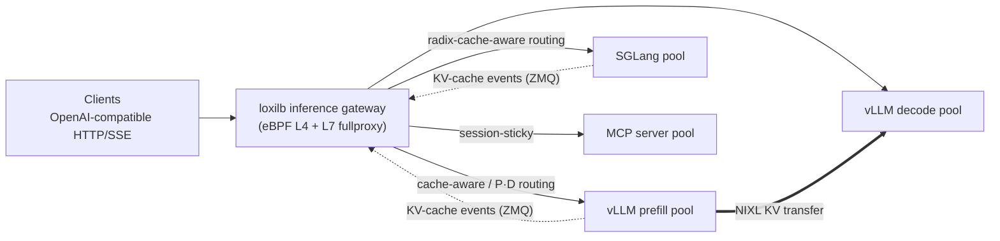

[](https://www.loxilb.io) [](https://ebpf.io/projects#loxilb)      
 [![Info][docs-shield]][docs-url] [](https://www.loxilb.io/members)

## What is loxilb-inference-gateway

loxilb-inference-gateway is an **inference-aware L4/L7 load balancer for LLM serving fleets**,
forked from [loxilb-io/loxilb](https://github.com/loxilb-io/loxilb). It adds AI-inference
routing for LLM serving engines (vLLM, SGLang) on top of loxilb's proven GoLang/eBPF data
path, so a single gateway can serve both classic cloud-native traffic and modern AI inference
traffic.

[loxilb](https://github.com/loxilb-io/loxilb) is an open source cloud-native load-balancer
based on GoLang/eBPF with the goal of achieving cross-compatibility across a wide range of
on-prem, public-cloud or hybrid K8s environments, developed to support the adoption of
cloud-native tech in telco, mobility, and edge computing.

loxilb-inference-gateway remains a **fully functional loxilb** — every AI capability is opt-in
per load-balancer rule, and with none enabled it behaves exactly like upstream loxilb. If you
only need the base cloud-native load balancer, use
[upstream loxilb](https://github.com/loxilb-io/loxilb) directly; if you are building or
operating an LLM serving fleet, this repository gives you the same load balancer with
inference-aware routing built in.

## AI-Inference routing with loxilb-inference-gateway

Modern LLM serving introduces load-balancing problems that classic L4/L7 policies cannot see:
KV-cache locality dominates time-to-first-token (TTFT), prefill and decode phases scale
differently, and request cost varies by orders of magnitude with prompt content.
loxilb-inference-gateway solves these at the gateway:



- **KV-cache-aware routing** (a.k.a. prefix-cache-aware routing) — routes each request to the
  endpoint whose vLLM/SGLang KV-cache already holds the longest prefix of the prompt. Two
  tiers: zero-engine-change **prefix-hash affinity (CHWBL)**, and **engine-exact** routing fed
  by the engines' own KV-cache event streams (block-hash contract, capacity-weighted
  bounded-load spill so hot prefixes cannot herd traffic).
- **Prefill/Decode (P/D) disaggregation** — L7-aware request splitting across prefill and
  decode endpoint pools with NIXL KV-transfer coordination, session affinity, circuit
  breaking and endpoint health tracking.
- **TTFT-adaptive load balancing** — an optional feedback controller that continuously tunes
  routing weights from observed time-to-first-token.
- **SGLang support** — the same cache-aware routing against SGLang's radix-tree cache,
  including multi-rank data-parallel event feeds.
- **AI observability** — per-endpoint inference metrics, tokenizer-exact prompt accounting
  and Prometheus/Grafana export.
- **AI gateway controls** — API-key management, per-tenant rate limiting, model-name routing
  and SSE stream quotas, all enforced at the L7 proxy.
- **MCP gateway & modern L7** — Model Context Protocol (Streamable HTTP) proxying with
  session stickiness, HTTP/2 + gRPC, mTLS and URL-prefix routing for AI application traffic.

📖 **Start here:** [`docs/load-balancing/README.md`](docs/load-balancing/README.md) — the full
guide set for L4/L7/TLS, the AI gateway, KV-cache-aware routing and SGLang configuration.

## Why choose loxilb-inference-gateway?

- One gateway for **both** worlds — classic K8s/telco load balancing (inherited from loxilb)
  and inference-aware routing for LLM fleets, under the same hood
- `Performs` on loxilb's eBPF data path, which leads its class across architectures
  ([single-node](https://loxilb-io.github.io/loxilbdocs/perf-single/) ·
  [multi-node](https://loxilb-io.github.io/loxilbdocs/perf-multi/) ·
  [ARM](https://www.loxilb.io/post/running-loxilb-on-aws-graviton2-based-ec2-instance))
- `Engine-exact` cache contracts — block-hash parity with vLLM and radix-tree parity with
  SGLang, not heuristics
- Every AI feature is `opt-in per LB rule` — adopt incrementally, roll back per service
- Works with `any` Kubernetes distribution/CNI (k8s / k3s / k0s / kind / OpenShift + Calico,
  Flannel, Cilium, Weave, Multus, etc)
- Runs in `any` cloud (public cloud / on-prem) or `standalone` environments

## Getting started by use case

Run the gateway (published as `ghcr.io/loxilb-io/loxilb-inference-gateway`), then jump to
your use case:

```bash
docker run -u root --cap-add SYS_ADMIN --restart unless-stopped --privileged \
  -dit -v /dev/log:/dev/log -v /opt/loxilb/config:/etc/loxilb \
  --name loxilb ghcr.io/loxilb-io/loxilb-inference-gateway:latest
```

> ⚠️ **Mount `/etc/loxilb` to a host path** (`-v /opt/loxilb/config:/etc/loxilb` above).
> The gateway persists its configuration snapshot (`/etc/loxilb/snapshot.json`) there and
> restores it automatically on boot. Without the mount, configuration survives a container
> *restart* but is **lost when the container is recreated** — which is exactly what happens
> on an image upgrade. See [Configuration persistence](#configuration-persistence--snapshots).

| Your situation | Use case |
|---|---|
| A pool of identical vLLM replicas | [1 — vLLM, non-disaggregated](#use-case-1--vllm-serving-non-disaggregated) |
| Separate prefill / decode vLLM pools (NIXL) | [2 — vLLM P/D disaggregation](#use-case-2--vllm-prefilldecode-pd-disaggregation) |
| SGLang workers (radix cache, DP ranks) | [3 — SGLang cache-aware routing](#use-case-3--sglang-cache-aware-routing) |
| MCP servers behind one endpoint | [4 — MCP gateway](#use-case-4--mcp-gateway) |
| Multi-team / multi-tenant OpenAI-compatible API | [5 — AI gateway controls](#use-case-5--multi-tenant-ai-gateway-controls) |
| Classic K8s / L4 / telco load balancing | [6 — everything loxilb does](#use-case-6--classic-load-balancing) |

Every rule below is one REST call to the gateway (`:11111/netlox/v1/config/loadbalancer`).
Two conventions: `mode: 4` selects the L7 fullproxy (required for all AI features), and `sel`
picks the endpoint-selection policy.

<details>
<summary><b>📖 Field decoder — every option used in the use cases below</b></summary>

| Field | Meaning |
|---|---|
| `mode` | `4` = L7 fullproxy — **required for every AI/L7 feature** (other values are L4 NAT modes) |
| `sel` | Endpoint selection: `0` round-robin · `3` source-persist · `8` CHWBL (consistent hash, bounded load) · `10` weighted CHWBL |
| `security` | Frontend TLS: omit = plain HTTP · `1` = TLS terminated at the gateway · `2` = end-to-end HTTPS (re-encrypt to backend) |
| `host` | The VIP address — must be local to the gateway node (the L7 proxy binds it) |
| `chwbl_prefix_hash_level` | How many prompt segments the prefix hash covers (deeper = finer affinity) |
| `chwbl_mean_load_factor` | Bounded-load spill threshold, % of mean load (`125` = spill at 1.25×) |
| `chwbl_replication` | Virtual nodes per endpoint on the hash ring |
| `pd_disagg_mode` | `true` = split each request into prefill + decode legs |
| `pd_cache_aware_mode` | `true` = cache-affinity prefill selection (trie-based) |
| `ep_role` *(per endpoint)* | `1` = prefill pool · `2` = decode pool · omit/`0` = plain |
| `nixl_port` *(per endpoint)* | That worker's NIXL side channel — must equal its `VLLM_NIXL_SIDE_CHANNEL_PORT` |
| `kvExactMode` | Engine-exact KV routing **topology** (not the engine — that's `kvEngineType`): `1` = P/D pool, requires `pd_disagg_mode: true` · `3` = single role-less pool, requires `mode: 4` and no P/D |
| `kvZmqPort` | Base port of the engine's KV-cache event stream (`--kv-events-config` endpoint); rank *N* at `kvZmqPort`+*N* |
| `kvBlockSize` | Must equal vLLM `--block-size` / SGLang `--page-size` |
| `kvHashAlgo` | Block-hash contract — **omit it**; the engine default applies (`vllm` ⇒ `sha256_cbor`, `sglang` ⇒ `sha256_sglang`). Set it only to pin vLLM's `"xxhash_cbor"`; a value that contradicts `kvEngineType` is rejected |
| `kvEngineType` | `"vllm"` (default) or `"sglang"` — picks the block-hash contract (immutable after create) |
| `kvDpRankCount` | SGLang data-parallel ranks (= `--dp-size`); rank *N* publishes at `kvZmqPort`+*N* |
| `kvWarmupSec` | Grace period before KV-exact selection engages |
| `sse_mode` | `true` = SSE-aware streaming (streams survive idle timeout, `[DONE]` detection); also arms AI-gateway key/limit enforcement |
| `max_stream_duration_sec` | Hard wall-clock cap per stream (runaway guard) |
| `backend_keepalive_interval_sec` | TCP keepalive toward the backend during long streams |
| `session_header_name` | Header-keyed stickiness — `"mcp-session-id"` for MCP, `"X-Conversation-Id"` for chats |
| `trace_type` | `"mcp"` tags proxy traces as MCP traffic |
| `model_name` + `path_prefix`/`path_match_mode` | Route by requested model (`X-Model` header or body `model`); `""` = catch-all |
| `monitor`, `probetype`, `probeport`, `probereq` | Endpoint health probing (e.g. HTTP GET `/health` or `/v1/models`) |

> ⚠️ **Field casing matters**: `pd_disagg_mode`, `ep_role`, `nixl_port`, `security` are
> snake_case; `kvExactMode`, `kvZmqPort`, `kvHashAlgo`, `kvBlockSize` are camelCase. A
> mis-cased field is silently ignored.

Full references: [REST API reference](docs/load-balancing/05-rest-api-reference.md) ·
[KV/P·D tuning guide](docs/load-balancing/11-hierarchical-kv-routing-config-tuning.md) ·
[SGLang fields](docs/load-balancing/17-sglang-config-tuning.md) ·
[MCP fields](docs/load-balancing/18-mcp-gateway.md) ·
[gateway-control fields](docs/load-balancing/19-ai-gateway-controls.md).

</details>

### Use case 1 — vLLM serving, non-disaggregated

A pool of identical vLLM replicas behind one OpenAI-compatible VIP. **Prefix-hash affinity
(CHWBL)** keeps prompts that share a prefix on the same replica — raising vLLM's prefix-cache
hit rate and cutting TTFT — with **zero changes to vLLM**:

```bash
curl -s -X POST http://127.0.0.1:11111/netlox/v1/config/loadbalancer \
  -H 'Content-Type: application/json' -d '{
  "serviceArguments": {
    "externalIP": "10.10.10.254", "port": 8080, "protocol": "tcp",
    "sel": 8, "mode": 4, "host": "10.10.10.254",
    "chwbl_prefix_hash_level": 2, "chwbl_mean_load_factor": 125, "chwbl_replication": 100 },
  "endpoints": [
    { "endpointIP": "31.31.31.1", "targetPort": 8000, "weight": 1 },
    { "endpointIP": "32.32.32.1", "targetPort": 8000, "weight": 1 } ]}'
```

`sel: 8` is CHWBL — consistent hashing with bounded load, so a hot prefix spills to the
next replica instead of herding. Variants: `sel: 10` for weighted CHWBL (heterogeneous
GPUs); add `"security": 1` to terminate TLS at the gateway; add `"monitor": true,
"probetype": "http", "probereq": "/v1/models"` for HTTP health probes.

▶ Runnable: [`cicd/vllm-httpproxy`](cicd/vllm-httpproxy) · [`cicd/vllm-fullproxy`](cicd/vllm-fullproxy) · WRR variants — real CPU-vLLM backends, no GPU needed.
📖 Deep dive: [AI gateway L7](docs/load-balancing/04-ai-gateway-l7.md), [KV-cache-aware routing](docs/load-balancing/08-kv-cache-aware-routing.md).
For **engine-exact** KV routing (fed by the engine's KV-cache event stream instead of prefix
hashing), see use case 2 for the P/D topology (`kvExactMode: 1`) and use case 3 for a single
role-less pool (`kvExactMode: 3`). The two modes are topologies, not engines — either one
accepts `kvEngineType: "vllm"` or `"sglang"` — but the shipped, CI-validated pairings are
vLLM on mode 1 and SGLang on mode 3.

### Use case 2 — vLLM Prefill/Decode (P/D) disaggregation

Split every request into a prefill leg and a streaming decode leg, routed to different pools
with NIXL KV transfer between them. Pools are declared per endpoint: `ep_role: 1` = prefill,
`ep_role: 2` = decode; `nixl_port` must match each worker's `VLLM_NIXL_SIDE_CHANNEL_PORT`:

```bash
curl -s -X POST http://127.0.0.1:11111/netlox/v1/config/loadbalancer \
  -H 'Content-Type: application/json' -d '{
  "serviceArguments": {
    "externalIP": "10.10.10.254", "port": 2020, "protocol": "tcp",
    "sel": 0, "mode": 4, "security": 1, "host": "10.10.10.254",
    "pd_disagg_mode": true, "sse_mode": true,
    "monitor": true, "probetype": "http", "probeport": 8000, "probereq": "/health" },
  "endpoints": [
    { "endpointIP": "31.31.31.1", "targetPort": 8000, "weight": 1, "ep_role": 1, "nixl_port": 9001 },
    { "endpointIP": "32.32.32.1", "targetPort": 8000, "weight": 1, "ep_role": 2, "nixl_port": 9002 } ]}'
```

vLLM side — prefill workers run as NIXL producers and publish KV-cache events; decode
workers consume:

```bash
# prefill worker
PYTHONHASHSEED=0 VLLM_NIXL_SIDE_CHANNEL_HOST=<node-ip> VLLM_NIXL_SIDE_CHANNEL_PORT=9001 \
vllm serve <MODEL> --port 8000 \
  --kv-transfer-config '{"kv_connector":"NixlConnector","kv_role":"kv_producer"}' \
  --kv-events-config '{"enable_kv_cache_events":true,"publisher":"zmq","endpoint":"tcp://*:5557"}'
# decode worker: same but kv_role":"kv_consumer" and no --kv-events-config
```

Level up per rule: `"pd_cache_aware_mode": true` adds cache-affinity prefill selection;
`"kvExactMode": 1, "kvZmqPort": 5557, "kvHashAlgo": "sha256_cbor", "kvBlockSize": 16`
enables **engine-exact KV routing** from the ZMQ event stream (`kvExactMode: 1` is valid
only on this `pd_disagg_mode: true` shape — on a single pool use `kvExactMode: 3`; requires
`--prefix-caching-hash-algo sha256_cbor`, `--block-size` = `kvBlockSize`, and
`PYTHONHASHSEED=0` parity on every worker); `"session_header_name": "X-Conversation-Id"`
pins conversations.

▶ Runnable: [`cicd/vllm-pd-disagg`](cicd/vllm-pd-disagg) (mock vLLM, no GPU) · [`cicd/vllm-kvcache-routing-cpu`](cicd/vllm-kvcache-routing-cpu) (KV-exact, echo backends).
📖 Deep dive: [P/D deploy & debug on AWS](docs/load-balancing/09-kv-cache-aware-routing-aws-pd-deep-dive.md), [architecture](docs/load-balancing/10-hierarchical-kv-routing-architecture.md), [tuning](docs/load-balancing/11-hierarchical-kv-routing-config-tuning.md).

### Use case 3 — SGLang cache-aware routing

Engine-exact KV routing against SGLang's radix-tree cache, on a plain single pool — no
P/D roles needed. `kvExactMode: 3` selects the single-pool **topology** (rejected unless
`mode: 4` and `pd_disagg_mode` is off), `kvEngineType: "sglang"` selects the **SGLang hash
contract**, and `kvDpRankCount` fans in one ZMQ feed per data-parallel rank
(`kvZmqPort + rank`):

```bash
curl -s -X POST http://127.0.0.1:11111/netlox/v1/config/loadbalancer \
  -H 'Content-Type: application/json' -d '{
  "serviceArguments": {
    "externalIP": "10.10.10.254", "port": 9090, "protocol": "tcp",
    "sel": 0, "mode": 4, "host": "10.10.10.254",
    "kvExactMode": 3, "kvEngineType": "sglang",
    "kvDpRankCount": 3, "kvZmqPort": 5561, "kvBlockSize": 16 },
  "endpoints": [
    { "endpointIP": "35.35.35.1", "targetPort": 80, "weight": 1 },
    { "endpointIP": "36.36.36.1", "targetPort": 80, "weight": 1 },
    { "endpointIP": "37.37.37.1", "targetPort": 80, "weight": 1 } ]}'
```

```bash
python3 -m sglang.launch_server --model <MODEL> --page-size 16 --dp-size 3 \
  --kv-events-config '{"publisher":"zmq","endpoint":"tcp://*:5561"}'
```

Parity rules: `--page-size` ⇔ `kvBlockSize`, `--dp-size` ⇔ `kvDpRankCount`, event port ⇔
`kvZmqPort`. Omit `kvHashAlgo` — the SGLang engine default (`sha256_sglang`) applies;
pinning vLLM's `"sha256_cbor"` here is rejected, because that contract would miss every
block SGLang publishes. vLLM and SGLang VIPs coexist on one gateway.

▶ Runnable: [`cicd/sglang-loxilb-kvcache`](cicd/sglang-loxilb-kvcache).
📖 Deep dive: [SGLang routing](docs/load-balancing/15-sglang-kv-cache-aware-routing.md) · [vs vLLM](docs/load-balancing/16-sglang-vs-vllm-routing-differences.md) · [config & tuning](docs/load-balancing/17-sglang-config-tuning.md).

### Use case 4 — MCP gateway

Put a fleet of MCP (Model Context Protocol) servers behind one stable, TLS-terminating
endpoint. The gateway keys stickiness on the `mcp-session-id` header so every call of an MCP
session lands on the server that owns it:

```bash
curl -s -X POST http://127.0.0.1:11111/netlox/v1/config/loadbalancer \
  -H 'Content-Type: application/json' -d '{
  "serviceArguments": {
    "externalIP": "10.10.10.254", "port": 2020, "protocol": "tcp",
    "sel": 0, "mode": 4, "security": 1,
    "session_header_name": "mcp-session-id", "host": "10.10.10.254", "trace_type": "mcp" },
  "endpoints": [
    { "endpointIP": "31.31.31.1", "targetPort": 8080, "weight": 1 },
    { "endpointIP": "32.32.32.1", "targetPort": 8080, "weight": 1 } ]}'
```

`security: 1` terminates TLS at the gateway (HTTP to backends); `security: 2` re-encrypts to
TLS-serving MCP backends; omit it for plain HTTP. Streamable-HTTP/SSE responses proxy
natively.

▶ Runnable: [`cicd/mcp-httpproxy`](cicd/mcp-httpproxy) · [`cicd/mcp-fullproxy`](cicd/mcp-fullproxy) · [`cicd/mcp-e2ehttps`](cicd/mcp-e2ehttps).
📖 Deep dive: [MCP gateway guide](docs/load-balancing/18-mcp-gateway.md).

### Use case 5 — Multi-tenant AI gateway controls

Expose one OpenAI-compatible endpoint to many teams with API keys, per-key model
allow-lists, per-tenant rate limits, model-name routing and SSE stream quotas — enforced at
the gateway, not in every engine:

```bash
# issue a key (loxilb started with --userservice --databasehost <mysql-ip>)
curl -s -X POST http://127.0.0.1:11111/netlox/v1/config/ai/apikey \
  -H "Authorization: Bearer $TOKEN" -d '{
  "tenant_id": "team-a", "name": "prod-key", "allowed_models": ["llama-70b"],
  "rate_limit_rps": 50, "tokens_per_min": 100000, "enabled": true }'
# → returns "raw_key": "lxb_…" (shown once); clients send it as  X-Api-Key: lxb_…
```

Routing by requested model (`X-Model` header or body `model` field) needs no database —
one rule per model pool with `"model_name": "llama-70b"`, and `"model_name": ""` as the
catch-all. SSE quotas per rule: `"sse_mode": true` (streams survive idle timeouts),
`"max_stream_duration_sec": 120` (runaway cap). Violations return `401` / `403`
(`model_not_allowed`) / `429`.

▶ Runnable: [`cicd/ai-apikey`](cicd/ai-apikey) · [`cicd/ai-model-routing`](cicd/ai-model-routing) · [`cicd/ai-sse-quota`](cicd/ai-sse-quota).
📖 Deep dive: [AI gateway controls guide](docs/load-balancing/19-ai-gateway-controls.md).

### Use case 6 — Classic load balancing

Everything upstream loxilb does, unchanged — service-type LB for any K8s distribution,
kube-proxy replacement, Ingress/Gateway API, SCTP/telco, HA clustering:

```bash
docker exec loxilb loxicmd create lb 10.10.10.254 --tcp=2020:8000 \
  --select=rr --endpoints=31.31.31.1:1,32.32.32.1:1
```

All upstream deployment modes work with this image — follow the
[upstream getting-started guides](https://loxilb-io.github.io/loxilbdocs/#getting-started)
([kube-loxilb](https://github.com/loxilb-io/loxilbdocs/blob/main/docs/kube-loxilb.md) ·
[HA](https://github.com/loxilb-io/loxilbdocs/blob/main/docs/ha-deploy.md) ·
[standalone](https://github.com/loxilb-io/loxilbdocs/blob/main/docs/standalone.md)) and
substitute the image name.

### Engine compatibility

| Engine | Integration | Parity requirements |
|---|---|---|
| vLLM (CHWBL affinity) | none — any OpenAI-compatible vLLM | — |
| vLLM (engine-exact KV) | `--kv-events-config` ZMQ event stream (vLLM ≥ 0.9) | `--prefix-caching-hash-algo sha256_cbor` · `--block-size` = `kvBlockSize` · `PYTHONHASHSEED=0` on all workers |
| vLLM (P/D) | `--kv-transfer-config` NixlConnector (`kv_producer`/`kv_consumer`) | `VLLM_NIXL_SIDE_CHANNEL_PORT` = rule `nixl_port` per endpoint |
| SGLang | `--kv-events-config` ZMQ (per DP rank) | `--page-size` = `kvBlockSize` · `--dp-size` = `kvDpRankCount` · base port = `kvZmqPort` |

## Where it fits (scope & non-goals)

loxilb-inference-gateway is a **self-contained inference gateway**: one Go/eBPF binary
covers L4 through inference-aware L7 — no Envoy, no ext-proc sidecar chain, no mandatory
Kubernetes control plane — and it speaks the serving engines' native contracts (vLLM
`--kv-events-config` ZMQ events, SGLang radix semantics) rather than approximating them at
the gateway. If you use the Kubernetes Gateway API Inference Extension vocabulary: the
KV-cache-aware selector plays the role of an endpoint picker over an inference pool, built
into the data path.

**Non-goals** — being honest about what this is *not*:
- Not a multi-provider SaaS proxy: it load-balances **your** engines; for federating
  OpenAI/Bedrock/Anthropic APIs use LiteLLM or Envoy AI Gateway (they compose fine in front
  of or behind this gateway).
- Not an orchestrator: it does not schedule or scale engine pods — llm-d and NVIDIA Dynamo
  operate at that layer; this gateway is the traffic layer.

## Documentation

The inference-gateway documentation lives in [`docs/load-balancing/`](docs/load-balancing/).
Classic L4 load balancing and general L7 policy routing are inherited from
[upstream loxilb](https://github.com/loxilb-io/loxilb) — see the
[upstream docs](https://loxilb-io.github.io/loxilbdocs/) for those fundamentals.

| Guide | Topic |
|-------|-------|
| [03 — L7 TLS](docs/load-balancing/03-l7-tls.md) | TLS termination, mTLS, HTTPS proxy |
| [04 — AI gateway (L7)](docs/load-balancing/04-ai-gateway-l7.md) | AI gateway feature overview |
| [05 — REST API reference](docs/load-balancing/05-rest-api-reference.md) | Config API for AI features |
| [06 — Troubleshooting](docs/load-balancing/06-troubleshooting.md) | Common issues |
| [07 — Developer guide](docs/load-balancing/07-developer-guide.md) | Internals & extending |
| [08 — KV-cache-aware routing](docs/load-balancing/08-kv-cache-aware-routing.md) | Prefix-cache routing |
| [09 — KV routing / P-D deep dive](docs/load-balancing/09-kv-cache-aware-routing-aws-pd-deep-dive.md) | Prefill/decode disaggregation |
| [10 — Hierarchical KV routing architecture](docs/load-balancing/10-hierarchical-kv-routing-architecture.md) | Design |
| [11 — Hierarchical KV routing tuning](docs/load-balancing/11-hierarchical-kv-routing-config-tuning.md) | Config tuning |
| [14 — KV-cache observability](docs/load-balancing/14-kv-cache-observability-design.md) | Metrics & tracing |
| [Monitoring stack](deploy/monitoring/README.md) · [design](docs/MONITORING-DESIGN.md) | Prometheus + Grafana setup & dashboards (see [Monitoring & observability](#monitoring--observability-prometheus--grafana)) |
| [15 — SGLang KV-cache-aware routing](docs/load-balancing/15-sglang-kv-cache-aware-routing.md) | SGLang routing |
| [16 — SGLang vs vLLM routing](docs/load-balancing/16-sglang-vs-vllm-routing-differences.md) | Engine differences |
| [17 — SGLang config tuning](docs/load-balancing/17-sglang-config-tuning.md) | SGLang tuning |
| [18 — MCP gateway](docs/load-balancing/18-mcp-gateway.md) | Load-balancing MCP servers |
| [loxilb-mcp](mcp/README.md) · [operations](docs/MCP-OPERATIONS.md) | Managing the gateway *from* an MCP client (see [loxilb-mcp](#manage-the-gateway-from-an-mcp-client-loxilb-mcp)) |
| [19 — AI gateway controls](docs/load-balancing/19-ai-gateway-controls.md) | API keys, rate limits, model routing, SSE quotas |

## Configuration persistence & snapshots

The gateway keeps its full configuration (load balancers, endpoints, firewall,
policies, mirrors, sessions, IP filters, security rate limits, BFD, BGP, IPsec —
including certificate material) in a single versioned, checksummed snapshot
document:

- `GET  /netlox/v1/config/snapshot` — download the snapshot (`?components=` to filter)
- `POST /netlox/v1/config/restore` — restore one; `?mode=dry-run` (default) validates
  and returns the change plan, `?mode=commit` applies it atomically with automatic
  rollback on any failure
- Every successful commit is written through to **`/etc/loxilb/snapshot.json`**, and
  the gateway restores that file automatically at boot
- `GET /config/export` / `POST /config/import` remain one release as deprecated
  aliases (they answer with `Deprecation` headers)

**Operator prerequisite — persistent volume.** `snapshot.json` lives *inside* the
container at `/etc/loxilb`. Always mount it from the host, or configuration will not
survive a container upgrade/recreate:

```bash
# docker run (add to the command above)
-v /opt/loxilb/config:/etc/loxilb
```

```yaml
# docker-compose
services:
  loxilb:
    image: ghcr.io/loxilb-io/loxilb-inference-gateway:latest
    network_mode: host
    privileged: true
    cap_add: [SYS_ADMIN]
    restart: unless-stopped
    volumes:
      - /dev/log:/dev/log
      - /opt/loxilb/config:/etc/loxilb   # ← configuration snapshot persistence
```

**Upgrade flow**: `GET /config/snapshot` (keep a copy) → deploy the new image with the
same `/etc/loxilb` volume → the gateway boot-restores automatically; verify, and if
anything is off, `POST /config/restore?mode=commit` the saved snapshot. Snapshot
documents contain secrets (IPsec PSKs, certificate private keys) — treat them like
credentials at rest.

## Monitoring & observability (Prometheus + Grafana)

The gateway exports Prometheus metrics for both classic L4/L7 traffic and AI inference
(per-endpoint KV-cache routing, P/D, SSE streams, TTFT, API-key/rate-limit enforcement). A
ready-to-run monitoring stack — Prometheus, alert rules and six provisioned Grafana
dashboards — ships under [`deploy/monitoring/`](deploy/monitoring/).

```bash
cd deploy/monitoring
cp .env.example .env                 # set the Grafana admin password
docker compose up -d                 # Prometheus :9090 · Grafana :3000
curl -X POST http://127.0.0.1:11111/netlox/v1/config/metrics   # enable collection (503 until enabled)
```

Prometheus scrapes loxilb's `/netlox/v1/metrics` route on the same host over localhost;
dashboards land in Grafana's **LoxiLB** folder. The metrics endpoint is control-plane REST,
so the default posture is **network isolation** (bind the plain listener to localhost or
firewall `:11111`) rather than TLS — see the setup guide for the auth/encryption details.

Provisioned dashboards ([`grafana/dashboards/`](deploy/monitoring/grafana/dashboards/)):
**Overview**, **L4**, **L7**, **AI Gateway** (KV routing / P·D / SSE / TTFT), **Security**
(firewall, flood/rate limiting) and **Bootstrap**.

| Guide | What it covers |
|---|---|
| [`deploy/monitoring/README.md`](deploy/monitoring/README.md) | Stack setup — quick start, security posture, cross-network TLS, operational notes |
| [`deploy/monitoring/TESTING.md`](deploy/monitoring/TESTING.md) | Live-test guide — drive real traffic through the cicd topology and verify panels against data-plane ground truth |
| [`docs/MONITORING-DESIGN.md`](docs/MONITORING-DESIGN.md) | Design rationale — every panel, alert and metric, and the findings behind them |
| [`docs/load-balancing/14-kv-cache-observability-design.md`](docs/load-balancing/14-kv-cache-observability-design.md) | AI/KV-cache observability metrics & tracing design |

## Manage the gateway from an MCP client (loxilb-mcp)

[`loxilb-mcp`](mcp/) is a standalone **MCP (Model Context Protocol) bridge**. It exposes the
gateway to MCP clients — Claude Desktop, Claude Code, MCP Inspector or any custom agent — as
guarded tools, so an operator (or an agent) can inspect load balancers, endpoints, AI-gateway
policy and metrics, and run diagnostics, without hand-rolling REST calls.

> Not to be confused with [use case 4 — MCP gateway](#use-case-4--mcp-gateway). That one puts a
> fleet of *MCP servers* behind the data path; this one lets an MCP client *operate the gateway
> itself*. They are independent, and compose fine.

It lives in [`mcp/`](mcp/) as its own Go module and releases on its own `mcp/vX.Y.Z` tags,
independent of the datapath: one static, cgo-free binary for macOS, Linux and Windows on
amd64/arm64. The same Linux binary runs on Ubuntu and Rocky/RHEL alike — nothing is linked
against glibc.

```sh
# macOS — the tap ships a cask, so it is macOS-only
brew install --cask loxilb-io/tap/loxilb-mcp

# any OS, nothing installed locally (-i keeps stdin open for the stdio transport)
docker run -i --rm ghcr.io/loxilb-io/loxilb-mcp:latest --target-url http://YOUR_LOXILB_HOST:11111

# with the Go toolchain
go install github.com/loxilb-io/loxilb-inference-gateway/mcp/cmd/loxilb-mcp@latest
```

Linux and Windows tarballs/zips, plus `SHA256SUMS`, are attached to each
[release](https://github.com/loxilb-io/loxilb-inference-gateway/releases) under its `mcp/vX.Y.Z`
tag. The `:latest` image tracks the newest **stable** release — pre-releases publish only their
own version tag, so `latest` never lands on a release candidate.

Point a client at a gateway:

```sh
claude mcp add loxilb -- /usr/local/bin/loxilb-mcp \
  --target-url http://YOUR_LOXILB_HOST:11111 --read-only
```

`--read-only` registers only the observe/diagnose tools and is the right default for a chat
session. Without it the guarded management tools are available too, and destructive ones still
require a two-step confirm-token flow; sessions carry a `viewer`/`operator`/`admin` role and
every call is written to a JSONL audit log.

| Guide | What it covers |
|---|---|
| [`mcp/README.md`](mcp/README.md) | Per-OS install, Claude Desktop / Claude Code wiring, cutting a release |
| [`docs/MCP-OPERATIONS.md`](docs/MCP-OPERATIONS.md) | Tool catalog, roles & guardrails, confirm-token flow, multi-target config, security posture |

## Try it — runnable CICD scenarios

Every feature ships with a self-contained scenario under [`cicd/`](cicd/) that spins up loxilb
plus mock/echo or containerized backends on the local host (`config.sh` → `validation.sh` →
`rmconfig.sh`). No cloud account or GPU is required for the mock/echo scenarios.

**KV-cache-aware routing & P/D**
- [`cicd/vllm-kvcache-routing-cpu`](cicd/vllm-kvcache-routing-cpu) — vLLM KV-exact routing (echo backends, no GPU)
- [`cicd/sglang-loxilb-kvcache`](cicd/sglang-loxilb-kvcache) — SGLang radix-cache routing coexistence
- [`cicd/vllm-pd-disagg`](cicd/vllm-pd-disagg) — prefill/decode disaggregation (mock vLLM, no GPU)

**vLLM L7 proxying** (real vLLM backend containers)
- [`cicd/vllm-httpproxy`](cicd/vllm-httpproxy) · [`cicd/vllm-fullproxy`](cicd/vllm-fullproxy) — HTTP/HTTPS proxy to vLLM
- [`cicd/vllm-httpproxy-wrr`](cicd/vllm-httpproxy-wrr) · [`cicd/vllm-fullproxy-wrr`](cicd/vllm-fullproxy-wrr) — weighted round-robin

**MCP (Model Context Protocol) proxying**
- [`cicd/mcp-httpproxy`](cicd/mcp-httpproxy) · [`cicd/mcp-fullproxy`](cicd/mcp-fullproxy) · [`cicd/mcp-e2ehttps`](cicd/mcp-e2ehttps) · [`cicd/mcp-direct-test`](cicd/mcp-direct-test) · [`cicd/mcp-direct-test-https`](cicd/mcp-direct-test-https)

**Gateway controls**
- [`cicd/ai-apikey`](cicd/ai-apikey) — API-key management
- [`cicd/ai-model-routing`](cicd/ai-model-routing) — model-name routing · [`cicd/ai-sse-quota`](cicd/ai-sse-quota) — SSE streaming quota

**Modern L7 transport**
- [`cicd/e2ehttpsproxy-mtls`](cicd/e2ehttpsproxy-mtls) · [`cicd/httpsproxy-mtls`](cicd/httpsproxy-mtls) — mTLS
- [`cicd/e2ehttpsproxy-prefix`](cicd/e2ehttpsproxy-prefix) · [`cicd/httpsproxy-prefix`](cicd/httpsproxy-prefix) · [`cicd/httpproxy-prefix`](cicd/httpproxy-prefix) — URL-prefix routing

```bash
cd cicd/vllm-kvcache-routing-cpu
./config.sh        # bring up loxilb + backends
./validation.sh    # run the scenario
./rmconfig.sh      # tear down
```

## Build and run from source

This repository builds differently from upstream loxilb in three ways: the
[`loxilb-ebpf`](loxilb-ebpf) dataplane is a **git submodule** (clone with
`--recurse-submodules`), the first clean build **regenerates the swagger API models via
Docker**, and the repo ships extra Dockerfiles for the optional AI components.

### Prerequisites

Linux only (macOS cannot build the eBPF/CGO parts). Go ≥ 1.25, Docker (needed once for the
swagger-model regeneration), and the eBPF toolchain:

```bash
sudo apt-get install -y clang llvm libelf-dev gcc-multilib libpcap-dev \
  linux-tools-$(uname -r) elfutils dwarves git libbsd-dev bridge-utils unzip \
  build-essential bison flex iproute2 libjson-c-dev libnghttp2-dev
```

The KV-cache router links against the prebuilt
[daulet/tokenizers](https://github.com/daulet/tokenizers) static library:

```bash
arch=$(arch | sed s/aarch64/arm64/ | sed s/x86_64/amd64/)
wget -q https://github.com/daulet/tokenizers/releases/download/v1.27.0/libtokenizers.linux-${arch}.tar.gz
sudo tar -xzf libtokenizers.linux-${arch}.tar.gz -C /usr/local/lib/
```

### Build the gateway binary

```bash
git clone --recurse-submodules https://github.com/loxilb-io/loxilb-inference-gateway.git
cd loxilb-inference-gateway
make build          # eBPF dataplane (submodule) + swagger models (first run, via Docker) + Go control plane
```

`make build` runs three stages: `subsys` (compiles `loxilb-ebpf`), `api-models` (regenerates
`api/models`/`api/restapi` from `api/swagger.yml` with dockerized go-swagger 0.30.3 — only
when missing), then `go build` → the `./loxilb` binary.

#### Full inference-gateway feature build

A plain `make build` produces a working gateway, but several inference-gateway features are
compiled **out**. The official Ubuntu 24.04 image ([`Dockerfile.u24`](Dockerfile.u24)) builds
with:

```bash
make HAVE_HTTP_TRACE=1 HAVE_L4_TRACE=1 HAVE_MTLS=1 EXTRA_CFLAGS="-DHAVE_L4_TRACE"
```

| Flag | Enables | Default |
|---|---|---|
| `HAVE_MTLS=1` | Frontend/backend mTLS — Go tag `mtls` + `-DHAVE_MTLS=1` | **on** (`HAVE_MTLS ?= 1`); opt out with `make HAVE_MTLS=` |
| `HAVE_HTTP_TRACE=1` | HTTP/HTTPS request tracing (`lxb_ring` transport in the C data path) | off |
| `HAVE_L4_TRACE=1` **and** `EXTRA_CFLAGS="-DHAVE_L4_TRACE"` | L4 flow tracing and span assembly — Go tag `l4trace` | off |
| `HAVE_DOCA=1` | BlueField DPU offload — Go tag `doca` (see also `make dpu`) | off |
| `HAVE_DP_DPU_SLIM=1` | DPU slim `dp_proxy_tacts` layout | off |

Two things that are easy to get wrong:

- **L4 tracing needs both halves.** `HAVE_L4_TRACE=1` sets the Go build tag; `EXTRA_CFLAGS="-DHAVE_L4_TRACE"` turns it on in the C data path. Setting only one yields a half-enabled build.
- **Always set feature flags on the top-level `make`.** `HAVE_MTLS` is deliberately exported to the `loxilb-ebpf` sub-make because it changes the `dp_proxy_tacts` layout shared by the cgo Go binary and `libloxilbdp.a`. Building the submodule separately with different flags gives a silent ABI mismatch that no `_Static_assert` can catch.

To confirm what actually got compiled in, `make` echoes the resulting Go build tags on the
last line of the build:

```
Built with tags: -tags l4trace,mtls
```

A plain `make build` prints `Built with tags: -tags mtls` — mTLS only.

Run it directly on the host:

```bash
sudo loxilb-ebpf/utils/mkllb_bpffs.sh   # mount the bpf filesystem (once per boot)
sudo ./loxilb                           # REST API on :11111
```

### Optional AI components

```bash
make ai-controller            # → loxilb-ai-controller (TTFT/weight advisory controller; pure Go)
make kv-agent HAVE_DOCA=0     # → loxilb-kv-agent (KV-cache offload agent; HAVE_DOCA=1 on BlueField)
```

### Docker images

| Target / file | Produces |
|---|---|
| `make docker` | Gateway image — auto-picks `Dockerfile.u20` / `Dockerfile.u24` / default [`Dockerfile`](Dockerfile) (Ubuntu 22.04) by host OS |
| `make docker-u24` | Ubuntu 24.04 image via [`Dockerfile.u24`](Dockerfile.u24) |
| `make docker-arm64` · `docker-arm64-u24` | ARM64 images (docker buildx) |
| [`Dockerfile.aictrl`](Dockerfile.aictrl) | `loxilb-ai-controller` image |
| [`Dockerfile.kv-agent`](Dockerfile.kv-agent) | `loxilb-kv-agent` image |

Image name/tag come from `IMAGE?=ghcr.io/loxilb-io/loxilb-inference-gateway` and
`TAG?=latest` in the [`Makefile`](Makefile):

```bash
make docker IMAGE=myrepo/loxilb-inference-gateway TAG=dev
```

Fast iteration without a full image rebuild — run the published image and overlay a freshly
built binary into it:

```bash
make docker-rp      # docker-run + build + docker cp ./loxilb into the running container
```

### Tests

The self-contained AI scenarios under [`cicd/`](cicd/) (previous section) are the
integration layer — CI runs them in
[`ai-gateway-sanity.yml`](.github/workflows/ai-gateway-sanity.yml).

**For maintainers:** this fork tracks upstream `loxilb` / `loxilb-ebpf` with merge-based
sync (never rebase) in submodule lockstep — eBPF first, then the gateway pin bump. New
AI code lives in new files so untouched upstream files merge cleanly.

## Kubernetes with loxilb

Kubernetes defines many service constructs like cluster-ip, node-port, load-balancer, ingress
etc. for pod to pod, pod to service and outside-world to service communication. **loxilb
provides service type load-balancer as its main use-case**, and can be run in-cluster or
ext-to-cluster as per user need. loxilb-inference-gateway inherits all of it:

- [x] Service type load-balancer (in-cluster / ext-cluster)
- [x] kube-proxy replacement with eBPF (full cluster-mesh implementation for Kubernetes)
- [x] Ingress support
- [x] Kubernetes Gateway API
- [x] HA capable Egress for Kubernetes

See the upstream operator [kube-loxilb](https://github.com/loxilb-io/kube-loxilb) and
[loxilb-ingress](https://github.com/loxilb-io/loxilb-ingress).

## Telco-Cloud with loxilb

For deploying telco-cloud with cloud-native functions, loxilb can be used as an enhanced SCP
(service communication proxy) with load-balancing across N2, N4, E2 (ORAN), S6x, 5GLAN, GTP,
SEPP and SCTP multi-homing — all inherited unchanged by loxilb-inference-gateway. See the
upstream README's [telco-cloud section](https://github.com/loxilb-io/loxilb#telco-cloud-with-loxilb).

## Overall features of loxilb (inherited)

- L4/NAT stateful loadbalancer
    * NAT44, NAT66, NAT64 with One-ARM, FullNAT, DSR etc
    * Support for TCP, UDP, SCTP (w/ multi-homing), QUIC, FTP, TFTP etc
- High-availability support with BFD detection for hitless/maglev/cgnat clustering
- Extensive and scalable end-point liveness probes for cloud-native environments
- Stateful firewalling and IPSEC/Wireguard support
- Full compatibility for ipvs (ipvs policies can be auto inherited)
- Policy oriented L7 proxy support - HTTP1.0, 1.1, 2.0, 3.0

## Components

- GoLang based control plane components
- A scalable/efficient [eBPF](https://ebpf.io/) based data-path implementation
- Integrated goBGP based routing stack
- AI-inference routing modules (KV-cache-aware selector, P/D coordinator, TTFT controller,
  AI metrics/observability) layered on the same control & data path
- A kubernetes operator [kube-loxilb](https://github.com/loxilb-io/kube-loxilb) and ingress
  [implementation](https://github.com/loxilb-io/loxilb-ingress) (upstream, compatible)

## Knowledge-Base

Architecture, eBPF internals, NAT modes, LB algorithms, API references and performance reports
are maintained in the upstream [loxilb documentation](https://loxilb-io.github.io/loxilbdocs/):

- [What is eBPF](https://github.com/loxilb-io/loxilbdocs/blob/main/docs/ebpf.md) · [Architecture in brief](https://github.com/loxilb-io/loxilbdocs/blob/main/docs/arch.md) · [eBPF internals of loxilb](https://github.com/loxilb-io/loxilbdocs/blob/main/docs/loxilbebpf.md)
- [loxilb NAT modes](https://github.com/loxilb-io/loxilbdocs/blob/main/docs/nat.md) · [LB algorithms](https://github.com/loxilb-io/loxilbdocs/blob/main/docs/lb-algo.md)
- [Manual steps to build/run upstream loxilb](https://github.com/loxilb-io/loxilbdocs/blob/main/docs/run.md) (for **this** repo see [Build and run from source](#build-and-run-from-source)) · [Debugging loxilb](https://github.com/loxilb-io/loxilbdocs/blob/main/docs/debugging.md)
- [loxicmd usage](https://github.com/loxilb-io/loxilbdocs/blob/main/docs/cmd.md) · [loxilb web-API reference](https://github.com/loxilb-io/loxilbdocs/blob/main/docs/api.md)
- [Performance Reports](https://github.com/loxilb-io/loxilbdocs/blob/main/docs/perf.md) · [System Requirements](https://github.com/loxilb-io/loxilbdocs/blob/main/docs/requirements.md) · [FAQs](https://github.com/loxilb-io/loxilbdocs/blob/main/docs/faq.md)
- [Blogs](https://www.loxilb.io/blog) · [Demo Videos](https://www.youtube.com/@loxilb697)

For inference-gateway internals (KV-cache routing design, P/D architecture, tuning), see
[`docs/load-balancing/`](docs/load-balancing/) in this repository.

## Community

loxilb-inference-gateway is part of the loxilb community.

### Slack
Join the loxilb [Slack](https://www.loxilb.io/members) channel to chat with loxilb developers
and other users. This is a good place to learn about loxilb and the inference gateway, ask
questions, and work collaboratively.

### General Discussion
Feel free to post inference-gateway queries, issues and PRs in this repository. For core
loxilb questions, see the upstream [discussion](https://github.com/loxilb-io/loxilb/discussions)
board and [issues](https://github.com/loxilb-io/loxilb/issues).

## CICD Workflow Status

### AI-Inference gateway

| AI & L7 feature sanity | Build & Release |
|:-------------|:-------------|
| [](https://github.com/loxilb-io/loxilb-inference-gateway/actions/workflows/ai-gateway-sanity.yml) — KV-cache routing, P/D, SGLang, model routing, SSE quota, API keys | [](https://github.com/loxilb-io/loxilb-inference-gateway/actions/workflows/docker-image.yml) |
| [](https://github.com/loxilb-io/loxilb-inference-gateway/actions/workflows/mcp-sanity.yml) — MCP proxying (HTTP / TLS / e2e-HTTPS, session stickiness) | [](https://github.com/loxilb-io/loxilb-inference-gateway/actions/workflows/build-check.yml) |
| [](https://github.com/loxilb-io/loxilb-inference-gateway/actions/workflows/l7-proxy-sanity.yml) — h1/h2, HTTPS, mTLS, prefix routing, gRPC | [](https://github.com/loxilb-io/loxilb-inference-gateway/actions/workflows/docker-multiarch.yml) |
| [](https://github.com/loxilb-io/loxilb-inference-gateway/actions/workflows/vllm-proxy-sanity.yml) — real CPU-vLLM backends (weekly) | [](https://github.com/loxilb-io/loxilb-inference-gateway/actions/workflows/release.yml) |

### Classic LB sanity (inherited from loxilb)

| Features(Ubuntu20.04) | Features(Ubuntu22.04)| Features(Ubuntu24.04)|
|:----------|:-------------|:-------------|
| [](https://github.com/loxilb-io/loxilb-inference-gateway/actions/workflows/basic-sanity.yml)  | [](https://github.com/loxilb-io/loxilb-inference-gateway/actions/workflows/basic-sanity-ubuntu-22.yml) | [](https://github.com/loxilb-io/loxilb-inference-gateway/actions/workflows/basic-sanity-ubuntu-24.yml) |
| [](https://github.com/loxilb-io/loxilb-inference-gateway/actions/workflows/tcp-sanity.yml) | [](https://github.com/loxilb-io/loxilb-inference-gateway/actions/workflows/tcp-sanity-ubuntu-22.yml)   | [](https://github.com/loxilb-io/loxilb-inference-gateway/actions/workflows/tcp-sanity-ubuntu-24.yml)   |
| [](https://github.com/loxilb-io/loxilb-inference-gateway/actions/workflows/udp-sanity.yml) | [](https://github.com/loxilb-io/loxilb-inference-gateway/actions/workflows/udp-sanity-ubuntu-22.yml) | [](https://github.com/loxilb-io/loxilb-inference-gateway/actions/workflows/udp-sanity-ubuntu-24.yml) |
| [](https://github.com/loxilb-io/loxilb-inference-gateway/actions/workflows/sctp-sanity.yml)  | [](https://github.com/loxilb-io/loxilb-inference-gateway/actions/workflows/sctp-sanity-ubuntu-22.yml)  | [](https://github.com/loxilb-io/loxilb-inference-gateway/actions/workflows/sctp-sanity-ubuntu-24.yml) |
|  [](https://github.com/loxilb-io/loxilb-inference-gateway/actions/workflows/advanced-lb-sanity.yml)|  [](https://github.com/loxilb-io/loxilb-inference-gateway/actions/workflows/advanced-lb-sanity-ubuntu-22.yml) |  [](https://github.com/loxilb-io/loxilb-inference-gateway/actions/workflows/advanced-lb-sanity-ubuntu-24.yml) |
| [](https://github.com/loxilb-io/loxilb-inference-gateway/actions/workflows/nat66-sanity.yml)   | [](https://github.com/loxilb-io/loxilb-inference-gateway/actions/workflows/nat66-sanity-ubuntu-22.yml)  |  [](https://github.com/loxilb-io/loxilb-inference-gateway/actions/workflows/nat66-sanity-ubuntu-24.yml)  |
|  [](https://github.com/loxilb-io/loxilb-inference-gateway/actions/workflows/ipsec-sanity.yml)   | [](https://github.com/loxilb-io/loxilb-inference-gateway/actions/workflows/ipsec-sanity-ubuntu-22.yml)  |  [](https://github.com/loxilb-io/loxilb-inference-gateway/actions/workflows/ipsec-sanity-ubuntu-24.yml)  |
| [](https://github.com/loxilb-io/loxilb-inference-gateway/actions/workflows/liveness-sanity.yml)  | [](https://github.com/loxilb-io/loxilb-inference-gateway/actions/workflows/liveness-sanity-ubuntu-22.yml)  |  [](https://github.com/loxilb-io/loxilb-inference-gateway/actions/workflows/liveness-sanity-ubuntu-24.yml)   |
|  | [](https://github.com/loxilb-io/loxilb-inference-gateway/actions/workflows/scale-sanity-ubuntu-22.yml) |  [](https://github.com/loxilb-io/loxilb-inference-gateway/actions/workflows/scale-sanity-ubuntu-24.yml)  |
|[](https://github.com/loxilb-io/loxilb-inference-gateway/actions/workflows/perf.yml) | [](https://github.com/loxilb-io/loxilb-inference-gateway/actions/workflows/perf.yml) |[](https://github.com/loxilb-io/loxilb-inference-gateway/actions/workflows/perf.yml) |

## License

loxilb-inference-gateway is licensed under the [Apache License 2.0](LICENSE), the same as
upstream loxilb.

## 📚 Please check the loxilb [website](https://www.loxilb.io) for more detailed info.

[docs-shield]: https://img.shields.io/badge/info-docs-blue
[docs-url]: https://loxilb-io.github.io/loxilbdocs/
[slack=shield]: https://img.shields.io/badge/Community-Join%20Slack-blue
[slack-url]: https://www.loxilb.io/members
