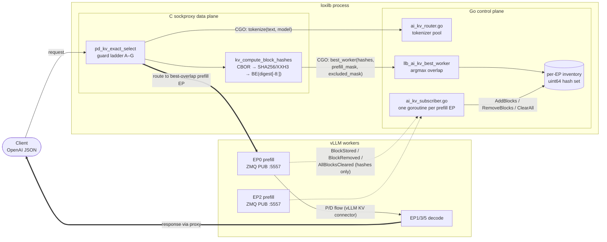
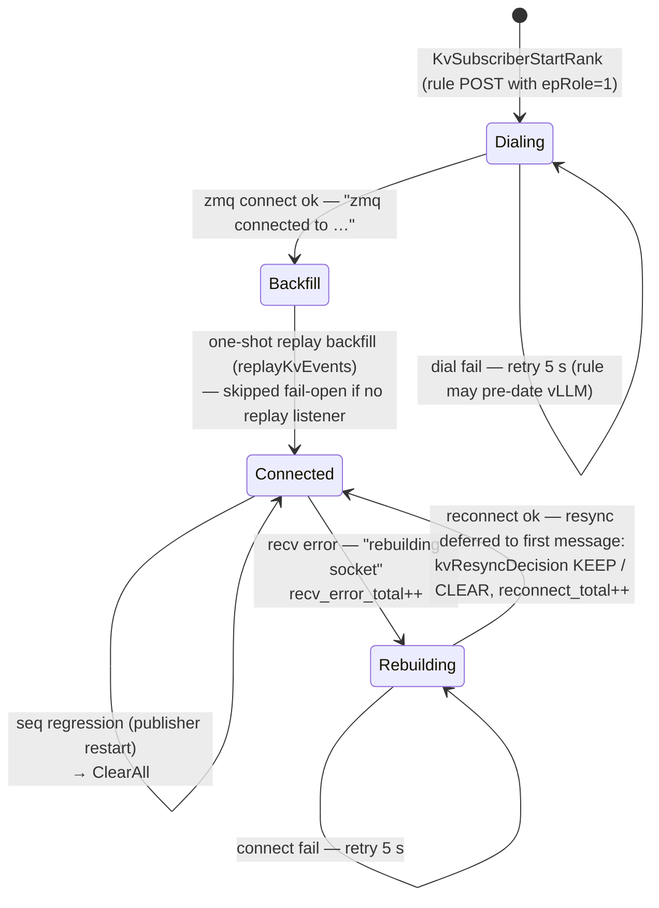
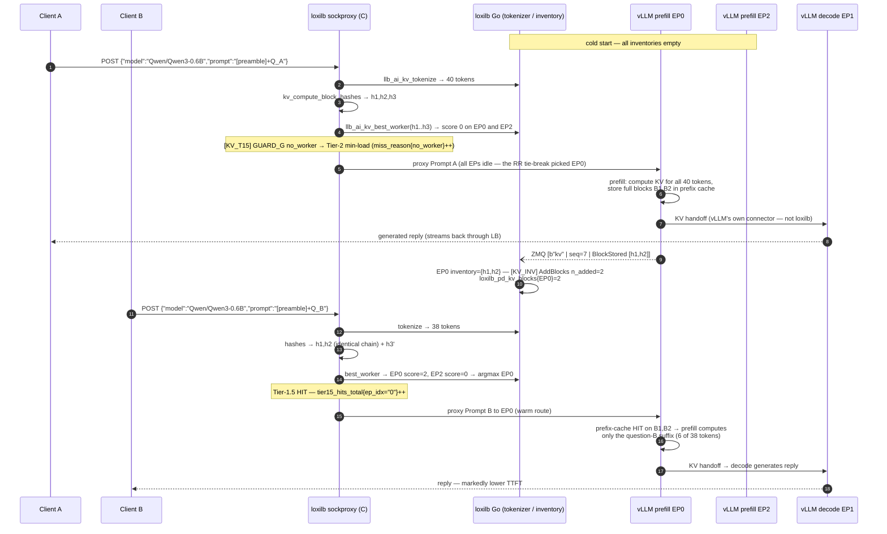
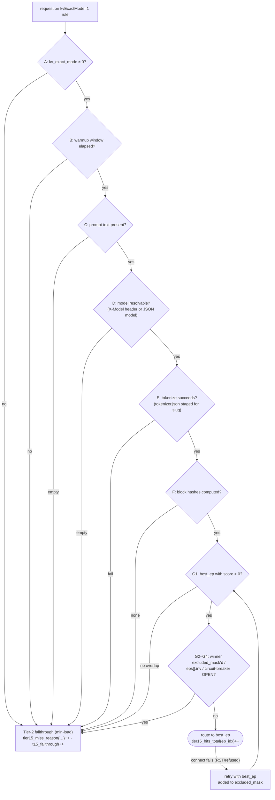

# KV-Cache-Aware AI Routing (Tier-1.5) — Deep Dive

> **Audience:** AI/vLLM platform engineers, QA engineers, and control-plane / data-plane developers.
> **Scope:** The Tier-1.5 KV-cache-aware routing path as shipped and hardened to the production
> CICD bar. Covers architecture, the end-to-end
> call flow, the vLLM block-hash contract, configuration, observability/log tracing, the full
> test & validation matrix, and the limitation/bottleneck analysis behind the
> enhancement roadmap (§10).
> **Status:** Shipped and gate-verified — authoritative paid AWS exit gate GREEN 2026-06-11
> (`SCENARIO-vllm-kvcache-routing-cpu [OK]` with `RUN_FR9=1`, `run-20260611T194404Z.log`).

Related: [AI-Gateway L7 proxy & HA](04-ai-gateway-l7.md) (the P/D routing tiers this slots into),
[Developer guide](07-developer-guide.md) (build gates), [Troubleshooting](06-troubleshooting.md).

---

## 1. What it is and where it sits

vLLM keeps a **prefix cache**: previously-computed KV blocks for token prefixes. If a new request's
prompt shares a prefix with blocks a particular worker already holds, sending the request to *that*
worker skips recomputation — lower TTFT, higher throughput.

LoxiLB exploits this without touching vLLM internals: vLLM v0.17.0 publishes **KV cache events**
(`BlockStored` / `BlockRemoved` / `AllBlocksCleared`) on a ZMQ PUB socket
(`--kv-events-config`). LoxiLB subscribes, mirrors each prefill worker's block inventory, and on
each request **recomputes the same block hashes vLLM would compute** for the prompt, then routes to
the prefill endpoint with the highest block overlap.

In the P/D routing tier ladder (see [04 §2.1](04-ai-gateway-l7.md)) this is **Tier 1.5** — between
exact conversation stickiness and the Tier-2 min-load (RR tie-break) fallback:

```
Tier 1   conversation stickiness (exact session mapping)
Tier 1.5 KV-cache overlap argmax  ← this document
Tier 2   min-load (RR tie-break) over prefill EPs (fallthrough when any Tier-1.5 guard fires)
```

Everything is **fail-open**: any guard failure falls through to Tier 2. Tier 1.5 can never make a
request undeliverable; it can only make it smarter.

---

## 2. Architecture

Three layers, two languages, one CGO seam:

```
                       ┌────────────────────────── loxilb process ──────────────────────────┐
                       │                                                                     │
 vLLM prefill EP-A ─┐  │  Go control plane                       C sockproxy data plane      │
 (ZMQ PUB :5557)    │  │  ┌──────────────────────┐               ┌──────────────────────┐    │
 vLLM prefill EP-B ─┼──┼─▶│ ai_kv_subscriber.go  │               │ sockproxy_kv_exact.c │    │
 (ZMQ PUB :5557)    │  │  │  per-EP goroutine    │               │  pd_kv_exact_select  │◀───┼── client HTTP
 vLLM prefill EP-C ─┘  │  │  3-frame envelope    │               │  guard ladder A–G    │    │   (OpenAI JSON)
   BlockStored…        │  │  seq-gap detection   │               │  kv_compute_block_   │    │
                       │  │  inventory map       │               │  hashes (CBOR+hash)  │    │
                       │  │  map[uint64]struct{} │               └──────────┬───────────┘    │
                       │  └─────────▲────────────┘                          │ CGO            │
                       │            │ llb_ai_kv_best_worker(hashes,         │                │
                       │            │   prefill_mask, excluded_mask)  ◀─────┘                │
                       │            │ llb_ai_kv_tokenize(text, model) ◀─────┘                │
                       │            │      (daulet/tokenizers,                               │
                       │            │       /etc/loxilb/tokenizers/<slug>/tokenizer.json)    │
                       └────────────┴────────────────────────────────────────────────────────┘
```

Same architecture as a Mermaid graph (renders on GitHub/wiki):



| Layer | Code | Responsibility |
|---|---|---|
| **Inventory ingest** (Go) | `pkg/loxinet/ai_kv_subscriber.go` | One goroutine per prefill EP subscribes to that EP's ZMQ KV-event stream, maintains a flat `map[uint64]struct{}` block-hash set per EP, handles reconnect/seq-gap/clear semantics |
| **Request decision** (C) | `loxilb-ebpf/common/sockproxy_kv_exact.c` | On each proxied request: extract prompt+model, tokenize (CGO), compute the vLLM-contract block hashes, query the Go inventory for the best-overlap prefill EP through the guard ladder |
| **Selection + tokenize** (Go, called from C) | `llb_ai_kv_best_worker` in `pkg/loxinet/ai_kv_subscriber.go`, `llb_ai_kv_tokenize` in `pkg/loxinet/ai_kv_router.go` | Argmax overlap scoring across per-EP inventories honoring prefill/excluded masks; tokenizer pool keyed by model slug |

Key design properties:

- **The inventory lives in Go, the decision runs in C.** The C data plane calls back into Go via
  two CGO exports per request (`llb_ai_kv_tokenize`, `llb_ai_kv_best_worker`). There is no eBPF
  involvement in Tier 1.5 — this is the sockproxy (fullproxy) path.
- **Per-EP isolation.** Each prefill EP has its own ZMQ subscription and its own inventory.
  A publisher restart on one EP clears only that EP's inventory.
- **Hash parity is the whole game.** loxilb's C hash core must produce *bit-identical* uint64
  block hashes to vLLM's Python hash core for the intersection to be non-empty. The contract is
  frozen at vLLM v0.17.0 (§4) and defended by golden vectors at three layers (§8).

---

## 3. End-to-end call flow

### 3.1 Control path — rule creation

1. Operator POSTs a loadbalancer rule with `kvExactMode: 1` and `pd_disagg_mode: true`
   (required — mode 1 is the P/D entry into Tier 1.5 and is rejected without it), plus
   endpoints carrying `epRole: 1` (prefill) / `epRole: 2` (decode) (§6).
2. The `KvExactMode==1` block in `pkg/loxinet/rules.go` — for every `epRole==1` endpoint, calls
   `KvSubscriberStartRank(serviceID=ruleNum, epIdx, epIP, kvZmqPort, kvHashAlgo)` once per
   data-parallel rank (rank N subscribes at `kvZmqPort+N`; see `kvDpRankCount`, §6.1).
3. `pkg/loxinet/dpebpf_linux.go` copies `kv_exact_mode / kv_hash_algo / kv_block_size /
   kv_warmup_sec` into the C `proxy_epval_t`, and `kv_warmup_start` is stamped — the warmup
   window (Guard B) starts counting.
4. Each subscriber goroutine dials `tcp://<epIP>:<kvZmqPort>`. Initial dial failure does **not**
   kill the subscriber — the dial-retry loop in `KvSubscriberStartRank` retries every 5 s, so the
   rule can be created before vLLM is up.

### 3.2 Ingest path — vLLM event → inventory

1. vLLM (with `--kv-events-config '{"enable_kv_cache_events":true, "publisher":"zmq", ...}'` and
   `VLLM_KV_EVENTS_USE_INT_BLOCK_HASHES=1`) publishes a 3-frame multipart message:
   `[topic | seq u64 BE | msgpack(KVEventBatch)]`.
2. On a fresh subscribe, the subscriber first performs a **one-shot replay backfill**
   (`replayKvEvents`) against the engine's replay endpoint — vLLM keeps a replay buffer on a
   paired ROUTER socket — so a rule created against an already-warm engine starts with a
   populated inventory (fail-open: no replay listener ⇒ the inventory warms organically). The
   live loop then runs with **no replay client**; it parses the seq frame of every message. A
   forward seq gap in the live stream is resolved by `kvResyncDecision`: **KEEP** the warm
   inventory on a small hop within the resume window, **CLEAR** on a large jump. A seq
   **regression** (publisher restarted with a fresh cache) triggers `inv.ClearAll()`.
3. `BlockStored` → `extractBlockHashes` (`ai_kv_subscriber.go`, accepts msgpack int types only —
   this is why `VLLM_KV_EVENTS_USE_INT_BLOCK_HASHES=1` is mandatory) → `inv.AddBlocks`.
   `BlockRemoved` → `inv.RemoveBlocks`. `AllBlocksCleared` → `inv.ClearAll`.
4. On any recv error the socket is rebuilt; on successful reconnect the subscriber does **not**
   blind-clear the inventory. The first post-reconnect message runs `kvResyncDecision`, which
   **KEEPs** the warm inventory when the seq resumes near the preserved `lastSeq` (transient
   blip, same running engine) and **CLEARs** it when the seq went backwards or jumped far ahead
   (publisher restart / ambiguous — stale hashes would mis-route).
   `loxilb_kv_subscriber_reconnect_total` increments.

### 3.3 Request path — client request → routed worker

For each proxied request on a `kvExactMode=1` rule, `pd_kv_exact_select`
(`sockproxy_kv_exact.c`) runs the guard ladder (full table in §5):

1. **Extract** prompt text from the parsed OpenAI JSON body (`pfe->prefix_key.prefix`; raw
   `rcvbuf` as fallback) and model from the `X-Model` header or JSON `model` field.
   ⚠ The request body **must be OpenAI JSON** (`{"model": ..., "prompt"/"messages": ...}`);
   a `text/plain` body leaves `prefix_key.model` empty → Guard D fires on every request →
   silent RR (live-proven in the gate).
2. **Tokenize** via CGO `llb_ai_kv_tokenize(text, model, ...)` — the daulet/tokenizers
   (HuggingFace-compatible) path, loading `/etc/loxilb/tokenizers/<model-slug>/tokenizer.json`
   (slug: `/` → `__`, e.g. `Qwen/Qwen3-0.6B` → `Qwen__Qwen3-0.6B`). Tokenizers are cached per
   model; load failures are negative-cached (`kvLoadTokenizer` in `ai_kv_router.go`).
3. **Hash** via `kv_compute_block_hashes` (`sockproxy_kv_exact.c`): for each
   `kv_block_size`-token block, canonical-CBOR-encode `[parent_hash, [token_ids...], null]`,
   hash with SHA-256 or XXH3-128, truncate to `BE(digest[-8:])` as the uint64, and chain the
   **full** digest as the next block's parent (§4).
4. **Select** via CGO `llb_ai_kv_best_worker(hashes, n, model, prefill_mask, excluded_mask)`:
   argmax of `inv.MatchCount(hashes)` over prefill EPs not in `excluded_mask`
   (`llb_ai_kv_best_worker` in `ai_kv_subscriber.go`). Ties resolve by EP iteration order.
5. **Post-filter** (Guard G): the winner must not be in `excluded_mask`, not have
   `eps[best_ep].inv` set (admin/maintenance down), and not have an **open circuit breaker**.
   If excluded, Tier 1.5 returns -1; the caller retries with `excluded_mask |= (1<<best_ep)` on
   connect failure, so the *second-best* overlap EP wins — never a decode EP, never plain RR
   (proven by CICD scenario.3).
6. On any guard miss → return -1 → **Tier-2 min-load (RR tie-break)** over prefill EPs;
   `loxilb_pd_kv_tier15_fallthrough_total` and the matching `tier15_miss_reason{reason}` increment.
   On success → `loxilb_pd_kv_tier15_hits_total{ep_idx}` increments and the request is proxied
   to the chosen prefill EP (then the P/D flow continues to a decode EP as usual — see
   [04 §2](04-ai-gateway-l7.md); in a P/D topology the *response banner* the client sees comes
   from the decode EP, while `tier15_hits{ep}` records the prefill decision).

### 3.4 C↔Go index translation

The C side passes the **absolute endpoint index** within the rule (0..n-1, mixed prefill+decode);
`prefill_mask` is built from `ep_role[i]==1` at those absolute positions
(the `prefill_mask` build loop in `sockproxy_kv_exact.c`). The Go inventories are keyed by the
same absolute index given to `KvSubscriberStartRank`. This shared absolute indexing fixed the
historical bug where the two sides disagreed on indexing
for non-contiguous prefill sets (e.g. prefill at indices 0/2/4); CICD scenario.2 pins this.

### 3.5 What exactly is synced — and why it is tiny

A common first misconception: **no KV-cache data is ever transferred to or through loxilb.**
The KV tensors stay inside each vLLM worker. What crosses the event bus is only a
*content-address* for each cached block — an 8-byte uint64 hash. "Syncing KV information"
therefore means: *mirroring the set of block hashes each prefill worker currently holds*,
nothing more.

**Wire anatomy of one sync message** (3-frame ZMQ multipart; shapes per
`ai_kv_subscriber.go` and the synthetic publisher, live-verified against real vLLM v0.17.0
in `FR9_SMOKE.md`):

```
frame 0  topic         e.g. b"kv"                          (subscription filter)
frame 1  seq           8 bytes, big-endian uint64           e.g. 00 00 00 00 00 00 00 07
frame 2  payload       msgpack( [ timestamp,                (KVEventBatch)
                                  [ event, event, ... ],
                                  null ] )

where a BlockStored event is the tagged array:
  ["BlockStored",
   [8849345569267872484, 11371376905288193447, ...],   ← the uint64 block hashes (msgpack ints)
   parent_hash,                                         ← chain anchor of the first hash
   [token_id, token_id, ...],                           ← token ids (present on the wire,
   block_size, lora_id, medium, ...]                       IGNORED by loxilb — hashes only)
```

The hash values above are real ones captured from CPU vLLM v0.17.0 in smoke. Note that
`extractBlockHashes` (`ai_kv_subscriber.go`) pulls **only the hash array**; the token ids
that vLLM includes are discarded — loxilb's inventory never stores prompt content.

**Where the "compression" is.** There is deliberately *no* transport compression (no
zlib/deflate) on this path — events are tens-to-hundreds of bytes of binary msgpack and
latency-sensitive. The real compression is semantic — the hash *is* the compressed
representation of the block's KV state:

| Representation | Size for one 16-token block (Qwen3-0.6B, bf16) |
|---|---|
| Actual KV tensors inside the worker | ≈ 2 (K,V) × 28 layers × 8 KV-heads × 128 head-dim × 16 tokens × 2 B ≈ **1.8 MB** |
| What crosses the ZMQ bus / sits in loxilb's inventory | **8 bytes** (uint64 hash) |

That is a ~200,000× reduction, and it is what makes mirroring whole fleets of workers in a load
balancer practical: a million cached blocks cost loxilb ~8 MB of inventory, while representing
terabytes of worker-side KV state.

> ⚠ **Do not confuse this with the v5.5 "AI KV Cache Acceleration" pipeline**
> (`TCP → HW Deflate → NEON Dequantize → P2P DMA` in PROJECT.md). That subsystem moves *actual KV
> tensors* between DPUs with hardware compression. Tier-1.5 routing never moves tensors — it only
> mirrors hashes. The two are independent features.

**Consistency model.** The sync is push-based, event-driven, eventually consistent:

- **Staleness window** = ZMQ propagation latency (sub-ms on a LAN). No polling.
- **Stale entries are harmless by construction**: if loxilb routes to a worker whose block was
  just evicted, vLLM simply recomputes that prefix — the response is always correct; only the
  optimization is lost. This is why eventual consistency is acceptable here at all.
- **Reconciliation events**: `BlockRemoved` (worker evicted blocks), `AllBlocksCleared` (worker
  reset its cache) keep the mirror honest in the shrinking direction.
- **Gap recovery**: the seq frame makes loss detectable. A fresh subscribe performs a one-shot
  replay backfill (`replayKvEvents`) against the engine's replay endpoint before entering the
  live loop; in the live stream (which runs with no replay client) a forward gap is resolved by
  `kvResyncDecision` — KEEP the warm inventory on a small hop within the resume window, CLEAR on
  a large jump.
- **Restart recovery**: a seq regression, or a post-reconnect seq that does not resume near the
  preserved `lastSeq`, clears the per-EP inventory (the publisher restarted with an empty
  cache), trading a brief `no_worker` window for never routing on a phantom inventory. A
  transient blip that resumes near `lastSeq` KEEPs the warm inventory instead.



### 3.6 Worked example — two prompts, end to end

Concrete case. Topology: EP0/EP2 prefill, EP1 decode; `kvBlockSize=16`, `kvHashAlgo=sha256_cbor`,
model `Qwen/Qwen3-0.6B`, warmup elapsed. Both clients share an application **system preamble**
that tokenizes to exactly 32 tokens (2 full blocks) — the classic shared-prefix pattern (RAG
preamble, few-shot header, system prompt).

- **Prompt A** (Client A): preamble + question A → 40 tokens → blocks `B1`(t1–16), `B2`(t17–32),
  `B3`(t33–40, partial).
- **Prompt B** (Client B): *same preamble* + question B → 38 tokens → `B1`, `B2` identical,
  `B3'` different.

Because block hashing is a deterministic chain over `(parent, token_ids)` (§4), identical token
prefixes ⇒ identical `h1, h2` on every party that implements the contract — vLLM and loxilb
independently compute the same values without ever exchanging them.



Step-by-step commentary (numbers match the diagram):

1–5 **Cold request.** Prompt A tokenizes to 40 tokens. loxilb computes `h1,h2,h3` (note: loxilb
hashes the partial block B3 too — `kv_compute_block_hashes` never skips the final partial block —
while vLLM only *stores* full blocks. The asymmetry is harmless: scoring is overlap *count*, and
`h3` simply never matches anything). Inventories are empty → `GUARD_G no_worker` → Tier-2
min-load; all EPs are idle, so the RR tie-break happens to pick EP0.

6–9 **First inference + reply.** EP0's prefill computes KV for all 40 tokens and caches blocks
B1,B2. In a P/D topology the KV then moves prefill→decode over **vLLM's own connector** (NIXL
etc.) — loxilb routes requests, it never participates in that transfer. Decode generates the
reply, which streams back to Client A through the proxy.

10–11 **The sync.** Storing B1,B2 makes EP0 emit one `BlockStored` event (~60 wire bytes).
loxilb's mirror of EP0 now reads `{h1,h2}` — 16 bytes representing ≈3.6 MB of worker-side KV.

12–15 **Warm request.** Prompt B shares the 32-token preamble, so loxilb derives the *same*
`h1,h2` purely by local computation. `best_worker` scores EP0=2, EP2=0 → argmax routes to EP0
and `tier15_hits{0}` increments (the **decision** proof; the response banner from the decode flow
is the **delivery** proof — the harness asserts both, §8.4).

16–18 **The payoff ("how the cache is used for the reply").** loxilb never serves any reply
from a cache — every reply is generated fresh by vLLM. The win is *inside* EP0: its prefix cache
is keyed by the same hash chain, so B1,B2 KV is reused and prefill runs only over the 6-token
suffix instead of 38 tokens (~84% of prefill compute skipped for this request). Lower TTFT,
freed prefill capacity. Had the request gone to EP2 (the tie-break could have picked it), EP2
would have recomputed everything — correct but slow. That delta is exactly what the exit gate's
warm-route assertion measures against real vLLM.

**Failure-mode coda:** if EP0's vLLM restarts between steps 11 and 12, the subscriber's resync
decision clears `{h1,h2}` (§3.5 — the post-restart seq does not resume near `lastSeq`), Prompt B
takes the honest `no_worker` → Tier-2 path, and the inventory
repopulates from whichever EP serves it. If instead EP0 is up but its `:80` refuses connections,
all guards pass, the connect fails, and the retry re-enters Tier-1.5 with `excluded_mask=0x1` —
landing on the *next-best overlap* prefill EP, never a decode EP (§5, scenario.3). And if EP0
dies *mid-request* while serving the prefill leg, `pd_retry_prefill()` re-drives the saved
request to another healthy prefill EP under a one-retry budget, and `pd_receipt_rewrite()`
rewrites the receipt to the EP that actually served (§5.1).

---

## 4. The block-hash contract (vLLM v0.17.0)

The single source of truth is the **vendored literal copy** of vLLM v0.17.0's hash functions:
`cicd/common/kv_hash/vllm_v0_17_0_blockhash.py` (provenance header records the exact upstream tag
and line ranges; `--self-check` self-asserts against the golden vectors on every run).

| Contract element | Definition | loxilb implementation |
|---|---|---|
| Block input | `(parent_hash, tuple(token_ids), extra)` per `kv_block_size` tokens | `kv_cbor_encode_block_input` — canonical CBOR (RFC 7049 §3.9), definite-length arrays (`sockproxy_kv_exact.c`) |
| Hash algorithms | `sha256_cbor` (32-byte digest) or `xxhash_cbor` (XXH3-128, 16-byte) | `kv_hash_algo` 0/1 |
| uint64 truncation | `int.from_bytes(digest, 'big') & ((1<<64)-1)` ⇒ **last 8 bytes, big-endian** | the truncation step in `kv_hash_block`: `memcpy(out, digest_full + digest_len - 8, 8)` — must be the **last** 8 bytes; an earlier `digest[:8]` mis-slice produced 0% overlap |
| Parent chaining | next block's parent = **full** digest of previous block (not the truncated u64) | the parent-chain step: `memcpy(parent_hash, digest_full, digest_len)` |
| `NONE_HASH` (first parent) | derived from `PYTHONHASHSEED` via `init_none_hash` | `LLB_KV_NONE_HASH_SEED` env var; **must equal vLLM's `PYTHONHASHSEED`** (e.g. both `0`). Unset ⇒ all-zero NONE_HASH, which diverges from a seeded vLLM on *every* chained hash (live-proven failure mode) |
| Wire encoding of hashes | msgpack **ints** (uint64), requires `VLLM_KV_EVENTS_USE_INT_BLOCK_HASHES=1` on vLLM | `extractBlockHashes` accepts int types only (`ai_kv_subscriber.go`) |
| Block size | must match vLLM's `--block-size` | `kvBlockSize` REST field (default 16). ⚠ **CPU vLLM defaults to 128** — it emits zero `BlockStored` events for prompts shorter than 128 tokens; run CPU vLLM with `--block-size 16` |

**Contract drift policy:** the hard gate is pinned to v0.17.0. A separate, *non-gating* drift
stage (see `cicd/vllm-kvcache-routing-cpu/KV_CONTRACT_DRIFT.md`) boots the latest vLLM and reports
divergence without ever turning the gate red.

---

## 5. Guard ladder reference (Tier-1.5 miss reasons)

All guards live in `pd_kv_exact_select` (`loxilb-ebpf/common/sockproxy_kv_exact.c`).
Every miss increments exactly one atomic counter, surfaced as
`loxilb_pd_kv_tier15_miss_reason_total{reason}`.



| Guard | Check (fires when…) | `reason` label | Log marker |
|---|---|---|---|
| A | `kv_exact_mode == 0` (feature off) | `mode_off` | `GUARD_A mode_off` |
| B | inside `kv_warmup_start + kv_warmup_sec` window (inventory still populating) | `warmup` | `GUARD_B warmup_remaining=` |
| C | no prompt text (`prefix_key.prefix` empty and `rcvbuf` fallback empty) | `text_empty` | `GUARD_C text_empty` |
| D | no model (`X-Model` header and JSON `model` both empty — e.g. non-JSON body) | `model_empty` | `GUARD_D model_empty` |
| E | `llb_ai_kv_tokenize` returned ≤0 (tokenizer missing/failed for model slug) | `tokenize` | `GUARD_E tokenize_fail` |
| F | `kv_compute_block_hashes` returned ≤0 (e.g. invalid algo) | `hashes` | `GUARD_F no_hashes` |
| G1 | best_ep < 0 or score ≤ 0 (no inventory overlap anywhere) | `no_worker` | `GUARD_G no_worker` |
| G2 | winner bit set in `excluded_mask` (caller-driven retry exclusion) | `excluded` | `GUARD_G excluded … reason=excluded_mask` |
| G3 | `eps[best_ep].inv` (endpoint administratively down) | `excluded` | `GUARD_G excluded … reason=ep_inv` |
| G4 | circuit breaker OPEN for winner (`cb_enabled && CB_STATE_OPEN`) | `excluded` | `GUARD_G excluded … reason=cb_open` |

> **Operational note on G2 vs G3/G4 (learned live on the paid gate):** REST health-probe state does
> **not** propagate to the data plane's `eps[].inv` — marking an EP "down" via probe failure will
> not by itself exclude it from Tier 1.5. Real exclusion comes from (a) connect-failure retry
> setting `excluded_mask`, (b) admin `inv`, or (c) an open circuit breaker. This is why the CICD
> failover scenario injects a TCP RST (instant connect failure → retry with the winner excluded)
> rather than relying on probes. What happens *after* a failure is observed is covered by the
> mid-request failover set in §5.1.

### 5.1 Mid-request failover (beyond the guard ladder)

The guard ladder governs *selection*; a separate set of shipped mechanisms governs what happens
when the selected backend fails during the request:

- **Prefill connect failure** — the connect-failure retry re-enters Tier-1.5 with the failed
  winner in `excluded_mask`, landing on the next-best-overlap prefill EP (proven by CICD
  scenario.3). A retry that succeeds silently increments `loxilb_pd_connect_failover_total`.
- **Prefill dies mid-request** — `pd_retry_prefill()` (`sockproxy_http.c`) re-drives the request
  under a **one-retry budget**: the saved request headers and body are replayed against another
  healthy prefill EP, and `pd_receipt_rewrite()` rewrites the receipt (completion id) to name
  the EP that actually served. Death events are counted in `loxilb_pd_prefill_ep_died_total`;
  an exhausted retry budget surfaces to the client as a 502.
- **Decode dies** — a decode-backend EOF with zero response bytes relayed becomes an HTTP 502
  `{"error":"pd_decode_backend_died"}` instead of a silent truncation; counted in
  `loxilb_pd_decode_ep_died_total` and `loxilb_pd_decode_zero_byte_eof_total`.
- **Non-P/D services** — a generalized mid-cycle connect failover in `sockproxy_ep.c` walks the
  remaining healthy EPs round-robin; if every candidate fails, the client receives a 502
  `backend_unreachable`, and if no healthy backend exists at all, a 503 `no_healthy_backend`.
  The tripwire counter `loxilb_lb_select_failure_shutdown_total` counts connections shut down
  raw (silent TCP reset instead of an HTTP error body) and must stay flat.
- **Parked-admission drain** — when an EP goes CB-open or otherwise ineligible, its parked
  admission FIFO is drained by `pd_parked_drain_ep()` (called from the health pass in
  `sockproxy_health.c`), and the parked requests are resumed against a healthy EP via
  `pd_resume_parked()` rather than being left to time out.

---

## 6. Configuration

### 6.1 REST surface (loadbalancer POST, `api/models/loadbalance_entry.go`)

```jsonc
{
  "serviceArguments": {
    "mode": 4,                   // fullproxy — required
    "pd_disagg_mode": true,      // REQUIRED for kvExactMode 1 (validated); use mode 3 for a single pool
    "kvExactMode": 1,            // 0=off, 1=zmq P/D, 2=nats (reserved), 3=zmq single-role
    "kvEngineType": "vllm",      // "vllm" (default) or "sglang" — picks the hash contract; immutable after create
    "kvDpRankCount": 1,          // data-parallel ranks: rank N subscribes at kvZmqPort+N
    "cb_enable": true,           // gates all circuit-breaker checks for the rule
    "kvZmqPort": 5557,           // vLLM KV-event PUB port (default 5557)
    "kvHashAlgo": "sha256_cbor", // or "xxhash_cbor" — MUST match vLLM (omit to take the engine default)
    "kvBlockSize": 16,           // MUST match vLLM --block-size
    "kvWarmupSec": 30            // Guard-B window after subscriber start
  },
  "endpoints": [
    { "endpointIP": "10.0.0.11", "targetPort": 80, "epRole": 1 },  // prefill
    { "endpointIP": "10.0.0.12", "targetPort": 80, "epRole": 2 }   // decode
  ]
}
```

### 6.2 Environment variables (loxilb process)

| Var | Purpose |
|---|---|
| `LLB_KV_NONE_HASH_SEED` | NONE_HASH seed; **must equal vLLM's `PYTHONHASHSEED`** (≤23 bytes). Unset ⇒ zero NONE_HASH (only correct if vLLM is also unseeded) |
| `LLB_KV_HASH_DEBUG=1` | Emit one `[KV_HASH]` log per computed block (hash + CBOR hex). Zero cost when unset |
| `LOXILB_KV_LB_MODE` | Tier-1.5 selection-law **mode selector**: `off`\|`hard`\|`soft`\|`adaptive`\|`adaptive-soft` (unset ⇒ `hard`; garbage ⇒ warn + `hard`) — see [doc 10 §4](10-hierarchical-kv-routing-architecture.md) |
| `LOXILB_KV_UNIFIED_MODE` | **Legacy fallback toggle**, consulted only when `LOXILB_KV_LB_MODE` is unset. The unified prefix-CHWBL **capacity-weighted bounded-load blend** is **ON by default (the shipped default)** — Tier-1.5 keeps the cache-affinity (overlap) winner while it is under its capacity-weighted cap and *spills* CHWBL-style when it is over, so a hot prefix can no longer herd every request onto one prefill EP. Set `LOXILB_KV_UNIFIED_MODE=0` (or `false`/`off`/`no`) to **explicitly disable** it and restore the legacy pure overlap-argmax selector (byte-identical to the pre-blend baseline). Why it is the default: replicated A/B testing showed the blend is the only mode where KV-exact beats round-robin at the loose SLO — it cuts the prefill hot-spot's TTFT p90 from ~15.9 s to ~10.0 s. |
| `LOXILB_KV_MEAN_LOAD_FACTOR` | The blend's bounded-load slack `c = (1+ε)·100`; valid `[100, 1000]` (ε ∈ [0, 9]); default `175` (ε = 0.75). Higher ⇒ more affinity-preserving (looser cap); lower ⇒ more aggressive spilling. Out-of-range/garbage ⇒ default. |
| `LOXILB_KV_LOAD_PENALTY` | Static λ for the `soft` blend mode (default 32) |
| `LOXILB_KV_SPILL_RELIEF` | Full-fleet hot-prefix relief. Unset/auto ⇒ ON for single-role `kvExactMode=3`, OFF for P/D mode 1; explicit `1/true/on/yes` or `0/false/off/no` overrides process-wide |
| `LOXILB_KV_CAP_SUM_MILLI` | Deployment Σcapacity (milli-units) for the capacity-normalized adaptive law (unset ⇒ normalization off) |
| `LOXILB_KV_TLOAD_LOG` | Promote per-selection `[KV_INV] totalLoad=` diagnostics to Info level |
| `LOXILB_KV_COLDSTART_SEED_N` | Every Nth Tier-1.5 hit seeds a cold EP while one exists; default 16, `0` disables |
| `LOXILB_KV_COLDSTART_MIN_BLOCKS` | Inventory below this floor is considered cold for seeding; default 16, `0` means strictly empty only |
| `LOXILB_KV_MAX_BLOCKS` | Per-EP inventory cap: default 1,000,000, range 1000–100,000,000; FIFO eviction counted in `loxilb_kv_inv_cap_evictions_total{service,ep}` |
| `LOXILB_KV_ZERO_HIT_N` | Consecutive-zero-hit watchdog threshold (default 50; positive integers only — cannot be disabled) |
| `LLB_KV_LOADGUARD` | Hard load-imbalance pre-guard applied before Tier 1.5 runs (default off) |

### 6.3 Tokenizer staging

The gateway tokenizes prompts itself — **no network fetch happens at runtime** — so for every
model served through a KV-exact rule the model's HuggingFace **fast** `tokenizer.json` must be
pre-staged at `/etc/loxilb/tokenizers/<model-slug>/tokenizer.json`, where `<model-slug>` is the
client-visible model name with every `/` replaced by `__` (e.g. `Qwen/Qwen2.5-7B-Instruct` →
`Qwen__Qwen2.5-7B-Instruct`).

Download it from Hugging Face:
```bash
MODEL=Qwen/Qwen2.5-7B-Instruct ; SLUG=${MODEL//\//__}
sudo mkdir -p /etc/loxilb/tokenizers/$SLUG
sudo curl -L -o /etc/loxilb/tokenizers/$SLUG/tokenizer.json \
  "https://huggingface.co/$MODEL/resolve/main/tokenizer.json"
# or, with huggingface_hub installed:
huggingface-cli download "$MODEL" tokenizer.json --local-dir /tmp/tok-$SLUG \
  && sudo install -D /tmp/tok-$SLUG/tokenizer.json /etc/loxilb/tokenizers/$SLUG/tokenizer.json
```
Gated models (e.g. Llama) need `huggingface-cli login` or `HF_TOKEN` set for the download; the
gateway itself never needs credentials.

Containers: stage under the host path mounted at `/etc/loxilb` — with the standard
`-v /opt/loxilb/config:/etc/loxilb` run flags that is
`/opt/loxilb/config/tokenizers/<slug>/tokenizer.json` on the host (or add a dedicated
`-v .../tokenizers:/etc/loxilb/tokenizers` mount).

A missing/unreadable tokenizer fails **silently**: warn-once log
`kv-router: tokenizer not available for model …` and Guard E fires for that model (fail-open to
lower tiers — KV-exact never engages). On success the gateway logs
`kv-router: loaded tokenizer for model …` at first use; verify it after deploying a new model.

For `/v1/chat/completions` there is a second prerequisite: a registered chat template (see §6.5
prerequisites).

### 6.4 vLLM side (must match)

```bash
PYTHONHASHSEED=0 VLLM_KV_EVENTS_USE_INT_BLOCK_HASHES=1 \
vllm serve Qwen/Qwen3-0.6B --block-size 16 \
  --kv-events-config '{"enable_kv_cache_events": true, "publisher": "zmq",
                       "endpoint": "tcp://*:5557"}'
```

(CPU builds: see `cicd/vllm-kvcache-routing-cpu/FR9_SMOKE.md` for the proven c5/Cascade-Lake
build flags — `max_jobs=4`, `VLLM_CPU_AMXBF16=0`, `--dtype=float32`, `tcp://*:5557` bind.)

### 6.5 Operator runbook — onboarding a new model (one model per rule)

> **loxilb is model-agnostic — no code change or rebuild is needed to serve a different model**
> (Qwen, Llama, Mistral, …). Onboarding is pure config + file staging. The catch: the tokenizer,
> `kvBlockSize`, and `kvHashAlgo`/vLLM-version are **per-deployment facts the operator must get
> right**, and getting them wrong **fails silently** — wrong hashes → 0 inventory overlap → quiet
> fall-back to Tier-2 min-load with no error. This runbook is the checklist that prevents that.
>
> The recommended production topology is **one model per LB rule** (each model gets its own
> VIP/route/backend pool). Each rule then carries exactly one set of KV params, which is correct by
> construction. (Running >1 model with different block sizes behind a *single* rule is a separate,
> deferred capability — see §10 / the per-model-config track.)

**Worked example: add `meta-llama/Llama-3-8B` alongside an existing `Qwen/Qwen3-0.6B`.**

1. **Stage the model's own tokenizer.** Slug = the model string with `/`→`__` (§6.3):
   ```
   client sends   "model": "meta-llama/Llama-3-8B"   (X-Model header, else JSON body "model")
   loxilb expects /etc/loxilb/tokenizers/meta-llama__Llama-3-8B/tokenizer.json
   ```
   It **must be Llama's own HuggingFace fast `tokenizer.json`** — loxilb must reproduce the exact
   token IDs vLLM uses, or every block hash is wrong. The dir name must match what clients send.

2. **Create a dedicated LB rule for the model** with KV params that match *its* vLLM deployment
   (§6.1 fields). Do **not** copy another model's rule blindly — `kvBlockSize`/`kvHashAlgo` are
   per-deployment:
   ```jsonc
   {
     "serviceArguments": {
       "mode": 4,
       "pd_disagg_mode": true,       // REQUIRED for kvExactMode 1 (validated)
       "kvExactMode": 1,
       "kvEngineType": "vllm",       // engine family — picks the hash contract (immutable after create)
       "kvDpRankCount": 1,           // data-parallel ranks (rank N subscribes at kvZmqPort+N)
       "cb_enable": true,            // circuit-breaker checks for this rule
       "kvZmqPort": 5558,            // this model's vLLM PUB port (distinct per deployment)
       "kvHashAlgo": "sha256_cbor",  // MUST match this vLLM version's hashing
       "kvBlockSize": 16,            // MUST match this deployment's vLLM --block-size
       "kvWarmupSec": 30
     },
     "endpoints": [
       { "endpointIP": "10.0.0.21", "targetPort": 80, "epRole": 1 },  // prefill (subscribed)
       { "endpointIP": "10.0.0.22", "targetPort": 80, "epRole": 2 }   // decode
     ]
   }
   ```

3. **Launch the model's vLLM with KV-event publishing on, matching the rule** (§6.4). The
   `--block-size`, hash scheme, and `PYTHONHASHSEED` (= loxilb's `LLB_KV_NONE_HASH_SEED`, §6.2) must
   all agree with step 2.

**Pre-requisites checklist (per model):**

| # | Requirement | Why / failure mode if wrong |
|---|---|---|
| 1 | Model ships a **fast HF `tokenizer.json`** | Llama 3 ✓. Older sentencepiece-only models (`tokenizer.model`, no `.json`) won't load via the rust binding → Guard E → RR. Convert first. |
| 2 | Tokenizer staged at the **exact slug path**, dir name = client model string with `/`→`__` | Mismatch → "tokenizer not available" warn-once → Guard E → silent Tier-2 |
| 3 | `kvBlockSize` **equals this deployment's** vLLM `--block-size` | Mismatch (e.g. Qwen's 128 copied onto a GPU Llama at 16) → 0 inventory overlap → **silent** Tier-2 |
| 4 | `kvHashAlgo` + vLLM **version** match loxilb's vendored contract (v0.17.0, §4) | Different vLLM hash scheme → hashes never match → **silent** Tier-2 (cross-version drift — keep KV-exact backends on a contract-matching vLLM) |
| 5 | `LLB_KV_NONE_HASH_SEED` == vLLM `PYTHONHASHSEED` | Seed mismatch corrupts NONE_HASH-seeded blocks → partial silent miss |
| 6 | Prefill endpoint marked `epRole: 1` | Only prefill EPs are subscribed for KV events; no subscription → empty inventory → Tier-2 |
| 7 | For `/v1/chat/completions`: a **chat template** registered in the gateway (`pkg/loxinet/ai_kv_chat_template.go`) | v1 ships only the Qwen2.5/ChatML family (any `Qwen__*` slug). For other models, chat requests miss at Guard E and silently route via lower tiers — `/v1/completions` is unaffected |

**Verify it engaged (don't assume — the failure is silent):**

- Log: `kv-router: loaded tokenizer for model "meta-llama/Llama-3-8B" from …` (success), **not**
  `kv-router: tokenizer not available for model …` (path/slug wrong).
- Inventory for the prefill EP is **non-empty** after `kvWarmupSec` (see §7.1 subscriber metrics /
  `GET /config/ai/kv/inventory`).
- The Tier-1.5 hit counter advances for that model and `pd_kv_tier15_miss_*` reasons stay flat under
  cache-friendly traffic (§7.1). If overlap stays 0 with a loaded tokenizer → suspect #3/#4/#5.
- Optional forensic: set `LLB_KV_HASH_DEBUG=1` and compare a `[KV_HASH]` block hash against the
  model's vLLM-published hash for the same prompt (§7.2 / §8).

**Silent-failure decoder** (loaded tokenizer but still routing via Tier-2):

| Symptom | Likely cause |
|---|---|
| `tokenizer not available` warn | wrong slug/path (#2) or no `tokenizer.json` (#1) |
| Tokenizer loaded, inventory empty | prefill EP not `epRole:1` (#6), wrong `kvZmqPort`, or vLLM KV-events not enabled |
| Tokenizer loaded, inventory non-empty, overlap still 0 | `kvBlockSize` (#3), `kvHashAlgo`/vLLM-version (#4), or seed (#5) mismatch |

---

## 7. Observability — metrics, logs, and trace recipes

### 7.1 Prometheus metrics (routing, inventory, failover, subscriber health)

| Metric | Labels | Type | Meaning |
|---|---|---|---|
| `loxilb_pd_kv_tier15_hits_total` | `ep_idx` | counter | Tier-1.5 selected this EP (the **decision** proof) |
| `loxilb_pd_kv_tier15_miss_reason_total` | `reason` ∈ {mode_off, warmup, text_empty, model_empty, tokenize, hashes, no_worker, excluded} | counter | One increment per guard miss (one CounterVec, 8 labels) |
| `loxilb_pd_kv_tier15_fallthrough_total` | — | counter | Requests that fell through to Tier-2 min-load |
| `loxilb_pd_kv_tier15_spills_total` | `ep_idx` | counter | Unified-blend spills past the affinity winner (capacity-weighted cap enforcement) |
| `loxilb_pd_kv_zero_hit_watchdog_total` | `service_id` | counter | Lookups at/past the consecutive-zero-hit threshold against a non-empty inventory — the authoritative silent hash-parity-failure signal |
| `loxilb_pd_kv_blocks` | `service`,`ep_idx` | gauge | Inventory size per EP (10 s bridge); `ep_idx` is the 0-based absolute endpoint index — join to the EP address via `loxilb_pd_ep_info` |
| `loxilb_pd_ep_info` | `service`,`ep_idx`,`ep` | gauge (info) | Maps `ep_idx` → endpoint IP for all per-EP series; value is always 1 |
| `loxilb_kv_subscriber_connected` | `service`,`ep` | gauge | ZMQ socket up (1) / down (0) |
| `loxilb_kv_subscriber_reconnect_total` | `service`,`ep` | counter | Successful socket rebuilds (the KEEP/CLEAR resync decision runs on the first post-reconnect message) |
| `loxilb_kv_subscriber_recv_error_total` | `service`,`ep` | counter | Recv errors (precede rebuilds) |
| `loxilb_kv_inv_cap_evictions_total` | `service`,`ep` | counter | Blocks FIFO-evicted at the `LOXILB_KV_MAX_BLOCKS` cap (nonzero ⇒ misbehaving publisher) |
| `loxilb_pd_prefill_ep_died_total` | — | counter | Prefill backends that died mid-request (§5.1) |
| `loxilb_pd_decode_ep_died_total` | — | counter | Decode endpoint failures (connect failure or EOF before any response byte) |
| `loxilb_pd_decode_zero_byte_eof_total` | — | counter | Decode EOF with zero bytes relayed (client received 502 `pd_decode_backend_died`) |
| `loxilb_pd_connect_failover_total` | — | counter | Prefill connect failovers that succeeded silently (client saw no error) |
| `loxilb_lb_select_failure_shutdown_total` | — | counter | Non-P/D connections shut down raw (TCP reset, no HTTP error body) — tripwire, must stay flat |
| `loxilb_pd_admission_shed_total` / `loxilb_pd_admission_queued_total` | — | counter | Admission-gate sheds (429) / parked requests |
| `loxilb_pd_cb_flips_total` / `loxilb_pd_cb_proactive_heal_total` | — | counter | Circuit-breaker state flips / proactive OPEN→HALF_OPEN heals |

There is also an admin inspection endpoint: `GET /netlox/v1/config/ai/kv/inventory`
(`api/restapi/handler/ai_kv_inventory.go`) returning live per-EP inventory sizes.

### 7.2 Log markers (grep keys)

| Prefix | Source | What it traces |
|---|---|---|
| `kv-subscriber:` | Go, `ai_kv_subscriber.go` | lifecycle: `starting EP`, `zmq connected`, `replayed buffered KV events`, `seq gap`, `BlockStored N block(s)`, `AllBlocksCleared`, `recv error … rebuilding socket`, `reconnected … deferring KEEP/CLEAR resync`, `resync KEEP …` / `resync CLEAR …` |
| `[KV_INV]` | Go inventory ops | `AddBlocks n_added= total= sample_hash=`, `RemoveBlocks`, `ClearAll` |
| `kv-router:` | Go tokenizer pool | `loaded tokenizer for model`, `tokenizer not available for model %q at %s` |
| `[KV_T15]` | C, per-request decision | `PRE_TOKENIZE`, every `GUARD_*` miss with full context (fd, masks, scores), `FALLBACK_TEXT_RCVBUF` |
| `[KV_HASH]` | C, per-block (only with `LLB_KV_HASH_DEBUG=1`) | `blk= algo= n_tokens= cbor_len= hash=0x… cbor=<hex>` — byte-level parity debugging |

```bash
# subscriber lifecycle + inventory churn
grep -E 'kv-subscriber:|\[KV_INV\]' loxilb.log
# every Tier-1.5 routing decision and miss reason
grep '\[KV_T15\]' loxilb.log
# hash-parity forensics (needs LLB_KV_HASH_DEBUG=1)
grep '\[KV_HASH\]' loxilb.log
```

### 7.3 Trace walkthrough — what "correct" signaling looks like

**A. Healthy warm-route (cache hit):**

```
kv-subscriber: starting EP 0 for service 7 at tcp://10.0.0.11:5557
kv-subscriber: zmq connected to tcp://10.0.0.11:5557
kv-subscriber: BlockStored 3 block(s) for ep 0 (total=3)
[KV_INV] AddBlocks n_added=3 total=3 sample_hash=0x7acd…
   …request arrives after the warmup window…
[KV_T15] fd=42 PRE_TOKENIZE text_src=prefix model_src=pk model='Qwen/Qwen3-0.6B' text_len=184
   (no GUARD line ⇒ all guards passed)
metrics: loxilb_pd_kv_tier15_hits_total{ep_idx="0"} +1
```
Verify with the **dual proof**: the response banner identifies the served backend (delivery) AND
`tier15_hits{ep_idx}` incremented for the expected EP (decision). Never trust either alone — a
metrics-only check can't catch a proxy that decides correctly but delivers elsewhere.

**B. Expected miss → Tier-2 fallthrough (fresh prompt):**

```
[KV_T15] fd=43 GUARD_G no_worker best_ep=-1 score=0 excluded_mask=0x0 prefill_mask=0x15 n_prefill_eps=3
metrics: tier15_miss_reason{reason="no_worker"} +1, t15_fallthrough_total +1
```

**C. Failover to 2nd-best (winner connect-fails):**

```
[KV_T15] fd=44 …all guards pass, best_ep=2 …  → connect to EP2 fails (RST)
[KV_T15] fd=44 GUARD_G excluded best_ep=2 score=5 excluded_mask=0x4 reason=excluded_mask   ← retry pass
metrics: tier15_miss_reason{reason="excluded"} +1, then tier15_hits{ep_idx="0"} +1 (the 2nd-best prefill EP)
```

**D. Publisher restart (inventory invalidation):**

```
kv-subscriber: ep 0 recv error: … — rebuilding socket
kv-subscriber: ep 0 rebuilding ZMQ socket (endpoint=tcp://10.0.0.11:5557)
kv-subscriber: ep 0 reconnected to tcp://10.0.0.11:5557 — deferring KEEP/CLEAR resync to first post-reconnect message (lastSeq=41 preserved)
kv-subscriber: ep 0 rank 0 resync CLEAR — first post-reconnect seq=3 vs lastSeq=41 indicates publisher restart/ambiguous; clearing stale inventory
metrics: kv_subscriber_reconnect_total +1; loxilb_pd_kv_blocks{service,ep_idx} drops to 0, refills on next BlockStored
```
(A transient blip whose first post-reconnect seq resumes near `lastSeq` logs `resync KEEP` instead
and the warm inventory is retained — no `no_worker` window.)

**E. Silent-RR diagnosis (the #1 field gotcha):** if `tier15_hits` never moves and
`tier15_miss_reason{reason="model_empty"}` climbs request-for-request, the client is not sending
OpenAI JSON (or the `model` field/`X-Model` header is missing). If instead
`reason="no_worker"` climbs while `[KV_INV] AddBlocks` shows a populated inventory, suspect
**hash divergence**: check `LLB_KV_NONE_HASH_SEED` vs vLLM `PYTHONHASHSEED`, `kvBlockSize` vs
`--block-size`, and `kvHashAlgo` — then set `LLB_KV_HASH_DEBUG=1` and compare `[KV_HASH]`
uint64s against the publisher's emitted hashes.

---

## 8. Test & validation matrix

Defense in depth: the same golden vectors pin the hash contract at three independent layers
(C, Go, Python), and the CICD harness proves the full path live.

### 8.1 Shared fixtures (`cicd/common/kv_hash/`)

| Artifact | Role |
|---|---|
| `fixtures/kv_hash_vectors.json` | Golden vectors: token blocks → expected uint64 for **both** algos, both seeded and zero NONE_HASH variants |
| `fixtures/tokenizers/Qwen__Qwen3-0.6B/tokenizer.json` | Committed offline tokenizer (11,422,654 bytes, sha256 `aeb13307…`) driving the real CGO tokenize path — CPU-only, no GPU, no network |
| `vllm_v0_17_0_blockhash.py` | Vendored literal vLLM v0.17.0 hash core with provenance header; `python3 … --self-check` ⇒ `SELF-CHECK PASS: 8/8 blocks` |

### 8.2 Unit layers

| Layer | Command | What it pins |
|---|---|---|
| C unit (58 asserts) | `make test_kv` (Linux testbed — CGO) | CBOR encoding, both hash algos vs golden vectors, NONE_HASH seeding, **guard ladder F/G** driven through the *real* `pd_kv_exact_select` (`TEST_KV_EXACT_WITH_GUARDS`, `loxilb-ebpf/common/test_kv_exact.c`) — each guard test asserts BOTH `rc==-1` AND the specific miss-counter delta (never weakened to `rc!=0`) |
| Go unit | `go test ./pkg/loxinet -run 'Kv\|KV'` | Hash-vector parity through the Go subscriber's conversion path, subscriber/inventory semantics |
| Python self-checks | `python3 cicd/common/kv_hash/vllm_v0_17_0_blockhash.py --self-check` and `python3 cicd/vllm-kvcache-routing-cpu/kv_event_publisher.py --self-check` | Vendored core and the mock publisher both reproduce the golden vectors (the publisher *reuses* the parity core — no second hash implementation exists) |

### 8.3 The mock publisher (`cicd/vllm-kvcache-routing-cpu/kv_event_publisher.py`)

The central fixture: a **contract-faithful synthetic** vLLM publisher. It tokenizes live
with the committed `tokenizer.json`, computes real contract hashes (reusing
`kv_hash_parity.py`'s `_digest` — single source of record), and emits the genuine 3-frame
envelope with the full BlockStored/BlockRemoved/AllBlocksCleared vocabulary as msgpack ints.
Supports `--seq-jump` (forces seq-gap → replay), `--kill` (socket close → subscriber rebuild),
per-EP single-prompt corpora, and refuses to bind `0.0.0.0`. This makes the full Tier-1.5 path
testable **without a GPU and without vLLM installed**.

### 8.4 CICD scenario — `cicd/vllm-kvcache-routing-cpu/` (4-file lifecycle)

Single sentinel: `SCENARIO-vllm-kvcache-routing-cpu [OK]`. Topology: 6 EPs — 3 prefill
(`epRole=1`) at **non-adjacent** absolute indices 0/2/4 + 3 decode at 1/3/5, socat reflect-echo
backends whose banner identifies the delivering server (the delivery half of the dual proof).

| Assert | Proves |
|---|---|
| .1 | Partial-overlap **argmax** picks EP-A (banner AND `tier15_hits{0}`), then an inventory **mutation flips** the same re-issued prompt to EP-B (`tier15_hits{2}`) |
| .2 | **Non-contiguous prefill bitmask**: prompt published only to abs idx 4 routes there (C↔Go index translation) |
| .3 | **Excluded winner → 2nd-best prefill** (never decode/RR): netns-injected `iptables REJECT --reject-with tcp-reset` on the winner's :80 → instant connect failure → retry with `excluded_mask` → genuine 2nd-best |
| .4 | Fresh no-overlap prompt → Tier-2 min-load fallthrough + `tier15_miss_reason` + `t15_fallthrough` increments |
| .5 | Dual-algo hash parity vs the promoted golden vectors (offline) |
| .6 | The routing counters surface non-zero deltas |
| .7 | Publisher kill/restart → `kv_subscriber_reconnect_total` increments; `--seq-jump` → gap-recovery path exercised |
| .8 | `kvExactMode: 1` live on the rule (REST read-back) |
| .9 | `vllm-pd-disagg` byte-for-byte `[PASS]` re-run (backward compat; runs LAST — its pre-clean destroys the topology by design) |

### 8.5 Two-tier gate (how to run)

```bash
# Tier 1 — fast inner loop (seconds–minutes, mock publisher, no GPU):
cd cicd/vllm-kvcache-routing-cpu && sudo ./config.sh && sudo ./validation.sh ; ./rmconfig.sh
# = make test_kv (.1) + go KV units (.2) + container scenario + compat,
#     all under the single sentinel

# Tier 2 — authoritative exit gate (adds, real CPU vLLM v0.17.0, paid AWS):
cd cicd/vllm-kvcache-routing-cpu-aws/
./provision-aws-infra.sh && RUN_FR9=1 ./pipeline-kvcache.sh
./teardown-aws-testbed.sh --yes        # ALWAYS — billable runner
```

The exit gate additionally boots **real** CPU vLLM v0.17.0 (Qwen3-0.6B, no GPU) and asserts
(a) the live ZMQ hash stream **intersects** loxilb's computed hashes (contract parity against the
real thing, not the mock) and (b) a follow-up request **warm-routes** to the warmed worker.
Evidence and reproduce steps: `cicd/vllm-kvcache-routing-cpu/FR9_SMOKE.md`.
Gate evidence (GREEN 2026-06-11): `cicd/vllm-kvcache-routing-cpu-aws/run-20260611T194404Z.log`.

### 8.6 GPU/real-vLLM harnesses (pre-existing)

`cicd/vllm-loxilb-kvcache-aws` and `-small` exercise the same path against GPU vLLM on AWS —
heavier, not part of the routine gate. The CPU harness exists precisely so the routine
gate doesn't need them.

---

## 9. Known limits & operational gotchas

1. **Hash parity is all-or-nothing.** Any mismatch in `NONE_HASH` seed, block size, hash algo, or
   tokenizer produces *zero* overlap — the feature silently degrades to Tier-2 min-load
   (fail-open). Watch `tier15_miss_reason{reason="no_worker"}` against a non-empty
   `loxilb_pd_kv_blocks`, and `loxilb_pd_kv_zero_hit_watchdog_total` as the authoritative signal.
2. **OpenAI JSON bodies required.** Non-JSON bodies → Guard D (`model_empty`) → silent Tier-2
   fallthrough.
3. **Reconnect may clear inventory.** After a subscriber rebuild, `kvResyncDecision` KEEPs the
   warm inventory only when the first post-reconnect seq resumes near the preserved `lastSeq`;
   a seq regression or large forward jump (publisher restart / ambiguous) CLEARs it. Expect a
   brief `no_worker` window after a real publisher restart until events repopulate.
4. **Inventory is capped per EP** at `LOXILB_KV_MAX_BLOCKS` (default 1,000,000; range
   1000–100,000,000) with FIFO eviction; evictions are counted in
   `loxilb_kv_inv_cap_evictions_total{service,ep}` — nonzero means a publisher outran the cap
   and overlap accuracy for that EP is degraded.
5. **Probe-down ≠ excluded.** REST health-probe state does not reach `eps[].inv` in the data
   plane (§5 note). Exclusion requires connect-failure retry, admin `inv`, or an open CB.
6. **CPU vLLM defaults `--block-size 128`** — emits no events for short prompts; always set 16.
7. **Warmup window (Guard B)** intentionally suppresses Tier 1.5 for `kvWarmupSec` after
   subscriber start; don't diagnose "broken routing" inside that window
   (`tier15_miss_reason{reason="warmup"}` tells you).
8. **Contract frozen at vLLM v0.17.0.** Upstream changes are detected by the non-gating drift
   stage (`KV_CONTRACT_DRIFT.md`), not by the hard gate.

---

## 10. Current limitations, bottleneck analysis & enhancement roadmap

§9 lists what an operator must *work around*; this section is the engineering analysis of what is
*structurally suboptimal* in the mechanism today, and the roadmap that addresses it.

> **Status caveat:** validation proved *correctness* end-to-end; **no run has ever timed the
> hot path**. Everything below is structural analysis from the code with back-of-envelope
> magnitudes. A benchmark stage is planned to replace this list's "suspected" ranking with
> measured numbers — per the project's measurement-first rule (no optimization lands without a
> baseline number proving it matters).

### 10.1 The core structural problem

**The Tier-1.5 overhead is paid unconditionally on every request, while its benefit is
conditional on a cache hit.** Every request on a `kvExactMode=1` rule pays full tokenization +
per-block CBOR/hash + an inventory scan, synchronously in the data path, *before* the connection
proceeds. A request ending in `no_worker` → RR paid the full cost for nothing. The win when a hit
lands (prefill recompute skipped inside vLLM — tens to hundreds of ms) dwarfs the cost, but the
economics depend on hit-rate, and there is no fast path for misses and no reuse of work between
requests.

### 10.2 Per-request latency costs (suspected ranking — unmeasured)

| # | Bottleneck | Why it matters | Rough magnitude (unmeasured) |
|---|---|---|---|
| 1 | **Full re-tokenization of every prompt** (`llb_ai_kv_tokenize` CGO → HF tokenizer) | The workloads where Tier-1.5 wins are exactly those with a large shared preamble — and that identical preamble is re-tokenized from scratch on **every** request. No prompt-prefix → tokens/hashes cache exists anywhere. | ~0.1–1 ms per KB of prompt |
| 2 | **Per-block CBOR + SHA-256** over the whole prompt | 10k tokens at block 16 = 625 encode+hash operations per request. `xxhash_cbor` is ~10× cheaper but must match the vLLM fleet config. | ~50–200 µs at 10k tokens |
| 3 | **Two CGO crossings + array marshaling** per request | Floor cost; also constrains where a cache could live. | a few µs + copies |
| 4 | **Everything runs in the sockproxy worker thread** | A multi-ms tokenize stalls every other connection multiplexed on that worker (head-of-line blocking) — the most architecturally important effect for the bench to quantify. | TTFT-additive + cross-connection |
| 5 | **Partial-block hash waste** | The final partial block is hashed but can never match (vLLM stores full blocks only, §3.6). Trivial fix. | one block per request |

### 10.3 Scaling limits

- **`llb_ai_kv_best_worker` is a linear scan**: all services × all EPs, per-inventory RWMutex,
  one Go-map lookup per (hash × EP). 625 hashes × 3 EPs ≈ 2k lookups today — fine. At 32 EPs
  that's ~20k random-access map lookups per request with poor cache locality, under read locks.
- **Inventory churn contends with the request path**: a busy vLLM storing/evicting constantly
  makes the subscriber writer hammer the same RWMutex the per-request reads take;
  `AllBlocksCleared` is an O(n) clear under the write lock.

### 10.4 Robustness & memory

- **Inventory growth is bounded** — the per-EP cap (`LOXILB_KV_MAX_BLOCKS`, FIFO eviction, §9.4)
  limits a misbehaving publisher to roughly 8 MB of hashes per EP at the default 1M-block cap;
  the residual cost is degraded overlap accuracy for that EP once eviction starts.
- **Reconnect is no longer total amnesia** — the seq-keyed resync decision (§3.5) KEEPs the warm
  inventory across transient blips and clears only on restart/ambiguous signals, and a fresh
  subscribe backfills from the engine's replay endpoint. The residual gap: there is no
  engine-identity field on the KV-event wire, so a large forward seq jump must still be treated
  conservatively as a restart (CLEAR).
- **Gauge accuracy unverified** — known open item: `loxilb_pd_kv_blocks` deltas did not
  match observed inventory in earlier testing; the observability you'd use to diagnose the above
  is itself unconfirmed.

### 10.5 Routing-quality limitations (subtle, surfaced 2026-06-12)

- **Argmax load-blindness — solved by the shipped unified blend.** The legacy pure
  overlap-argmax scored raw overlap count only, so 50 clients sharing one hot preamble would all
  route to the same prefill EP while siblings idled. The shipped default (`LOXILB_KV_LB_MODE`
  unset ⇒ `hard`, §6.2) bounds cache affinity by a capacity-weighted load cap and spills
  CHWBL-style when the winner is over cap. The load-blind behavior now exists only when
  explicitly running `LOXILB_KV_LB_MODE=off`.
- **No model filtering in scoring** (to verify): `best_worker` receives the model name but scores
  inventories purely by hash overlap. On an EP serving multiple models with the same tokenizer,
  cross-model overlap could false-positive; the planned benchmark stage includes a verify
  scenario.
- **Warmup is a dumb timer** (§9.7): Tier-1.5 is suppressed for `kvWarmupSec` regardless of
  whether the inventory is actually populated; could be readiness-based.
- **Probe-driven exclusion is still absent** (§9.5): probe-down never reaches `eps[].inv`, so an
  unhealthy-but-*accepting* EP keeps winning argmax until a connect or mid-request failure is
  actually observed — at which point the shipped failover set takes over (§5.1: connect-failover
  retry, `pd_retry_prefill()`, decode-death 502).

### 10.6 Architectural reachability

For **vLLM**, the mechanism is reachable **only inside the P/D prefill-selection flow**
(`ep_role`-partitioned services) — a plain single-pool vLLM service uses the CHWBL prefix-hash
path instead. The single-role KV-exact seam (`kvExactMode: 3`) now exists and ships for
**SGLang** (see [doc 15](15-sglang-kv-cache-aware-routing.md)); extending it to single-pool
vLLM and other engines is roadmap work (§10.7).

### 10.7 Enhancement roadmap mapping

| Track | Owns | Key items |
|---|---|---|
| **KV-routing performance** | §10.1–10.3, §10.5 | First a benchmark stage on a CPU rig — per-stage latency breakdown (hit AND miss paths), head-of-line effect, EP load-skew under shared-prefix traffic, cross-model false-positive check. Then: prefix→hash cache, fewer/cheaper CGO crossings, best_worker scaling, partial-block skip, blended overlap×load scoring, model-filtered scoring, readiness-based warmup — each change gated on its measured baseline |
| **Inventory robustness** | §10.4 + probe propagation | Cap/eviction and reconnect resync-instead-of-clear have **shipped** (§3.5, §9.3–9.4). Remaining: inventory-gauge accuracy, probe→`eps[].inv` propagation decision, gate extensions |
| **Single-role decoupling** | §10.6 | KV-exact seam for single-role endpoint sets beyond SGLang, feature-gated default-off; non-P/D CICD scenario; existing P/D behavior byte-for-byte unchanged |

### 10.8 Known limitation — probe state does not drive EP exclusion

**Reactive (failure-driven) endpoint exclusion is intended behavior, not a defect.** It is
documented here as a known limitation with a clear upgrade path.

**What "reactive" means here.** REST health-probe state (the control plane's view of an EP's health)
**does not propagate into the sockproxy data plane's `eps[].inv`** structure that Tier-1.5 argmax
scores against (§3.4, §5 note, §9.5). So an EP that is *unhealthy but still accepting TCP* keeps
winning argmax on its warm inventory — it is dropped only once a real failure is observed. The
shipped failure-driven mechanisms (§5.1) then take over: a failed prefill-leg connect seeds
`excluded_mask` and the mid-cycle retry picks the genuine next-best prefill EP; a prefill death
mid-request triggers the one-retry `pd_retry_prefill()` re-drive with the receipt rewritten via
`pd_receipt_rewrite()` to the EP that actually served; a decode death surfaces as a 502
`pd_decode_backend_died`; and a CB-open transition drains that EP's parked admission FIFO
(`pd_parked_drain_ep()` / `pd_resume_parked()`). Exclusion is therefore driven by observed
failure, not by proactive probe state.

**This is the architecture's real, live-proven exclusion mechanism, not a theory.** The failover
investigation nailed down exactly why probe-state propagation cannot be relied on, after two
exclusion variants were live-disproven on the 2026-06-11 paid gate:

- *Probe-misdirection* (point the REST probe at a dead port so probe-state goes `nok`): the "down"
  EP **kept serving** — probe state never reached `tepval -> eps[].inv` in the data plane.
- *`docker pause` of the backend process*: the freezer stops the server process but the netns kernel
  still completes the TCP handshake from the listen backlog, so **connect SUCCEEDS** — no failover;
  the request merely stalls to the client timeout.

Only `iptables REJECT --reject-with tcp-reset` on the winner's `:80` produced an **instant connect
RST → mid-cycle failover → `excluded_mask` → genuine 2nd-best prefill** (the assertion CICD
scenario.3 ships with, §8.4). That confirms failure-driven exclusion is the dependable path, and
proactive probe→data-plane exclusion is **absent**, not merely untested.

**Why this is safe to ship as-is.** The fail-open posture is the safety net: under *any*
inventory failure (empty / stale / down publisher) the data plane degrades to Tier-2 min-load and
never breaks — the load-bearing invariant of the design. The harness's chaos matrix
(`cicd/vllm-kvcache-routing-cpu/validation.sh` — down-at-startup / mid-stream death / partial
outage) exists precisely to *prove* that posture end-to-end. Combined with the shipped failover
set (§5.1) — mid-cycle connect failover, the one-retry `pd_retry_prefill()` re-drive budget,
decode-death 502s, and the raw-reset tripwire `loxilb_lb_select_failure_shutdown_total` — an
unhealthy EP's worst case is a few retried connects or one re-driven prefill, never a wrong-EP
routing loop or a crash. (See also §9.5 and the §10.5 note, which this subsection supersedes as
the authoritative record.)

**Future work.** Wiring REST health-probe state into `eps[].inv` so an unhealthy-but-accepting EP
is dropped from argmax *before* failures are observed is a real improvement, but it is a
control-plane → data-plane state-sync change with a materially larger blast radius than a
robustness change should absorb. It is deferred to its own future work item; the §10.7 roadmap
row already lists "probe→`eps[].inv` propagation **decision**" — that decision is recorded here
as: **deferred.**
