# 다중 LLM 플랫폼 운영 가이드

> **대상 독자:** vLLM, SGLang, TensorRT-LLM, llama.cpp를 처음 운영하는 AI Infra 운영자
> **목표:** 엔진의 배포 형태를 선택하고, LoxiLB Inference Gateway 규칙을 생성한 뒤,
> 실제 요청과 메트릭으로 정상 동작을 확인한다.
> **검증 기준일:** 2026-08-27
> **구성 기준:** 현재 Gateway 구현, 병합된 GitHub PR, 내부 설계 문서,
> 실제 GPU 검증 harness를 교차 확인했다.

이 문서의 가장 중요한 원칙은 다음 두 가지다.

1. 네 엔진을 한 규칙에 섞지 않는다. **하나의 VIP:port 규칙은 하나의
   `kvEngineType`만 사용**한다. 하나의 Gateway가 서로 다른 포트의 여러 엔진 규칙을
   동시에 제공하는 것은 지원한다.
2. 엔진이 실제로 제공하지 않는 기능을 규칙으로 흉내 내지 않는다. 특히 llama.cpp는
   KV event plane과 Gateway가 조정할 P/D disaggregation이 없으므로 CHWBL 기반
   converged 구성을 사용한다.

---

## 1. 먼저 배포 형태를 선택한다

### 1.1 한눈에 보는 지원 행렬

| 플랫폼 | Converged | P/D disaggregation | Gateway KV-exact | KV event 전달 | 권장 시작 구성 |
|---|---|---|---|---|---|
| **vLLM** | 지원: 한 worker가 prefill+decode 수행 | 지원: **순차형**, prefill 응답의 `kv_transfer_params`를 decode 요청으로 전달 | 운영 검증 기준은 P/D의 `kvExactMode: 1` | prefill별 ZMQ PUB, replay 지원 | 처음에는 converged+CHWBL, 긴 prompt/격리 필요 시 P/D+KV-exact |
| **SGLang** | 지원: `kvExactMode: 3`로 모든 endpoint의 radix cache를 조회 | 지원: **동시 dual-dispatch**, Gateway가 bootstrap triple을 두 leg에 주입 | converged=`3`, P/D=`1` | ZMQ PUB, DP rank별 연속 포트 | prefix 재사용 중심이면 converged, prefill 간섭 격리까지 필요하면 P/D |
| **TensorRT-LLM** | 지원: `kvExactMode: 3` | 지원: **순차 context-first**, `disaggregated_params` dialect | converged=`3`, P/D=`1` | `POST /kv_cache_events` 파괴적 HTTP drain | NVIDIA 전용 최적화와 계약 검증을 운영할 수 있을 때 사용 |
| **llama.cpp** | **지원하며 유일한 권장 형태** | **미지원** | **미지원** | 없음 | `sel: 8` CHWBL + 엔진 내부 slot/cache-ram 재사용 |

`kvExactMode`는 엔진 이름이 아니라 endpoint **토폴로지**를 뜻한다.

- `0`: KV-exact 끔
- `1`: 역할이 분리된 P/D pool. `ep_role: 1`인 prefill/context endpoint만 KV 후보
- `2`: 예약값이며 사용하지 않음
- `3`: 역할 없는 converged/single-pool. 모든 endpoint가 KV 후보

현재 공개 운영 근거가 가장 강한 조합은 vLLM P/D=`1`, SGLang converged 또는
P/D=`3/1`, TensorRT-LLM converged 또는 P/D=`3/1`, llama.cpp CHWBL이다.

### 1.2 Converged란 무엇인가

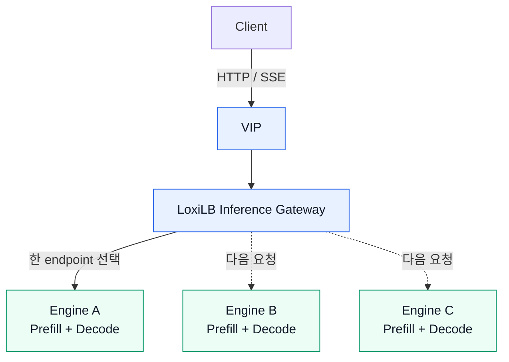

Converged 구성에서는 한 엔진 process가 prompt를 처리하는 **prefill**과 토큰을
생성하는 **decode**를 모두 수행한다. 요청 하나는 선택된 endpoint 한 곳에서 시작부터
끝까지 처리된다.

장점은 단순성이다. 별도 KV 전송망, 역할별 장애 처리, rendezvous가 필요 없다.
단점은 긴 prompt의 compute burst가 같은 GPU의 decode latency에 영향을 줄 수 있다는
점이다.

### 1.3 P/D disaggregation이란 무엇인가

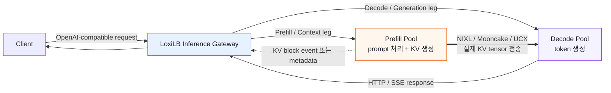

LLM 추론은 성격이 다른 두 단계로 나뉜다.

| 단계 | 하는 일 | 주요 병목 | 대표 지표 |
|---|---|---|---|
| **Prefill / Context** | prompt 전체를 병렬 처리하고 KV cache 생성 | GPU compute | TTFT |
| **Decode / Generation** | 이전 KV를 읽으며 한 번에 한 token 생성 | memory bandwidth | TPOT/ITL |

P/D 구성은 두 단계를 다른 worker pool로 분리한다.

Gateway는 **KV tensor 자체를 전송하지 않는다**. Gateway의 역할은 P/D endpoint를
선택하고 작은 rendezvous JSON을 양쪽 요청에 전달하는 것이다. 실제 KV byte는 NIXL,
Mooncake, UCX 등의 엔진 전송 backend가 endpoint 사이에서 옮긴다.

엔진별 orchestration은 서로 다르다.

- vLLM: prefill을 먼저 호출하고 응답에서 `kv_transfer_params`를 꺼낸 뒤 decode 호출
- SGLang: prefill과 decode를 동시에 호출하고 동일한
  `bootstrap_host`, `bootstrap_port`, `bootstrap_room`을 양쪽에 주입
- TensorRT-LLM: context를 먼저 호출하고 `disaggregated_params`를 generation에 전달
- llama.cpp: 이 형태를 제공하지 않음

### 1.4 KV cache-aware routing과 CHWBL의 차이

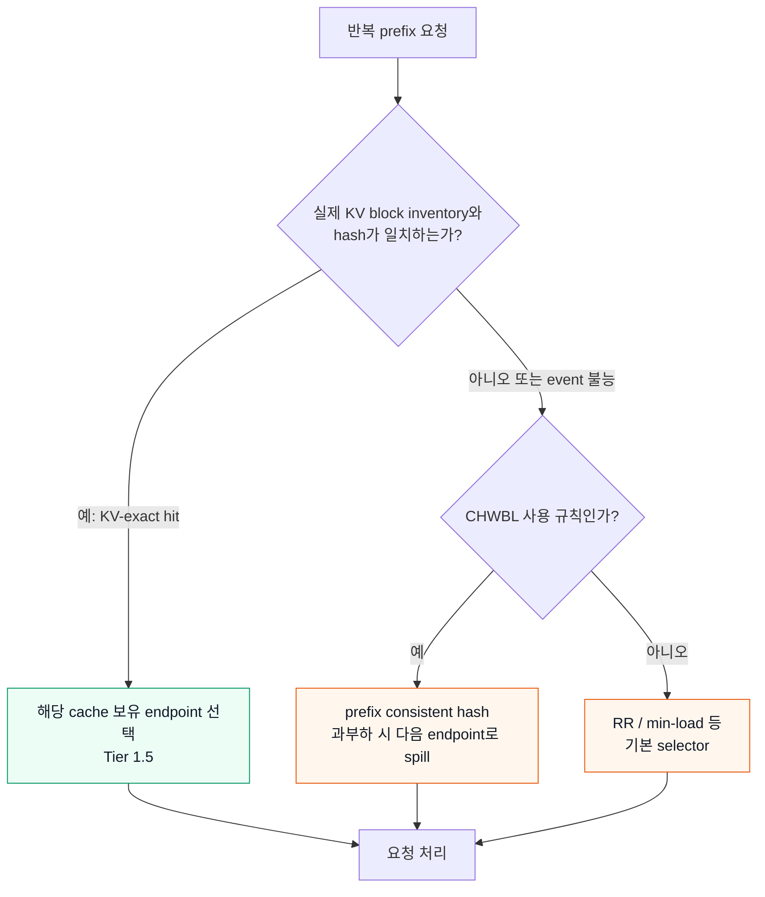

반복되는 긴 prefix가 endpoint A의 GPU cache에 있다면 후속 요청도 A로 보내는 것이
TTFT에 유리하다.

- **KV-exact / Tier 1.5:** 엔진이 알린 실제 cache block 목록과 요청의 block hash를
  비교한다. 정확하지만 tokenizer, block/page size, hash, event stream 계약이 모두
  맞아야 한다.
- **CHWBL (`sel: 8`):** model과 안정적인 prompt prefix를 consistent hash ring에
  매핑하고, endpoint가 과부하이면 다음 endpoint로 spill한다. 엔진의 실제 cache
  목록은 모르지만 event plane이 없는 llama.cpp와 KV-exact miss fallback에 유용하다.
- **RR (`sel: 0`):** cache locality를 고려하지 않는 baseline이다.

KV-exact는 장애 시 요청을 막지 않는다. tokenizer, event, hash 조건이 맞지 않으면
lower-tier selector로 **fail-open**한다. 따라서 요청 성공만 보고 KV 최적화가 동작한다고
판단하면 안 되고, 반드시 hit/inventory 메트릭을 확인해야 한다.

---

## 2. 공통 준비

### 2.1 예제 토폴로지

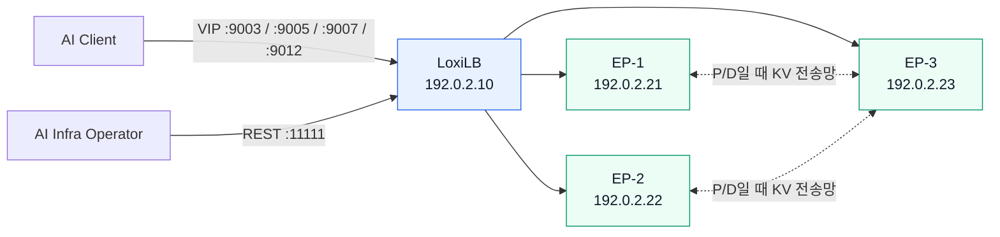

아래 주소는 문서용 주소다. 실제 관리망/GPU망 주소로 치환한다.

| 구성 요소 | 예제 주소 | 역할 |
|---|---|---|
| LoxiLB Gateway/VIP | `192.0.2.10` | REST `:11111`, client VIP는 엔진별 포트 사용 |
| Engine EP-1 | `192.0.2.21` | converged 또는 prefill/context |
| Engine EP-2 | `192.0.2.22` | converged 또는 prefill/context |
| Engine EP-3 | `192.0.2.23` | converged 또는 decode/generation |

P/D production 구성은 최소 1P+1D가 필요하다. 장애 허용을 원하면 최소 2P+2D를
권장한다. KV-aware 선택의 효과를 보려면 prefill/context endpoint가 2개 이상이어야
한다.

### 2.2 공통 사전 점검

1. 모든 엔진 image와 모델을 immutable tag/digest로 고정한다. `latest`를 운영 pin으로
   사용하지 않는다.
2. endpoint 간 KV 전송망이 필요한 P/D 구성은 양방향 route/firewall을 먼저 확인한다.
3. engine serving port, event port, bootstrap port가 실제로 listen하는지 확인한다.
4. Gateway fullproxy가 bind할 VIP는 Gateway node에 local address로 존재해야 한다.
5. 모든 L7/AI 규칙은 `mode: 4`를 사용한다.
6. SSE 요청을 위해 `sse_mode: true`를 사용하고 `/health` HTTP probe를 설정한다.
7. KV-exact를 사용할 때는 동일 규칙의 모든 endpoint가 같은 model, tokenizer,
   engine build, block/page size를 사용해야 한다.

예시 환경 변수:

```bash
export GW_REST='http://192.0.2.10:11111'
export GW_VIP='192.0.2.10'
export MODEL='Qwen/Qwen2.5-7B-Instruct'

# 인증을 사용하는 Gateway라면 실제 token을 shell history에 직접 쓰지 말고
# secret manager 또는 안전한 환경 주입으로 설정한다.
CURL_AUTH=()
if [[ -n "${LOXILB_TOKEN:-}" ]]; then
  CURL_AUTH=(-H "Authorization: Bearer ${LOXILB_TOKEN}")
fi
```

규칙 생성은 현재 구현과 가장 정확하게 대응하는 REST JSON을 기준으로 설명한다.
`loxicmd-inference-gateway`의 현재 checkout은 대부분의 KV/P/D 필드를 전달하지만
`pdBootstrapPort`를 노출하지 않고 도움말의 engine 목록도 vLLM/SGLang에 머물러 있다.
따라서 특히 SGLang P/D와 TensorRT-LLM/llama.cpp typed rule은 REST를 권장한다.

### 2.3 Gateway와 tokenizer 준비

Gateway는 고정된 release image를 privileged host-network 형태로 배포한다. 실제 운영
옵션과 volume은 조직의 배포 표준을 따른다.

```bash
docker run -d --name loxilb --restart unless-stopped \
  --privileged --network host \
  -v /etc/loxilb/tokenizers:/etc/loxilb/tokenizers:ro \
  <PINNED_GATEWAY_IMAGE> -p

curl -fsS "${GW_REST}/netlox/v1/metrics" >/dev/null
```

vLLM/SGLang/TensorRT-LLM에서 KV-exact를 사용할 때는 동일 model의 Hugging Face
`tokenizer.json`을 다음 위치에 둔다.

```text
/etc/loxilb/tokenizers/<model-id에서 /를 __로 바꾼 값>/tokenizer.json

예: Qwen/Qwen2.5-7B-Instruct
 -> /etc/loxilb/tokenizers/Qwen__Qwen2.5-7B-Instruct/tokenizer.json
```

llama.cpp CHWBL은 Gateway-side tokenization을 하지 않으므로 이 parity 조건이 없다.

### 2.4 규칙 생성과 확인의 공통 명령

아래 각 절의 JSON을 파일로 저장한 뒤 생성한다.

```bash
curl -fsS -X POST "${GW_REST}/netlox/v1/config/loadbalancer" \
  -H 'Content-Type: application/json' \
  "${CURL_AUTH[@]}" \
  --data-binary @rule.json

curl -fsS "${GW_REST}/netlox/v1/config/loadbalancer/all" \
  "${CURL_AUTH[@]}" | jq .
```

Gateway restart 직후 boot snapshot replay 중에는 변경 API가 `503`과
`Retry-After: 5`를 반환할 수 있다. 이때는 5초 후 재시도한다.

### 2.5 엔진 argument와 Gateway field를 읽는 방법

모든 엔진 argument가 Gateway field로 복제되는 것은 아니다. 설정값을 다음 세 종류로
나누면 튜닝 중 실수를 줄일 수 있다.

| 종류 | 의미 | 운영 규칙 | 예 |
|---|---|---|---|
| **계약값** | Gateway와 엔진이 같은 단위와 값을 사용해야 함 | 한쪽만 변경하면 안 됨. 엔진 read-back 후 rule 생성 | vLLM block size, SGLang page size, TRT `tokens_per_block` |
| **토폴로지값** | 엔진의 역할·포트와 Gateway endpoint 구성을 연결 | 실제 listen 주소와 role을 그대로 매핑 | serving port, P/D role, ZMQ/bootstrap port |
| **엔진 내부 성능값** | GPU memory, batch, concurrency, KV 전송 구현을 조절 | Gateway에 같은 이름의 값을 찾지 말고 엔진 메트릭으로 튜닝 | memory fraction, TP/DP, slots, cache RAM |

특히 `kvBlockSize`를 “Gateway가 엔진에 내려주는 값”으로 이해하면 안 된다. Gateway는
엔진의 block/page 크기를 변경하지 못한다. **엔진을 먼저 실행하고 유효값을 확인한 뒤,
Gateway가 같은 값으로 hash하도록 설정**하는 구조다.

권장 튜닝 순서는 다음과 같다.

1. image digest, model/tokenizer, serving port와 역할을 고정한다.
2. 엔진을 직접 호출해 health, context limit, block/page 크기와 event endpoint를 확인한다.
3. Gateway rule에 계약값과 토폴로지값만 정확하게 매핑한다.
4. cold→warm 동일-prefix 시험으로 routing correctness를 먼저 통과시킨다.
5. 그 후에만 memory fraction, concurrency, batch, cache capacity를 한 항목씩 변경한다.
6. 변경할 때마다 TTFT, TPOT/ITL, goodput, OOM, cache hit, endpoint load skew를 비교한다.

### 2.6 KV-exact hot-prefix CAP과 요청 분산

먼저 아래 두 장면만 이해하면 된다. 같은 prefix의 cache가 EP-A에 있으므로 처음에는
EP-A를 쓰지만, EP-A가 정해진 부하 한계에 도달하면 **그다음 요청부터** EP-B/EP-C로
보낸다.

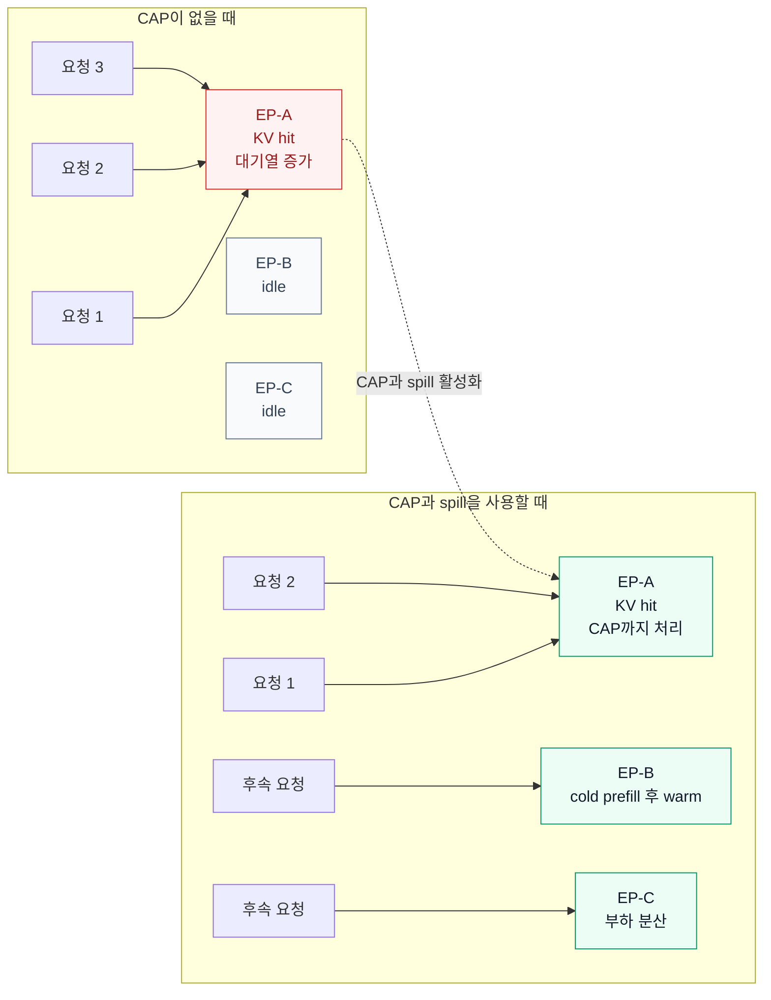

> **초급 운영자가 기억할 핵심:** 한 요청을 여러 GPU로 쪼개는 기능이 아니다. 요청 한
> 건은 endpoint 한 곳에서 처리하고, 같은 prefix를 가진 **여러 요청을 시간에 따라
> 나누어 보내는 기능**이다.

| 용어 | 쉬운 의미 |
|---|---|
| affinity winner | 요청 prefix의 KV block을 가장 많이 가진 endpoint |
| CAP | 한 endpoint가 affinity를 유지할 수 있는 부하 한계 |
| spill | CAP에 도달한 endpoint 대신 다른 endpoint로 후속 요청을 보내는 것 |
| cold endpoint | 아직 해당 prefix의 KV block이 거의 없는 endpoint |

다음 그림은 Gateway 내부에서 이 결정이 이루어지는 순서다.

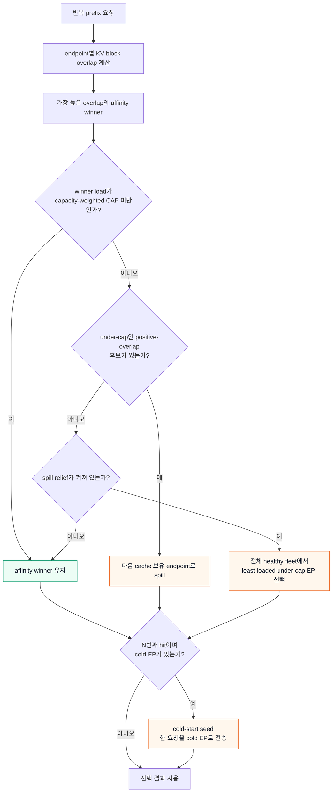

#### 2.6.1 CAP 계산과 `mean load factor`

`hard` 모드는 각 endpoint의 CAP을 다음과 같이 계산한다.

```text
cap_i = ceil(
  mean_load_factor / 100
  × total_load
  × capacity_i / total_capacity
)
```

| 항목 | 의미 |
|---|---|
| `total_load` | 후보 endpoint들의 Gateway 관측 active connection 합계 |
| `capacity_i` | endpoint가 광고한 KV block capacity. 0/미제공 값은 최소 양수 weight로 보정 |
| `total_capacity` | 후보 endpoint들의 보정된 capacity 합계 |
| `mean_load_factor` | capacity-fair share를 얼마나 초과해도 affinity를 유지할지 정하는 백분율 |

동일 용량 endpoint 2개, 전체 load가 8이라고 가정하면 다음과 같다.

| `LOXILB_KV_MEAN_LOAD_FACTOR` | endpoint당 CAP | affinity EP load가 5일 때 |
|---:|---:|---|
| `175` | `ceil(1.75 × 8 ÷ 2) = 7` | CAP 미만이므로 cache affinity 유지 |
| `120` | `ceil(1.20 × 8 ÷ 2) = 5` | CAP 도달이므로 다른 under-cap EP로 spill |
| `100` | `ceil(1.00 × 8 ÷ 2) = 4` | 더 일찍 spill하여 분산 우선 |

수식을 외울 필요는 없다. factor 120인 위 예제의 실제 판단은 다음 그림처럼 단순하다.

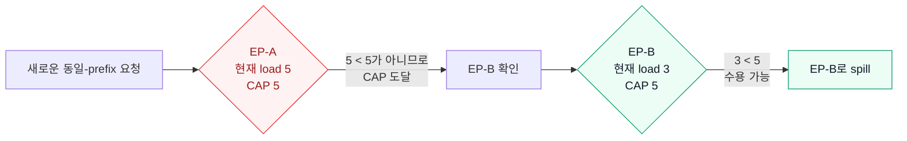

값을 낮추면 tail latency와 endpoint 균형을 우선하고, 높이면 cache locality를 더 오래
유지한다. 허용 범위는 100~1000이고 기본값은 175다. `hard` 모드에서 load가 CAP과
**같아도** under-cap 후보에서 제외된다.

#### 2.6.2 일반 spill, fleet spill relief, cold-start seed의 차이

일반 spill과 spill relief의 차이는 “Gateway가 어느 endpoint까지 후보로 보는가”다.

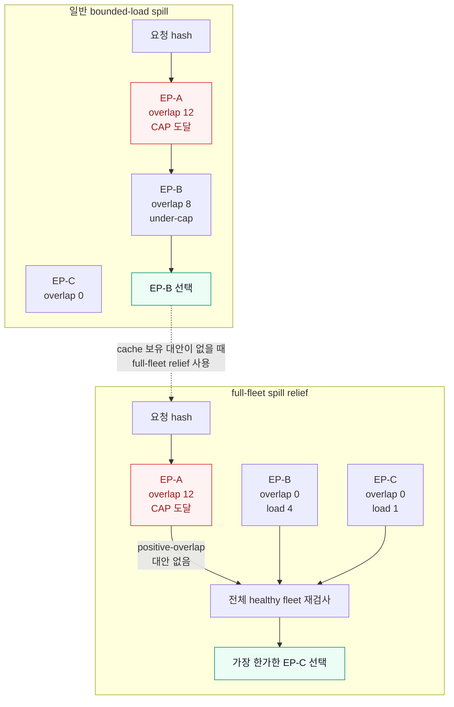

기본 CAP selector의 1차 후보는 `overlap > 0`인 endpoint다. 여러 endpoint가 해당 prefix
block을 가지고 있으면 affinity winner가 CAP에 도달했을 때 다음 cache 보유 endpoint로
자연스럽게 spill한다.

반면 hot prefix가 EP-A에만 있고 EP-B/EP-C는 overlap 0이면 1차 후보 집합이 EP-A 하나가
된다. 이 singleton 집합은 자기 load만으로 CAP을 계산하므로 EP-A에서 벗어나지 못할 수
있다. `LOXILB_KV_SPILL_RELIEF=1`은 이 경우 전체 healthy fleet을 다시 보고, EP-A가
fleet-wide CAP에 도달했으면 가장 부하가 낮은 under-cap endpoint로 요청을 보낸다. 해당
요청은 cold prefill을 다시 계산하지만 긴 queue에 계속 고정되는 상황을 피한다.

현재 미설정 시 동작은 topology별로 다르다.

| topology | `LOXILB_KV_SPILL_RELIEF` 미설정 시 | 운영 권장 |
|---|---|---|
| `kvExactMode: 3` converged/single-role | 자동 ON | 재현 가능한 manifest를 위해 `1` 명시 |
| `kvExactMode: 1` P/D | 자동 OFF | hot-prefix 분산이 필요하면 반드시 `1` 명시 |

CAP spill은 부하가 올라야 발생한다. 낮은 동시성에서는 cache inventory가 비어 있는 새
endpoint가 계속 overlap 0이라 영원히 선택되지 않을 수 있다. 이를 막는 별도 기능이
**cold-start seed**다.

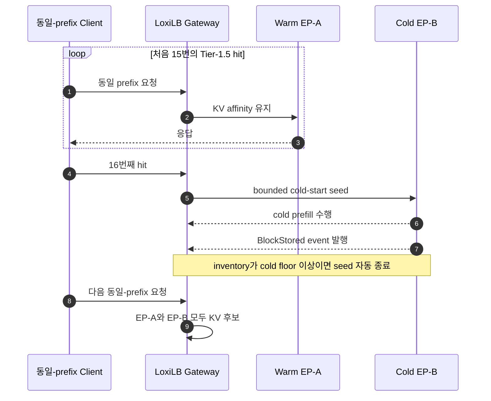

- `LOXILB_KV_COLDSTART_SEED_N=16`: Tier-1.5 hit 16회마다 한 요청을 cold endpoint로 전송
- `LOXILB_KV_COLDSTART_MIN_BLOCKS=16`: inventory가 16 block 미만이면 cold로 판정
- seed 요청이 block을 채워 floor 이상이 되면 diversion이 자동 종료
- `SEED_N=0`은 기능을 끄며 비교 시험 이외에는 권장하지 않음

따라서 spill relief는 **고부하 hotspot 해소**, cold-start seed는 **저부하에서 신규/복구
endpoint 재가열**을 담당한다.

#### 2.6.3 Gateway container 설정 예시

이 값들은 REST rule field가 아니라 Gateway process 환경 변수다. 시작 시 읽고, 현재는
모든 KV-exact VIP에 공통 적용된다. 서로 다른 VIP마다 다른 factor를 설정할 수 없으므로
production에서는 명시적인 공통 profile을 선택하고 container를 재생성한다.

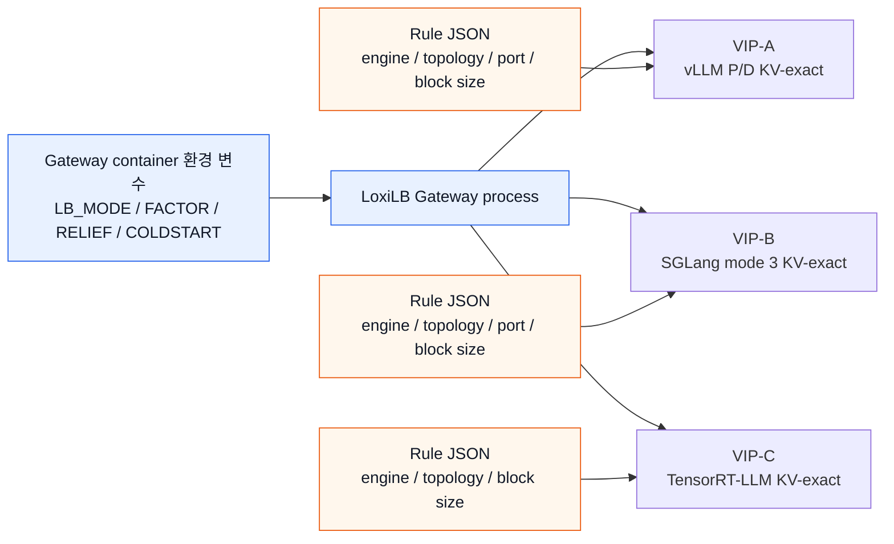

그림의 파란 경로는 **Gateway 전체에 한 번 설정**하고, 주황색 rule은 **VIP마다 별도로
설정**한다. `LOXILB_KV_MEAN_LOAD_FACTOR`를 rule JSON 안에 넣어도 적용되지 않는다.

일반적인 load-balance 우선 profile:

```yaml
services:
  loxilb:
    environment:
      LOXILB_KV_LB_MODE: "hard"
      LOXILB_KV_MEAN_LOAD_FACTOR: "120"
      LOXILB_KV_SPILL_RELIEF: "1"
      LOXILB_KV_TLOAD_LOG: "1"
      LOXILB_KV_COLDSTART_SEED_N: "16"
      LOXILB_KV_COLDSTART_MIN_BLOCKS: "16"
      LOXILB_KV_MAX_BLOCKS: "1000000"
```

동일한 `docker run` 형태:

```bash
docker run -d --name loxilb \
  -e LOXILB_KV_LB_MODE=hard \
  -e LOXILB_KV_MEAN_LOAD_FACTOR=120 \
  -e LOXILB_KV_SPILL_RELIEF=1 \
  -e LOXILB_KV_TLOAD_LOG=1 \
  -e LOXILB_KV_COLDSTART_SEED_N=16 \
  -e LOXILB_KV_COLDSTART_MIN_BLOCKS=16 \
  -e LOXILB_KV_MAX_BLOCKS=1000000 \
  <나머지 Gateway option> <PINNED_LOXILB_IMAGE>
```

rule에서는 기존 KV-exact topology를 그대로 설정한다. CAP 자체를 rule JSON에 중복해서
넣지 않는다.

Converged/single-role 예:

```json
{
  "sel": 8,
  "mode": 4,
  "kvEngineType": "sglang",
  "kvExactMode": 3,
  "kvZmqPort": 5561,
  "kvDpRankCount": 3,
  "kvBlockSize": 64
}
```

P/D 예:

```json
{
  "sel": 0,
  "mode": 4,
  "pd_disagg_mode": true,
  "kvEngineType": "vllm",
  "kvExactMode": 1,
  "kvZmqPort": 5557,
  "kvBlockSize": 16
}
```

위 JSON은 각 플랫폼의 전체 `serviceArguments` 안에 넣을 핵심 fragment다. endpoint role,
health probe, SSE 등은 §3~§5의 완전한 rule 예제를 함께 적용한다.

#### 2.6.4 mode와 튜닝 profile 선택

초급 운영자는 아래 순서로 시작하면 된다.

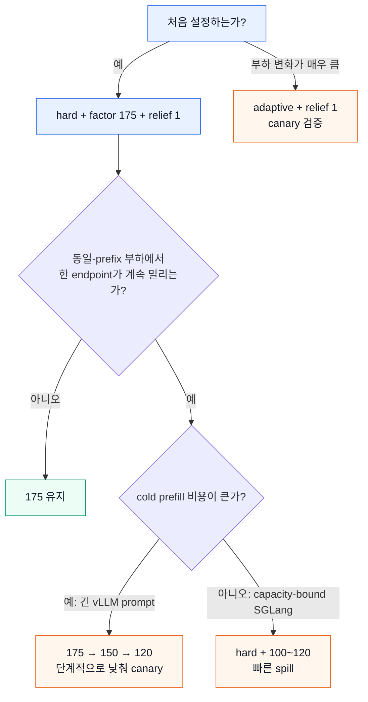

| 환경 | 권장 process 설정 | 기대 동작 |
|---|---|---|
| 처음 시작/혼합 workload | `LB_MODE=hard`, factor `175`, relief `1` | locality와 분산의 보수적 균형 |
| SGLang capacity-bound saturation | `LB_MODE=hard`, factor `100~120`, relief `1` | mean load 부근에서 빠르게 spill |
| cache hit가 latency보다 중요한 batch | `LB_MODE=hard`, factor `250~300` canary | affinity를 오래 유지하되 hotspot 위험 관찰 |
| 시간대별 부하 변동이 큼 | `LB_MODE=adaptive`, relief `1` | 관측 load에 따라 factor를 조정 |
| 연속 비용함수 기반 실험 | `LB_MODE=soft`, `LOXILB_KV_LOAD_PENALTY` 조정 | cache miss 비용과 load penalty를 함께 최소화 |
| legacy 비교 시험 | `LB_MODE=off`, `COLDSTART_SEED_N=0` | 순수 overlap argmax. production 비권장 |

SGLang 내부 GPU 검증에서는 작은 model의 saturation-heavy 조건에서 `hard`, factor
100~120, spill relief ON이 가장 균형 있게 분산됐다. 이는 특정 검증 fleet 결과이므로
다른 GPU/model에서도 canary로 확인한다. vLLM P/D처럼 prefill recompute 비용이 큰
환경은 175에서 시작해 낮추는 편이 안전하다.

#### 2.6.5 더 강한 P/D load guard

P/D `kvExactMode: 1`에는 CAP blend보다 거친 hard bypass도 있다.

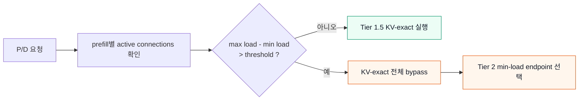

```yaml
environment:
  LLB_KV_LOADGUARD: "1"
```

```json
{
  "pd_balance_abs_threshold": 3
}
```

eligible prefill의 `max active connections - min active connections > 3`이면 Tier-1.5
KV-exact를 실행하지 않고 Tier-2 min-load로 바로 내려간다. 이 동작은 spill이 아니라
**KV-exact 전체 bypass**이므로 `tier15_fallthrough_total`로 관측한다. mode 3에는 적용되지
않는다. 일반 운영에서는 bounded-load CAP과 spill relief를 먼저 사용하고, 극단적인 P/D
불균형을 빠르게 차단해야 할 때만 load guard를 추가한다.

`pd_cache_threshold`는 Tier-1 heuristic prefix match 비율이고 KV-exact CAP이 아니다.
`pd_balance_abs_threshold`도 `LLB_KV_LOADGUARD=1`이 없으면 Tier-1.5 CAP factor를 바꾸지
않는다.

#### 2.6.6 검증 절차와 판정

검증은 “붙는지 → 분산되는지 → 다시 따뜻해지는지” 세 단계로 진행한다.

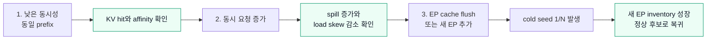

1. 동일한 긴 prefix로 낮은 동시성 요청을 보내 affinity hit를 먼저 확인한다.
2. 같은 prefix의 동시 요청을 늘려 affinity endpoint가 CAP에 도달하게 한다.
3. `tier15_spills_total` 증가와 endpoint별 요청 분산을 확인한다.
4. endpoint 하나의 cache를 비우거나 새 endpoint를 추가한 뒤 cold-seed counter를 본다.
5. 설정 전후 P95/P99 TTFT, active connection skew, cache hit율을 함께 비교한다.

```bash
curl -fsS "${GW_REST}/netlox/v1/metrics" | grep -E \
  'loxilb_pd_kv_tier15_(hits|spills|fallthrough|cold_seeds)_total'

docker logs loxilb 2>&1 | grep -E \
  'KV_INV|KV_COLDSEED|LB mode|pressure-relief|totalLoad'
```

| 관측 결과 | 해석 |
|---|---|
| hit만 증가하고 load skew가 허용 범위 | affinity가 CAP 미만에서 정상 유지됨 |
| `spills_total` 증가 + load skew/TTFT 감소 | bounded-load 또는 spill relief가 정상 작동 |
| P/D에서 spill이 전혀 없고 한 prefill만 과부하 | `SPILL_RELIEF=1`, factor, 실제 active load 신호 확인 |
| `cold_seeds_total` 증가 후 cold EP inventory 성장 | 신규/복구 endpoint 재가열 정상 |
| `fallthrough_total` 증가 | load guard 또는 KV miss guard가 Tier-2로 bypass |
| inventory cap eviction 증가 | routing CAP 문제가 아니라 `MAX_BLOCKS`/publisher event 문제 |

마지막으로 이름이 비슷한 설정을 구분한다.

| 설정 | 실제 대상 |
|---|---|
| `LOXILB_KV_MEAN_LOAD_FACTOR` | Tier-1.5 KV-exact traffic CAP |
| `LOXILB_KV_SPILL_RELIEF` | zero-overlap endpoint까지 포함한 hot-prefix pressure relief |
| `LOXILB_KV_COLDSTART_*` | 저부하에서 cold endpoint를 제한적으로 재가열 |
| `LOXILB_KV_MAX_BLOCKS` | Gateway per-endpoint inventory 메모리 CAP. traffic 분산값이 아님 |
| `chwbl_mean_load_factor` | `sel: 8/10` CHWBL selector CAP. Tier-1.5 process CAP과 별도 |
| `pd_cache_threshold` | Tier-1 heuristic prefix match threshold |

### 2.7 이기종 GPU endpoint: 서로 다른 서버도 자동으로 균형을 맞출 수 있는가

결론부터 말하면 **부분적으로 가능하다.** 다만 “GPU 모델 이름만 보고 Gateway가 모든
플랫폼을 무설정으로 자동 튜닝한다”는 의미는 아니다. 현재 구현은 다음 신호를 조합한다.

1. 모든 endpoint에 공통인 health, circuit breaker, Gateway 관측 active connection
2. P/D rule에서 엔진 `/metrics`로 읽는 queue와 KV pressure
   (현재 request selector가 직접 소비하는 핵심 동적 신호는 queue)
3. vLLM이 광고하는 `num_gpu_blocks` capacity
4. KV-exact의 capacity-weighted CAP
5. 운영자가 benchmark 결과로 설정한 endpoint weight

먼저 균등 RR과 이기종-aware 배분의 차이를 그림으로 보자.

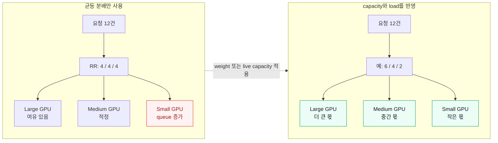

> **정확한 표현:** LoxiLB는 관측 가능한 capacity와 load를 이용해 **요청 단위로** 더
> 적합한 endpoint를 고른다. 하나의 요청을 여러 GPU 서버에 쪼개 실행하거나, 엔진의
> tensor parallel 구성을 자동 변경하는 기능은 아니다.

#### 2.7.1 같은 VIP에 묶어도 되는 “이기종”의 범위

GPU 종류, HBM 용량, GPU 수, TP/DP 구성은 달라도 다음 serving 계약은 같아야 한다.

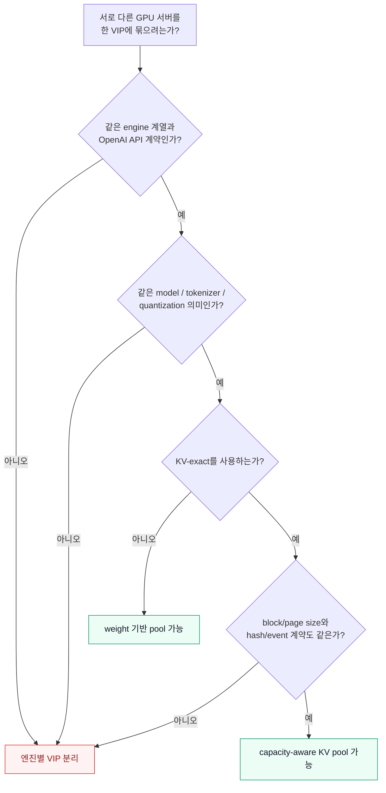

| 함께 달라도 되는 항목 | 같은 VIP에서 같아야 하는 항목 |
|---|---|
| GPU model과 HBM 크기 | API 및 engine dialect |
| GPU 개수, TP/DP 크기 | model과 tokenizer의 의미 |
| engine concurrency와 KV capacity | KV-exact 사용 시 block/page size, hash algo, event contract |
| 서버별 sustainable throughput | P/D 사용 시 endpoint role과 side-channel 계약 |

예를 들어 같은 vLLM model을 L40S 1장 서버와 L4 1장 서버에 올리고 서로 다른
`num_gpu_blocks`를 갖는 것은 정상적인 이기종 구성이다. 반면 vLLM, SGLang,
TensorRT-LLM을 **한 VIP의 endpoint로 혼합**하지 않는다. 이 매뉴얼처럼 엔진별 VIP를
만들어야 `kvEngineType`과 request rewrite 계약이 명확해진다.

#### 2.7.2 어떤 기능이 무엇을 자동화하는가

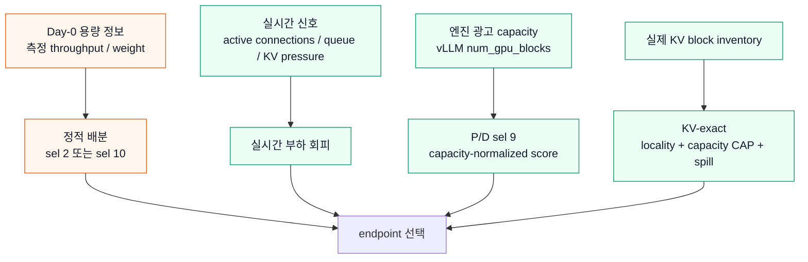

| 기능 | 자동으로 아는 것 | 운영자가 해야 할 일 | 중요한 한계 |
|---|---|---|---|
| health + circuit breaker | endpoint 장애와 연속 origin 오류 | probe와 breaker 설정 | 장애 회피이며 성능 비율 계산은 아님 |
| `sel: 2` WRR | 설정된 endpoint weight | 서버별 weight 측정·입력 | 실시간 GPU load에 따라 weight를 다시 계산하지 않음 |
| `sel: 10` WRR-hash | weight 비례 hash-ring 배치 | weight와 prefix hash 설정 | 같은 hot prefix는 locality 우선으로 한 endpoint에 집중될 수 있음 |
| P/D Tier-2 기본 | `active_conns + queued_requests` | P/D와 metrics 노출 설정 | capacity가 없으면 큰 GPU와 작은 GPU를 같은 단위로 비교 |
| P/D `sel: 9` | live load를 `num_gpu_blocks` capacity로 정규화 | fullproxy P/D, compatible metrics 확인 | **single-pool `sel:9`에는 이 capacity score가 적용되지 않음** |
| KV-exact `hard` | KV overlap, live load, advertised capacity | KV contract와 CAP profile 설정 | capacity 0/미제공은 1로 보정되어 endpoint들이 사실상 동등 capacity |

따라서 자동화 수준을 다음처럼 이해하는 것이 안전하다.

- **자동 장애 회피:** 모든 플랫폼에서 가능하다.
- **정적 이기종 분배:** 모든 플랫폼의 converged pool에서 `sel:2` 또는 `sel:10`으로
  가능하다.
- **실시간 queue-aware 분배:** vLLM과 SGLang P/D에서 엔진 metric family가 정상 노출되면
  가능하다.
- **실시간 capacity-aware 분배:** 현재 가장 완전한 경로는 `num_gpu_blocks`를 제공하는
  **vLLM P/D + `sel:9`**다.
- **완전 무설정 자동 최적화:** 지원한다고 보아서는 안 된다. model별 benchmark와 canary
  검증이 필요하다.

#### 2.7.3 플랫폼별 이기종 지원 수준

| 플랫폼 / 모드 | Gateway가 자동으로 읽는 live 신호 | capacity 신호 | 권장 이기종 방식 | 현재 주의점 |
|---|---|---|---|---|
| vLLM P/D | active connections, `vllm:num_requests_waiting`; KV usage도 cache에 기록 | `vllm:cache_config_info{num_gpu_blocks}` | `sel:9` + 필요 시 KV-exact `hard`/spill | prefill은 capacity-aware지만 decode 선택은 min-load이며 capacity-weighted가 아님 |
| vLLM converged | Gateway active connections | built-in P/D scraper가 이 경로에서는 시작되지 않음 | `sel:2` 정적 WRR 또는 `sel:10` weighted affinity | converged `sel:9`를 GPU capacity auto mode로 오해하지 말 것 |
| SGLang P/D | active connections, `sglang:num_queue_reqs`; token usage도 cache에 기록 | `num_gpu_blocks` 동등 신호 없음 | role pool을 신중히 구성하고 live queue 분산 사용 | `sel:9`를 켜도 capacity는 0→1 floor라 GPU 크기 비율이 자동 복원되지 않음 |
| SGLang converged | Gateway active connections | 자동 capacity 없음 | benchmark 기반 `sel:2`; locality 필요 시 `sel:10` | DP rank count는 event fan-out이며 서버 capacity weight가 아님 |
| TensorRT-LLM P/D | Gateway active connections | built-in narrow scraper가 TRT metric을 capacity로 변환하지 않음 | 역할별 동급 pool 또는 별도 VIP; canary로 확인 | `/metrics`와 `/perf_metrics` 일부는 drain-on-read이므로 일반 scraper로 사용 금지 |
| TensorRT-LLM converged | Gateway active connections | 자동 capacity 없음 | benchmark 기반 `sel:2`/`sel:10` | `tokens_per_block`은 hash 계약값이지 traffic weight가 아님 |
| llama.cpp converged | Gateway active connections, health | `/props`의 slot 차이는 경고만 함 | measured goodput 기반 `sel:2`; prefix 다양성이 크면 `sel:10` | P/D와 KV-exact가 없고 `/props` probe가 weight를 자동 수정하지 않음 |

`kvDpRankCount`, TP size, `--parallel-size`, `--tp-size`, llama.cpp `--parallel` 같은
엔진 argument를 Gateway weight로 그대로 복사하면 안 된다. 이 값들은 concurrency와
capacity에 영향을 주는 **원인**이고, weight는 동일 workload에서 관측한 sustainable
goodput이라는 **결과**를 비율로 표현하는 값이다.

#### 2.7.4 가장 단순하고 예측 가능한 방법: 정적 WRR weight

이기종 pool을 처음 도입할 때는 동일한 대표 workload를 endpoint에 직접 보내고, 목표
SLO를 지키는 최대 goodput을 측정한다.

| endpoint | 예시 GPU | SLO 내 측정 goodput | 초기 weight |
|---|---|---:|---:|
| EP-A | Large | 40 req/min | 4 |
| EP-B | Medium | 20 req/min | 2 |
| EP-C | Small | 10 req/min | 1 |

VRAM이 2배라고 반드시 throughput이 2배는 아니다. prompt 길이, quantization, TP 통신,
batching과 decode 길이가 모두 영향을 주므로 **GPU 사양표가 아니라 같은 payload의
측정값**으로 4:2:1을 만든다.

아래 `sel:2` 규칙은 engine에 관계없이 요청 수를 대략 4:2:1로 분배하는 가장 단순한
출발점이다.

```json
{
  "serviceArguments": {
    "externalIP": "192.0.2.10",
    "port": 9020,
    "protocol": "tcp",
    "sel": 2,
    "mode": 4,
    "security": 0,
    "host": "",
    "sse_mode": true,
    "monitor": true,
    "cb_enable": true,
    "probetype": "http",
    "probeport": 8000,
    "probereq": "/health"
  },
  "endpoints": [
    {"endpointIP":"192.0.2.21","targetPort":8000,"weight":4},
    {"endpointIP":"192.0.2.22","targetPort":8000,"weight":2},
    {"endpointIP":"192.0.2.23","targetPort":8000,"weight":1}
  ]
}
```

엔진별로 `kvEngineType`, health path와 port는 §3~§6의 예제에 맞춘다. `sel:2`는 cache
locality보다 **예측 가능한 용량 비율**을 우선한다.

prefix affinity도 필요하면 `sel:10`을 사용한다.

```json
{
  "sel": 10,
  "mode": 4,
  "chwbl_prefix_hash_level": 1,
  "chwbl_prefix_hash_flags": 0,
  "chwbl_mean_load_factor": 175,
  "chwbl_replication": 100
}
```

endpoint의 4:2:1 weight가 hash ring의 virtual-node 비율에 반영되어 **서로 다른 prefix
집합 전체**는 큰 GPU가 더 많이 맡는다. 하지만 prefix hash가 존재하는 현재 WRR-hash
경로는 locality를 우선하므로, 하나의 매우 뜨거운 prefix가 자동으로 4:2:1로 쪼개진다고
가정하면 안 된다. 이런 workload는 다음 중 하나를 선택한다.

- vLLM/SGLang/TRT-LLM의 KV-exact 가능 구성: §2.6의 CAP + spill relief 사용
- llama.cpp 또는 KV-exact 미사용: hot-prefix 분산이 더 중요하면 `sel:2` 사용
- affinity가 더 중요함: `sel:10` 유지하되 endpoint queue와 P95/P99 TTFT를 경보로 감시

#### 2.7.5 vLLM P/D에서 live capacity를 자동 반영하는 예

P/D rule의 selector를 `sel:9`로 설정하면 Tier-2 prefill scorer가 활성화된다.

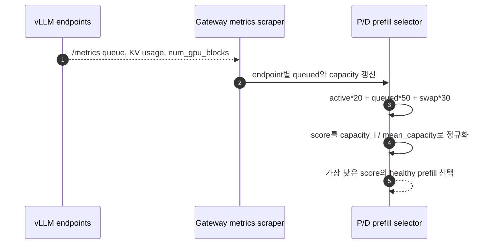

§3.2의 vLLM P/D rule에서 다음처럼 `sel`만 바꾼다.

```json
{
  "sel": 9,
  "mode": 4,
  "pd_disagg_mode": true,
  "kvEngineType": "vllm",
  "kvExactMode": 1,
  "kvBlockSize": 16,
  "kvZmqPort": 5557
}
```

예를 들어 두 prefill의 capacity가 8,000과 4,000 block이고 현재 전체 load가 12,
`LOXILB_KV_MEAN_LOAD_FACTOR=120`이면 KV-exact CAP은 다음처럼 계산된다.

| endpoint | capacity share | 계산된 CAP |
|---|---:|---:|
| Large EP | 8,000 / 12,000 | `ceil(1.2 × 12 × 8000 / 12000) = 10` |
| Small EP | 4,000 / 12,000 | `ceil(1.2 × 12 × 4000 / 12000) = 5` |

큰 endpoint가 더 많은 동시 요청을 받아도 capacity당 부하는 공정하게 유지된다. 이
`num_gpu_blocks` 값은 rule JSON의 endpoint `weight`에서 가져오는 것이 아니라 vLLM
`/metrics`에서 읽는다. vLLM memory 설정이나 TP를 바꾸면 capacity도 바뀔 수 있으므로
재배포 후 반드시 read-back한다.

`num_gpu_blocks`는 **KV memory 수용량**이지 GPU의 실제 tokens/s 처리량은 아니다. HBM이
큰 endpoint에 적합한 신호이지만, compute 성능·memory bandwidth·TP 통신 차이까지 완전히
표현하지는 않는다. 따라서 `sel:9`도 “자동 최적화의 좋은 기준선”이지 benchmark를
대체하는 oracle은 아니다.

주의할 점은 세 가지다.

1. `sel:9` capacity score는 **P/D Tier-2 prefill** 경로에서만 동작한다.
2. P/D decode endpoint는 현재 `active_conns + queued` min-load로 선택하므로, decode pool의
   GPU 차이가 매우 크면 자동 capacity 비례를 기대하지 않는다.
3. `LLB_PD_MAX_INFLIGHT_PER_EP`는 endpoint마다 다른 값이 아니라 process-wide 동일 cap이다.
   이를 이기종 capacity weight로 사용하지 않는다.

따라서 초급 운영자에게는 **prefill pool은 이기종 `sel:9`**, decode pool은 가능한 한
비슷한 성능으로 구성하는 topology가 가장 이해하기 쉽다.

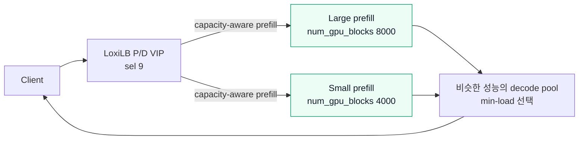

#### 2.7.6 단계별 도입과 검증

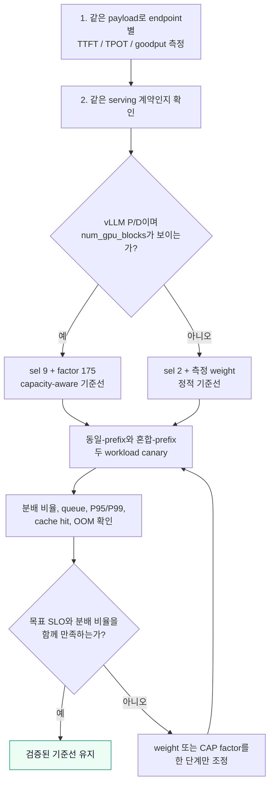

검증 시 평균 latency 하나만 보면 안 된다.

1. 각 endpoint를 직접 호출해 같은 prompt/input-output token 길이에서 goodput과 OOM
   한계를 측정한다.
2. Gateway를 통과시켜 endpoint별 request count가 기대 비율에 근접하는지 본다.
3. P95/P99 TTFT와 TPOT, active/queued skew, KV hit/spill을 함께 비교한다.
4. 큰 endpoint 하나를 중지해 health/CB가 즉시 제외하고 나머지가 감당하는지 확인한다.
5. 작은 endpoint를 과부하시켜 새 요청이 다른 endpoint로 이동하는지 확인한다.
6. model, quantization, TP/DP, memory fraction을 바꿀 때마다 weight와 capacity를 다시
   측정한다.

```bash
# P/D 엔진 metric 계약 확인
curl -fsS http://192.0.2.21:8000/metrics | grep -E \
  'vllm:(num_requests_waiting|kv_cache_usage_perc|cache_config_info)|sglang:(num_queue_reqs|token_usage)'

# Gateway가 보유한 최근 worker metric 확인
curl -fsS "${GW_REST}/netlox/v1/config/worker/metrics" \
  "${CURL_AUTH[@]}" | jq .
```

| 증상 | 원인 후보 | 조치 |
|---|---|---|
| 큰 GPU와 작은 GPU가 거의 1:1 | RR 사용 또는 capacity가 모두 0→1로 보정 | converged는 `sel:2` weight, vLLM P/D는 `sel:9`와 `num_gpu_blocks` 확인 |
| `sel:9`인데 converged pool이 capacity 비례가 아님 | single-pool `sel:9`는 capacity scorer가 아님 | `sel:2`/`sel:10`, 또는 P/D topology 선택 |
| SGLang P/D에서 queue는 분산되지만 GPU 크기 비율은 아님 | SGLang metric에는 queue/usage는 있으나 vLLM식 block capacity가 없음 | 역할별 동급 pool, converged WRR, 별도 VIP 중 선택 |
| llama.cpp slot 차이 경고 후에도 traffic이 그대로 | `/props` probe는 advisory이며 weight 수정 기능이 아님 | 측정 goodput으로 endpoint weight 설정 |
| endpoint는 healthy인데 tail latency가 나쁨 | health는 성능 포화도를 판정하지 않음 | queue/TTFT 경보와 CAP/weight 재튜닝 |

운영 원칙은 간단하다. **자동화가 소비하는 신호가 실제로 존재하는지 먼저 확인하고,
없는 신호는 측정 기반 weight나 topology 분리로 명시적으로 보완한다.** 이 원칙을 지키면
동일 GPU만 있는 환경보다 복잡하지만, 서로 다른 GPU 자원을 낭비하지 않고 안전하게 한
서비스 pool로 사용할 수 있다.

---

## 3. vLLM 운영 절차

### 3.1 어떤 형태를 선택할까

- 빠른 시작/단순 운영: converged vLLM + CHWBL
- 긴 prompt가 decode latency를 방해하거나 P/D pool을 독립 증설해야 함:
  vLLM P/D + KV-exact
- 현재 production evidence가 가장 강한 KV-exact 형태는 P/D `kvExactMode: 1`이다.

### 3.2 vLLM 고유 arguments와 P/D 예제

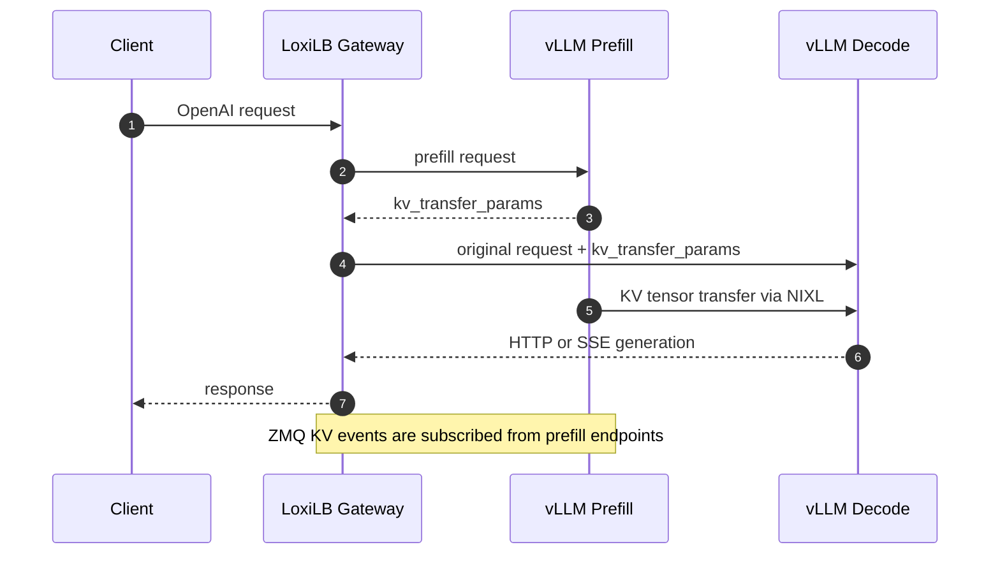

#### 3.2.1 Gateway와 반드시 맞춰야 하는 vLLM arguments

| vLLM argument / 환경 변수 | 개념 | LoxiLB 설정 | 값 결정과 오류 증상 |
|---|---|---|---|
| `--model` | endpoint가 실제로 load하고 요청에서 사용할 model ID | tokenizer 경로와 필요 시 `model_name` | 모든 P/D endpoint와 Gateway tokenizer가 같은 model이어야 한다. `model_name`은 엔진을 load하는 값이 아니라 요청의 `model`별 pool 선택 키다. |
| `--host 0.0.0.0` | Gateway가 접속할 serving socket bind | `endpoints[].endpointIP` | localhost bind이면 container 내부 health는 정상이어도 Gateway는 연결하지 못한다. |
| `--port N` | OpenAI HTTP/SSE serving port | `targetPort:N`, `probeport:N` | role별 port가 다르면 endpoint의 `targetPort`에는 각각의 값을 넣는다. rule-global `probeport`는 한 값뿐이라는 점에 주의한다. |
| `--block-size N` | prefix cache와 event hash의 token block 크기 | `kvBlockSize:N` | 반드시 동일해야 한다. 다르면 subscriber와 inventory가 살아 있어도 모든 KV-exact lookup이 miss한다. |
| `--prefix-caching-hash-algo sha256_cbor` | vLLM이 block chain을 hash하는 직렬화 계약 | `kvEngineType:"vllm"`; `kvHashAlgo`는 생략하거나 `sha256_cbor` | vLLM 기본 hash를 그대로 쓰면 Gateway CBOR hash와 교집합이 0이 될 수 있다. 명시값을 바꾸면 양쪽을 함께 변경한다. |
| `PYTHONHASHSEED=0` | 첫 block의 parent인 vLLM `NONE_HASH`를 결정적으로 고정 | Gateway process `LLB_KV_NONE_HASH_SEED=0` | 둘 중 하나라도 다르면 첫 block부터 chain이 달라져 hit가 0으로 고정된다. |
| `--kv-events-config ... tcp://*:5557` | prefill cache의 store/remove event를 ZMQ PUB으로 발행 | `kvZmqPort:5557`, `kvWarmupSec:30` | P/D에서는 prefill에만 설정한다. `*`로 bind하고 방화벽을 연다. publisher가 없으면 `loxilb_pd_kv_blocks=0`이다. |
| `--kv-transfer-config`의 `kv_role` | 이 process가 KV producer인지 consumer인지 표시 | producer=`ep_role:1`, consumer=`ep_role:2`, `pd_disagg_mode:true` | Gateway가 실제 role을 추측하지 않는다. role이 뒤바뀌면 prefill 응답 또는 decode KV load가 실패한다. |
| `VLLM_NIXL_SIDE_CHANNEL_HOST` | peer가 KV metadata/data plane에 접속할 node 주소 | 보통 같은 endpoint의 `endpointIP` | `0.0.0.0`이 아니라 peer가 실제로 route 가능한 주소를 넣는다. |
| `VLLM_NIXL_SIDE_CHANNEL_PORT` | vLLM NIXL side-channel listen port | `endpoints[].nixl_port` | harness 기준 `5600`. `nixl_port:0`/생략은 `targetPort` fallback이므로 serving port와 side-channel port가 다르면 반드시 명시한다. |

`kv_transfer_config` 안의 다음 값들은 Gateway field가 아니다.

- `kv_connector:"NixlConnector"`: 실제 KV byte mover 선택
- `kv_buffer_device:"cpu"`: RDMA/GDRcopy가 없는 TCP 환경에서 host staging 사용
- `kv_load_failure_policy:"fail"`: KV load 실패를 숨기지 않고 요청 실패로 표면화
- `UCX_TLS`, `UCX_NET_DEVICES`: NIXL이 사용할 network transport/device 선택

Gateway는 이 값을 전달하거나 검증하지 않는다. 예를 들어 일반 Ethernet 환경은 검증된
`UCX_TLS=tcp`, `kv_buffer_device:"cpu"`에서 시작할 수 있지만, RDMA 환경은 NIC/GPU
topology에 맞는 UCX/NIXL 구성을 별도 검증해야 한다.

#### 3.2.2 vLLM 성능 arguments 튜닝

| argument | 무엇을 조절하는가 | Gateway 대응값 | 초급 운영자의 조정 기준 |
|---|---|---|---|
| `--gpu-memory-utilization` | model executor가 예약할 GPU memory 비율 | 없음 | 전용 GPU에서도 처음에는 여유를 남기고 시작한다. startup/profile OOM이면 낮추고, KV capacity 부족·recompute가 많고 memory headroom이 충분하면 조금씩 높인다. |
| `--max-model-len` | 한 요청의 prompt+generation 최대 길이와 KV 필요량 | 직접 대응 없음 | 목표 P99 prompt token + 최대 generation token + 안전 여유 이상으로 설정한다. P/D 양쪽을 같게 유지한다. 너무 크게 잡으면 KV block 수와 concurrency가 줄어든다. |
| `--tensor-parallel-size` | 한 worker가 model을 몇 GPU에 분할할지 결정 | 없음 | P/D 양쪽의 KV layout 호환성을 먼저 검증한다. 값을 늘리면 큰 model을 적재할 수 있지만 collective 통신 비용이 증가한다. |
| `--max-num-seqs` | 동시에 scheduler에 올릴 sequence 수 | 없음 | decode concurrency가 부족하면 늘리고, KV memory 압박/OOM/TPOT 악화가 생기면 줄인다. |
| `--max-num-batched-tokens` | 한 iteration의 token scheduling 상한 | 없음 | prefill throughput을 높이려면 늘릴 수 있지만 긴 prefill batch가 decode latency를 방해하지 않는지 확인한다. P/D에서는 role별로 다르게 튜닝할 수 있다. |

위 성능값은 Gateway correctness를 바꾸지 않는다. 다만 cache capacity와 queueing이
달라져 `kvExactMode`의 실효 hit율과 TTFT가 변하므로, endpoint별 active request와 GPU
memory를 함께 관측한다.

예시는 vLLM `v0.17.0`, NIXL, block size 16 계약을 사용한다. 버전을 바꾸면 먼저
hash/event/KV transfer 계약을 다시 검증한다.

Prefill endpoint 예시:

```bash
docker run -d --name vllm --gpus all --network host \
  -e VLLM_NIXL_SIDE_CHANNEL_HOST=192.0.2.21 \
  -e VLLM_NIXL_SIDE_CHANNEL_PORT=5600 \
  -e UCX_TLS=tcp -e UCX_NET_DEVICES=all -e PYTHONHASHSEED=0 \
  -v /root/.cache/huggingface:/root/.cache/huggingface \
  vllm/vllm-openai:v0.17.0 \
    --model "$MODEL" --host 0.0.0.0 --port 8000 \
    --block-size 16 --prefix-caching-hash-algo sha256_cbor \
    --enable-request-id-headers \
    --kv-transfer-config \
      '{"kv_connector":"NixlConnector","kv_role":"kv_producer","kv_buffer_device":"cpu","kv_load_failure_policy":"fail"}' \
    --kv-events-config \
      '{"enable_kv_cache_events":true,"publisher":"zmq","endpoint":"tcp://*:5557"}'
```

Decode endpoint는 같은 image/model/hash/block 설정을 사용하되 다음을 바꾼다.

```text
VLLM_NIXL_SIDE_CHANNEL_HOST=<decode-node-ip>
kv_role=kv_consumer
--kv-events-config 제거
```

Gateway와 vLLM의 세 parity 항목이 반드시 같아야 한다.

| 계약 | vLLM | Gateway |
|---|---|---|
| 첫 block parent seed | `PYTHONHASHSEED=0` | `LLB_KV_NONE_HASH_SEED=0` 환경 변수 |
| hash | `sha256_cbor` | `kvHashAlgo: "sha256_cbor"` |
| block size | `--block-size 16` | `kvBlockSize: 16` |

Gateway container에 `LLB_KV_NONE_HASH_SEED=0`을 추가하고 재배포한 뒤 다음 규칙을
사용한다.

```json
{
  "serviceArguments": {
    "externalIP": "192.0.2.10", "port": 9003, "protocol": "tcp",
    "sel": 0, "mode": 4, "security": 0, "host": "",
    "pd_disagg_mode": true,
    "kvEngineType": "vllm",
    "kvExactMode": 1,
    "kvZmqPort": 5557,
    "kvHashAlgo": "sha256_cbor",
    "kvBlockSize": 16,
    "kvWarmupSec": 30,
    "sse_mode": true, "monitor": true, "cb_enable": true,
    "probetype": "http", "probeport": 8000, "probereq": "/health",
    "probeTimeout": 5, "probeRetries": 2
  },
  "endpoints": [
    {"endpointIP":"192.0.2.21","targetPort":8000,"weight":1,"ep_role":1,"nixl_port":5600},
    {"endpointIP":"192.0.2.22","targetPort":8000,"weight":1,"ep_role":1,"nixl_port":5600},
    {"endpointIP":"192.0.2.23","targetPort":8000,"weight":1,"ep_role":2,"nixl_port":5600}
  ]
}
```

`ep_role: 1`은 prefill, `ep_role: 2`는 decode다. 역할별 serving port가 서로 다르면
rule-global `probeport` 하나로 양쪽을 검사할 수 없으므로, 동일 port를 쓰거나 별도의
운영 health check를 설계해야 한다.

검증:

```bash
curl -fsS http://192.0.2.21:8000/health
curl -fsS http://192.0.2.22:8000/health
curl -fsS http://192.0.2.23:8000/health
ss -ltn | grep ':5557'                 # prefill node에서 확인

curl -fsS "${GW_REST}/netlox/v1/metrics" \
  | grep -E 'loxilb_(kv_subscriber_connected|pd_kv_blocks|pd_kv_tier15)'
```

긴 공통 prefix를 한 번 보낸 뒤 동일 prefix 요청을 반복한다. 기대 결과는 첫 요청의
cold miss 후 `loxilb_pd_kv_tier15_hits_total` 증가와 동일 prefill 선택이다. vLLM P/D
응답 id에는 실제 `prefill_addr`/`decode_addr` receipt가 포함된다.

### 3.3 vLLM converged 간단 구성

```mermaid
flowchart LR
    C["Client"] --> G["LoxiLB<br/>sel: 8 CHWBL"]
    G -->|"prefix family A"| V1["vLLM EP-1<br/>Prefill + Decode"]
    G -.->|"부하 spill 또는 다른 prefix"| V2["vLLM EP-2<br/>Prefill + Decode"]
    V1 --> G --> C
```

각 endpoint를 일반 OpenAI server로 실행하고 `sel: 8`, `mode: 4`,
`kvEngineType: "vllm"`, `sse_mode: true`인 역할 없는 규칙을 만든다. 이 가이드의
보수적인 초급 운영 경로에서는 vLLM converged에 KV-exact를 켜지 않고 CHWBL을
사용한다. 실제 cache event 기반 vLLM 검증/운영 기준은 §3.2 P/D 구성이다. CHWBL의
prefix 민감도와 부하 spill 임계값은 §6.2.2의 Gateway-side 튜닝 기준을 동일하게
적용한다.

---

## 4. SGLang 운영 절차

### 4.1 엔진별 핵심 차이

SGLang은 radix cache를 page 단위로 관리한다. Gateway가 쓰는 hash는 vLLM의 CBOR
hash가 아니라 `sha256_sglang`이며, 첫 digest 8 byte를 사용한다. `kvHashAlgo`는
명시하지 않는 것이 안전하다. `kvEngineType: "sglang"`이 올바른 기본값을 선택한다.

`kvBlockSize`는 임의로 정하지 않는다.

```bash
curl -fsS http://192.0.2.21:30000/get_server_info \
  | jq '.page_size // .server_info.page_size'
```

동일 규칙의 모든 endpoint가 같은 값을 반환해야 한다.

#### 4.1.1 SGLang 고유 arguments와 Gateway 매핑

| SGLang argument / read-back 값 | 개념 | LoxiLB 설정 | 값 결정과 오류 증상 |
|---|---|---|---|
| `--model-path` | endpoint가 load할 model 또는 경로 | tokenizer 경로, 필요 시 `model_name` | 모든 endpoint와 Gateway tokenizer를 같은 model 계열로 맞춘다. `model_name`은 request pool key이지 model loader가 아니다. |
| `--host`, `--port` | OpenAI serving bind 주소와 포트 | `endpointIP`, `targetPort`, `probeport` | `--host 0.0.0.0`으로 외부 접근을 허용하고 실제 serving port를 endpoint에 기록한다. |
| `/get_server_info`의 `page_size` | radix cache가 event/hash를 나누는 token page 단위 | `kvBlockSize` | **argument 이름을 추정하지 말고 실행 중인 서버에서 read-back**한다. 다르면 ZMQ가 연결돼도 KV-exact hit가 나지 않는다. |
| `--kv-events-config`의 ZMQ endpoint | cache page의 store/remove event publisher | base port를 `kvZmqPort`에 설정 | converged는 모든 endpoint, P/D는 prefill endpoint에 설정한다. wildcard bind와 방화벽을 확인한다. |
| `--dp-size N` | 한 endpoint process group의 data-parallel rank 수 | `kvDpRankCount:N` | Gateway는 `kvZmqPort`부터 `base+N-1`까지 rank별 publisher를 구독한다. 현재 허용 범위는 1~8이다. |
| `--disaggregation-mode prefill\|decode` | SGLang worker 역할 | prefill=`ep_role:1`, decode=`ep_role:2`, `pd_disagg_mode:true` | converged에는 이 argument와 `ep_role`을 모두 넣지 않는다. 실제 역할과 rule 역할이 다르면 bootstrap/KV 전송이 실패한다. |
| `--disaggregation-bootstrap-port N` | decode가 room을 등록하고 prefill이 찾아가는 rendezvous 포트 | `pdBootstrapPort:N` | prefill에만 listen한다. `0`/생략 시 Gateway 기본값은 8998이지만, 초급 운영에서는 양쪽에 8998을 명시하는 편이 안전하다. |
| `--disaggregation-transfer-backend mooncake` | P/D 사이에서 실제 KV tensor를 운반하는 backend | 직접 대응 없음 | 모든 P/D worker에서 호환되는 backend/library/NIC 구성을 사용한다. Gateway는 backend를 설치하거나 검증하지 않는다. |
| `--mem-fraction-static F` | model weight 이외의 static/KV memory 예약 비율 | 없음 | startup OOM이면 낮추고, cache eviction이 많고 GPU 여유가 있으면 소폭 높인다. endpoint별로 달리하면 cache capacity와 hit 분포가 치우친다. |
| `--tp-size N` | model 한 replica를 N개 GPU에 분할 | 없음 | P/D 양쪽의 model/KV layout 호환성을 같은 image에서 검증한다. 늘리면 큰 model 적재가 가능하지만 collective 비용이 증가한다. |
| `--max-running-requests N` | 동시에 실행할 request 상한 | 없음 | queue와 GPU memory를 보며 조정한다. 과도하면 OOM/TPOT 악화, 너무 작으면 GPU 유휴와 queue 증가가 나타난다. |
| `--enable-metrics` | SGLang 운영 메트릭 노출 | 없음 | routing correctness 값은 아니지만 운영에서는 켜고 queue/cache/GPU 신호를 Gateway 메트릭과 함께 본다. |
| `PYTHONHASHSEED=0` | harness 재현성을 높이는 Python runtime seed | 직접 대응 없음 | SGLang의 `sha256_sglang` 계약을 vLLM의 `LLB_KV_NONE_HASH_SEED`와 혼동하지 않는다. |

SGLang에서는 `--dp-size`와 `--tp-size`가 서로 다른 축이다. DP는 독립 rank와 event
port fan-out을 만들기 때문에 Gateway의 `kvDpRankCount`에 반영하지만, TP는 한 replica
내 GPU 분할이므로 Gateway field가 없다. 설정 후에는 다음 세 값을 한 번에 기록한다.

```text
effective page_size = <GET /get_server_info 결과>
event ports         = kvZmqPort .. kvZmqPort + dp-size - 1
bootstrap port      = prefill --disaggregation-bootstrap-port = pdBootstrapPort
```

### 4.2 SGLang converged + KV-exact

```mermaid
sequenceDiagram
    autonumber
    participant C as Client
    participant G as LoxiLB Gateway
    participant A as SGLang EP-A
    participant B as SGLang EP-B

    A-->>G: ZMQ page events
    B-->>G: ZMQ page events
    C->>G: request with repeated prefix
    G->>G: sha256_sglang page lookup
    alt KV-exact hit on EP-A
        G->>A: route request
        A-->>G: response
    else miss or warmup
        G->>B: CHWBL fallback
        B-->>G: response
    end
    G-->>C: HTTP or SSE response
```

엔진 예시:

```bash
docker run -d --name sglang --gpus all --network host --ipc=host --shm-size 16g \
  -e PYTHONHASHSEED=0 \
  -v /root/.cache/huggingface:/root/.cache/huggingface \
  lmsysorg/sglang:v0.5.9 \
  python3 -m sglang.launch_server \
    --model-path "$MODEL" --host 0.0.0.0 --port 30000 \
    --mem-fraction-static 0.85 --enable-metrics \
    --kv-events-config '{"publisher":"zmq","endpoint":"tcp://*:5561"}'
```

DP size가 `N`이면 rank마다 `5561`부터 연속 포트를 사용하고 규칙의
`kvDpRankCount`를 `N`으로 맞춘다. 예를 들어 DP=3이면 5561, 5562, 5563을 모두
열어야 한다.

페이지 크기를 64로 read-back한 예제 규칙:

```json
{
  "serviceArguments": {
    "externalIP":"192.0.2.10", "port":9010, "protocol":"tcp",
    "sel":8, "mode":4, "security":0, "host":"",
    "kvEngineType":"sglang",
    "kvExactMode":3,
    "kvZmqPort":5561,
    "kvBlockSize":64,
    "kvDpRankCount":1,
    "kvWarmupSec":30,
    "sse_mode":true, "monitor":true, "cb_enable":true,
    "probetype":"http", "probeport":30000, "probereq":"/health"
  },
  "endpoints":[
    {"endpointIP":"192.0.2.21","targetPort":30000,"weight":1},
    {"endpointIP":"192.0.2.22","targetPort":30000,"weight":1},
    {"endpointIP":"192.0.2.23","targetPort":30000,"weight":1}
  ]
}
```

`ep_role`과 `pd_disagg_mode`는 넣지 않는다. KV-exact miss는 규칙 자체의 selector로
fallback하므로 `sel: 8`을 권장한다.

### 4.3 SGLang P/D + KV-exact

```mermaid
sequenceDiagram
    autonumber
    participant C as Client
    participant G as LoxiLB Gateway
    participant P as SGLang Prefill
    participant D as SGLang Decode

    C->>G: OpenAI request
    G->>G: choose bootstrap_host, port, room
    par Decode leg
        G->>D: request + bootstrap triple
        D->>P: register room at prefill bootstrap port
    and Prefill leg
        G->>P: same request + bootstrap triple
        P->>D: KV transfer via Mooncake
        P-->>G: prefill leg drained
    end
    D-->>G: HTTP or SSE generation
    G-->>C: response
    Note over G,P: ZMQ page events come from prefill ranks
```

Private GPU 검증 기준은 prefill 2개 이상, decode 1개 이상이며 Mooncake를 transfer
backend로 사용했다. backend는 엔진 고유 제약이 아니므로 환경에 맞는 지원 backend를
선택하되 모든 worker 설정을 일치시킨다.

Prefill launch에 추가할 핵심 flag:

```text
--disaggregation-mode prefill
--disaggregation-transfer-backend mooncake
--disaggregation-bootstrap-port 8998
--kv-events-config {"publisher":"zmq","endpoint":"tcp://*:5561"}
```

Decode launch에 추가할 핵심 flag:

```text
--disaggregation-mode decode
--disaggregation-transfer-backend mooncake
```

SGLang P/D는 Gateway가 양쪽 leg를 **동시에** 보내야 한다. decode가 먼저 bootstrap
room에 등록되고 prefill이 같은 room으로 KV metadata를 전달하므로, 순차 실행은
정상 동작하지 않는다.

페이지 크기를 64로 read-back한 예제 규칙:

```json
{
  "serviceArguments": {
    "externalIP":"192.0.2.10", "port":9005, "protocol":"tcp",
    "sel":0, "mode":4, "security":0, "host":"",
    "pd_disagg_mode":true,
    "kvEngineType":"sglang",
    "pdBootstrapPort":8998,
    "kvExactMode":1,
    "kvZmqPort":5561,
    "kvBlockSize":64,
    "kvDpRankCount":1,
    "kvWarmupSec":30,
    "sse_mode":true, "monitor":true, "cb_enable":true,
    "probetype":"http", "probeport":30000, "probereq":"/health"
  },
  "endpoints":[
    {"endpointIP":"192.0.2.21","targetPort":30000,"weight":1,"ep_role":1},
    {"endpointIP":"192.0.2.22","targetPort":30000,"weight":1,"ep_role":1},
    {"endpointIP":"192.0.2.23","targetPort":30000,"weight":1,"ep_role":2}
  ]
}
```

검증 순서:

```bash
curl -fsS http://192.0.2.21:30000/health
curl -fsS http://192.0.2.21:8998/health
ss -ltn | grep -E ':(30000|5561|8998)'

curl -fsS "${GW_REST}/netlox/v1/metrics" \
  | grep -E 'loxilb_(kv_subscriber_connected|pd_kv_blocks|pd_kv_tier15|pd_sg_)'
```

SGLang 응답에는 vLLM의 NIXL receipt가 없으므로 endpoint별 engine request counter와
Gateway의 `loxilb_pd_sg_*`, `loxilb_pd_kv_tier15_hits_total`을 함께 본다.

---

## 5. TensorRT-LLM 운영 절차

### 5.1 운영 전에 이해할 제약

TensorRT-LLM은 ZMQ event publisher가 없다. Gateway가 각 endpoint의
`POST /kv_cache_events`를 polling하면 engine ring buffer가 **비워진다**.

따라서 다음 규칙은 필수다.

- endpoint마다 `/kv_cache_events` consumer는 Gateway 하나만 둔다.
- NVIDIA Dynamo, 다른 router, debug script, monitoring이 같은 endpoint를 drain하지
  않게 한다.
- monitoring은 `/prometheus/metrics`만 scrape한다. `/metrics`와 `/perf_metrics`도
  drain-on-read 성격이 있으므로 상시 scrape하지 않는다.
- `kvDpRankCount > 1`은 현재 거부된다.
- `kvBlockSize`는 `/server_info`의 `tokens_per_block`과 같아야 하며 mismatch endpoint는
  KV admission에서 거부된다. 요청 자체는 lower tier로 계속 처리된다.

### 5.2 엔진 공통 YAML

```yaml
kv_cache_config:
  enable_block_reuse: true
  event_buffer_max_size: 4096
  free_gpu_memory_fraction: 0.85
cache_transceiver_config:
  backend: NIXL
return_perf_metrics: true
enable_iter_perf_stats: true
```

Converged endpoint는 role flag 없이 실행한다.

```bash
trtllm-serve "$MODEL" --host 0.0.0.0 --port 8355 \
  --backend pytorch --extra_llm_api_options /etc/trtllm/trt.yaml
```

P/D는 context와 generation으로 분리한다.

```bash
# context/prefill endpoint
trtllm-serve "$MODEL" --host 0.0.0.0 --port 8355 \
  --backend pytorch --server_role CONTEXT \
  --extra_llm_api_options /etc/trtllm/trt.yaml

# generation/decode endpoint
trtllm-serve "$MODEL" --host 0.0.0.0 --port 8355 \
  --backend pytorch --server_role GENERATION \
  --extra_llm_api_options /etc/trtllm/trt.yaml
```

사용하는 TensorRT-LLM version에서 role flag와 NIXL/UCX library 조합을 실제 image 안에서
검증한다. 내부 검증 당시 bare role flag crash와 UCX library shadowing을 image pin/patch로
해결했으므로, 검증되지 않은 image tag를 그대로 운영에 올리면 안 된다.

#### 5.2.1 TensorRT-LLM 고유 arguments/YAML과 Gateway 매핑

| TensorRT-LLM 설정 | 개념 | LoxiLB 설정 | 값 결정과 오류 증상 |
|---|---|---|---|
| positional `MODEL` | load할 model/engine | tokenizer 경로, 필요 시 `model_name` | fleet와 Gateway tokenizer를 같은 model 계열로 고정한다. `model_name`은 요청 pool key다. |
| `--host`, `--port` | OpenAI serving 및 Gateway event polling 주소 | `endpointIP`, `targetPort`, `probeport` | Gateway는 **serving port의** `/server_info`, `/kv_cache_events`를 사용한다. 별도 ZMQ port를 만들지 않는다. |
| `--backend pytorch` | TensorRT-LLM 실행 backend | 없음 | image/model이 지원하는 backend를 선택한다. Gateway의 routing dialect에는 영향을 주지 않는다. |
| `--server_role CONTEXT` | context/prefill-only worker | `ep_role:1`, `pd_disagg_mode:true` | P/D에서만 사용한다. role flag가 없는 endpoint는 converged로 취급한다. |
| `--server_role GENERATION` | generation/decode-only worker | `ep_role:2`, `pd_disagg_mode:true` | context 응답의 `disaggregated_params`를 받아야 하므로 양 role의 version/transport 호환이 필수다. |
| `--extra_llm_api_options FILE` | 아래 KV/event/transport YAML을 주입 | 없음 | Gateway가 YAML을 전달하지 않는다. 모든 endpoint에 immutable file/image로 배포한다. |
| `enable_block_reuse:true` | 완료된 KV block을 다음 요청에서 재사용 | 직접 대응 없음 | KV-exact routing의 실효 이득을 위해 켠다. 꺼져 있으면 event가 있어도 warm reuse가 제한된다. |
| `event_buffer_max_size:N` | Gateway가 poll하기 전 event를 보관하는 ring 크기 | 직접 대응 없음 | 0보다 커야 event 수집이 가능하다. gap/overflow가 보이면 polling 장애를 먼저 고치고, 정상 burst가 원인이면 memory 여유 내에서 높인다. |
| `free_gpu_memory_fraction:F` | KV cache에 사용할 free GPU memory 비율 | 없음 | 0~1 범위에서 image가 허용하는 값을 쓴다. OOM이면 낮추고, eviction/recompute가 많고 headroom이 있으면 높인다. |
| `cache_transceiver_config.backend:NIXL` | P/D KV tensor transfer backend | 없음 | Gateway는 transport를 선택하지 않는다. context/generation image의 NIXL/UCX library를 같은 검증 조합으로 pin한다. |
| `/server_info`의 `tokens_per_block` | KV cache의 token block 크기 | `kvBlockSize` | 서버를 띄운 뒤 read-back한 값을 그대로 사용한다. mismatch endpoint는 KV inventory admission에서 제외된다. |
| `/server_info`의 `block_key_hasher`/`v1_block_key` | event hash schema capability | `kvEngineType:"trtllm"`; `kvHashAlgo` 생략 | Gateway가 token list를 자체 chained SHA-256으로 재-hash한다. 임의 `kvHashAlgo`를 넣지 않는다. |
| `return_perf_metrics`, `enable_iter_perf_stats` | response/iteration 성능 계측 | 없음 | 튜닝 관측용이다. drain-on-read endpoint와 Prometheus endpoint를 구분한다. |
| `TRTLLM_NIXL_PORT` 등 transport 환경 변수 | engine끼리 KV를 전송할 내부 side channel | 없음 | vLLM의 endpoint `nixl_port`와 매핑하지 않는다. TensorRT-LLM이 자체 교환한 주소/metadata를 사용한다. |

TensorRT-LLM 규칙에는 `kvZmqPort`를 넣지 않고 `kvDpRankCount`는 1로 유지한다. 운영자는
다음 순서로 값을 확정한다.

1. 검증된 image와 YAML로 endpoint를 실행한다.
2. `/server_info`에서 `tokens_per_block`과 v1 block-key capability를 확인한다.
3. `tokens_per_block`을 `kvBlockSize`에 복사해 rule을 생성한다.
4. Gateway만 `/kv_cache_events`를 소비하게 한 뒤 gap, inventory, hit를 관찰한다.
5. correctness가 확인된 후 `free_gpu_memory_fraction`과 event buffer를 한 항목씩 조정한다.

### 5.3 TensorRT-LLM converged 규칙

```mermaid
sequenceDiagram
    autonumber
    participant C as Client
    participant G as LoxiLB Gateway
    participant T as TensorRT-LLM EP

    G->>T: GET /server_info before admission
    T-->>G: v1_block_key + tokens_per_block
    loop Gateway is the sole consumer
        G->>T: POST /kv_cache_events
        T-->>G: destructive event drain with token lists
        G->>G: re-hash tokens into routing keys
    end
    C->>G: request
    G->>T: KV-exact hit or CHWBL fallback
    T-->>G: response
    G-->>C: response
```

`tokens_per_block=32`로 검증된 예:

```json
{
  "serviceArguments": {
    "externalIP":"192.0.2.10", "port":9011, "protocol":"tcp",
    "sel":8, "mode":4, "security":0, "host":"",
    "kvEngineType":"trtllm",
    "kvExactMode":3,
    "kvBlockSize":32,
    "kvDpRankCount":1,
    "kvWarmupSec":30,
    "sse_mode":true, "monitor":true, "cb_enable":true,
    "probetype":"http", "probeport":8355, "probereq":"/health"
  },
  "endpoints":[
    {"endpointIP":"192.0.2.21","targetPort":8355,"weight":1},
    {"endpointIP":"192.0.2.22","targetPort":8355,"weight":1},
    {"endpointIP":"192.0.2.23","targetPort":8355,"weight":1}
  ]
}
```

`kvZmqPort`와 `kvHashAlgo`는 쓰지 않는다. Gateway는 event의 token list를 자체 chained
SHA-256 key로 다시 hash하고, engine hash는 짧은 translation handle로만 사용한다.

### 5.4 TensorRT-LLM P/D 규칙

```mermaid
sequenceDiagram
    autonumber
    participant C as Client
    participant G as LoxiLB Gateway
    participant P as TRT Context EP
    participant D as TRT Generation EP

    C->>G: OpenAI request
    G->>P: request_type context_only
    P-->>G: disaggregated_params
    alt Context already reached EOS or stop
        G-->>C: context early-exit response
    else Generation is required
        G->>D: request_type generation_only + disaggregated_params
        P->>D: KV transfer via NIXL or UCX
        D-->>G: HTTP or SSE generation
        G-->>C: response
    end
```

```json
{
  "serviceArguments": {
    "externalIP":"192.0.2.10", "port":9007, "protocol":"tcp",
    "sel":0, "mode":4, "security":0, "host":"",
    "pd_disagg_mode":true,
    "kvEngineType":"trtllm",
    "kvExactMode":1,
    "kvBlockSize":32,
    "kvDpRankCount":1,
    "kvWarmupSec":30,
    "sse_mode":true, "monitor":true, "cb_enable":true,
    "probetype":"http", "probeport":8355, "probereq":"/health"
  },
  "endpoints":[
    {"endpointIP":"192.0.2.21","targetPort":8355,"weight":1,"ep_role":1},
    {"endpointIP":"192.0.2.22","targetPort":8355,"weight":1,"ep_role":1},
    {"endpointIP":"192.0.2.23","targetPort":8355,"weight":1,"ep_role":2}
  ]
}
```

Gateway는 context leg에 `request_type: context_only`를 넣고 응답의
`disaggregated_params`를 generation leg로 전달한다. context 단계에서 이미 EOS/stop이
발생한 경우 generation leg를 생략하는 early-exit도 지원한다.

검증:

```bash
curl -fsS http://192.0.2.21:8355/health
curl -fsS http://192.0.2.21:8355/server_info | jq .

curl -fsS "${GW_REST}/netlox/v1/metrics" \
  | grep -E 'loxilb_(pd_kv_tier15|kv_trt|pd_trt|kv_subscriber)'
```

P/D 응답의 `usage.prompt_tokens_details.cached_tokens`는 generation leg가 전달받은 전체
prompt KV를 보고하므로 affinity 판별에 사용할 수 없다. P/D에서는
`loxilb_pd_kv_tier15_hits_total`을 사용하고, `cached_tokens`는 converged에서만 사용한다.

---

## 6. llama.cpp 운영 절차

### 6.1 왜 converged-only인가

```mermaid
flowchart TD
    C["Client<br/>stable prompt prefix"] --> G["LoxiLB<br/>CHWBL sel: 8"]
    G -->|"prefix family A"| L1["llama-server EP-1"]
    G -.->|"prefix family B 또는 overload spill"| L2["llama-server EP-2"]

    subgraph I1["EP-1 내부 캐시"]
        S1["Slot LCP"] --> R1["Host RAM prompt cache"]
        R1 --> U1["선택적 chunk reuse"]
    end

    L1 --> S1
    L1 --> RESP["HTTP / SSE response"]
    RESP --> C
    X["Gateway-side KV event / block table"]:::unsupported
    X -.->|"llama.cpp에는 없음"| G

    classDef gateway fill:#e8f1ff,stroke:#2563eb,color:#111827;
    classDef engine fill:#ecfdf5,stroke:#059669,color:#111827;
    classDef unsupported fill:#fef2f2,stroke:#dc2626,color:#991b1b,stroke-dasharray: 5 5;
    class G gateway;
    class L1,L2 engine;
```

llama.cpp는 다음 interface를 제공하지 않는다.

- Gateway가 구독할 KV block event stream
- network로 KV를 넘기는 prefill/decode role과 rendezvous
- Gateway가 재현할 block table/hash 계약

대신 각 `llama-server`가 slot의 longest-common-prefix, host RAM prompt cache
(`--cache-ram`), 선택적 chunk reuse를 내부적으로 처리한다. Gateway는 prefix family를
같은 endpoint에 보내는 CHWBL만 담당한다.

### 6.2 고유 arguments와 endpoint 배포

#### 6.2.1 llama.cpp server arguments와 Gateway 매핑

| llama-server argument | 개념 | LoxiLB 설정 | 값 결정과 오류 증상 |
|---|---|---|---|
| `-hf REPO[:quant]` 또는 `-m FILE` | Hugging Face/GGUF model 선택 | 필요 시 `model_name`; `/props`로 동질성 관측 | 모든 endpoint에서 같은 GGUF checksum과 tokenizer 계열을 쓴다. Gateway가 model을 load하지 않는다. |
| `--host`, `--port` | HTTP/SSE serving bind | `endpointIP`, `targetPort`, `probeport` | 예제는 8085다. `/health`, `/props`, `/metrics`가 이 port에 노출된다. |
| `-np N` / `--parallel N` | 동시에 서비스할 slot 수 | 직접 대응 없음 | endpoint별 값이 다르면 `/props`가 `slots_mismatch`를 경고한다. 늘리면 동시성은 커지지만 slot당 KV 여유가 줄 수 있다. |
| `-c N` / `--ctx-size N` | server의 전체 context/KV 용량 | 없음 | 목표 prompt+generation보다 작으면 request가 거부/절단될 수 있다. `--kv-unified` 사용 여부와 slot 수를 함께 시험한다. |
| `--kv-unified` | slot들이 통합 KV cache를 공유하도록 하는 mode | 없음 | 긴 단일 요청이 더 많은 context를 활용할 수 있지만 동시 slot contention을 측정해야 한다. 세부 allocation은 llama.cpp build/version에 따라 달라질 수 있다. |
| `--cache-ram MiB` | 재사용 가능한 prompt state를 host RAM에 보관 | 없음 | RAM budget 안에서 설정한다. 값을 늘리면 warm prompt 보존 가능성이 커지지만 Gateway-side cache가 생기는 것은 아니다. |
| `--cache-reuse N` | 일부 삭제/RAG-compaction 패턴에서 N token 이상 chunk 재사용 | 없음 | 기본 0/off에서 시작한다. 실제 workload의 cached token/latency 개선이 확인될 때만 켠다. |
| `-ngl N` / `--gpu-layers N` | GPU로 offload할 model layer 수 | 없음 | VRAM과 throughput을 기준으로 정한다. OOM이면 줄이고 CPU fallback latency를 측정한다. `999`는 가능한 모든 layer를 GPU에 두려는 관용적 값이다. |
| `--metrics` | llama.cpp Prometheus metrics 활성화 | 없음 | opt-in이므로 운영에서는 켠다. Gateway의 engine/probe 메트릭과 별도다. |
| `--sse-ping-interval N` | llama-server가 idle SSE 연결에 보내는 heartbeat 간격 | Gateway `sse_mode`와 **직접 매핑되지 않음** | 엔진 heartbeat와 Gateway의 SSE parsing/proxy 기능을 각각 설정한다. 한쪽 값으로 다른 쪽이 자동 활성화되지 않는다. |
| `--sleep-idle-seconds N` | idle 후 model을 unload/sleep | 사용하지 않음 | Gateway가 sleeping endpoint를 즉시 배제하지 않으며 첫 요청이 reload latency를 부담한다. production pool에서는 끈다. |

`-np`, `-c`, `--kv-unified`의 상호작용은 build마다 확인해야 한다. 시작점은 “endpoint
동질성”이다. 동일 rule 안에서 model/build/slot/context 설정을 같게 만든 뒤, P99 context
요구와 목표 concurrency를 만족하도록 `-np`와 `-c`를 함께 조정한다.

```bash
docker run -d --name llamacpp --gpus all --network host \
  -v /root/.cache/llama.cpp:/root/.cache/llama.cpp \
  -e LLAMA_CACHE=/root/.cache/llama.cpp \
  <PINNED_LLAMACPP_SERVER_CUDA_IMAGE> \
    -hf 'Qwen/Qwen2.5-7B-Instruct-GGUF:Q8_0' \
    --host 0.0.0.0 --port 8085 \
    -np 4 -c 32768 -ngl 999 \
    --cache-ram 8192 --metrics --kv-unified
```

운영 rail:

- `--sleep-idle-seconds`를 설정하지 않는다. sleep 후 첫 요청이 model reload 비용을
  그대로 지불한다.
- `--metrics`는 opt-in이므로 반드시 설정한다.
- 같은 규칙의 endpoint는 같은 GGUF checksum, build, slot 수를 사용한다.
- long context에서 `-np 4 -c 32768`을 split KV로 쓰면 slot당 약 8192 token만 받을 수
  있다. 한 요청이 전체 context를 사용할 필요가 있으면 `--kv-unified`를 사용하고
  동시성 contention을 측정한다.
- `--cache-reuse`는 deletion/RAG-compaction 패턴에서 이득을 확인한 뒤 선택적으로
  켠다. 일반 기본값은 off다.
- classic single-model mode를 사용한다. llama.cpp 자체 multi-model router 뒤에 다시
  Gateway를 두는 double routing은 피한다.

#### 6.2.2 CHWBL Gateway-side 튜닝

llama.cpp와 vLLM converged처럼 Gateway-side KV inventory가 없는 구성은 CHWBL이 같은
prefix family를 한 endpoint에 유지한다. 아래 값은 engine argument가 아니라 Gateway
rule의 `serviceArguments`다.

| Gateway field / 환경 변수 | 의미 | 초급 운영 권장 시작점 | 조정 기준 |
|---|---|---|---|
| `sel:8` | cache-aware weighted bounded-load selector | 필수 | RR selector를 쓰면 같은 prefix가 endpoint마다 분산되어 engine 내부 cache 이득이 감소한다. |
| `chwbl_prefix_hash_level` | affinity hash 계층: 1=system prompt+model, 2=1+session context, 3=1+2+RAG | `1`에서 시작 | session/RAG 차이를 더 분리해야 하면 2~3으로 올리고 key cardinality와 분산 증가를 확인한다. |
| `chwbl_prefix_hash_flags` | LoRA, image/audio, cache salt, tools, session, RAG 문서 등을 hash에 선택적으로 포함하는 bit mask | `0`(auto)에서 시작 | 같은 text라도 adapter/media/docs가 다르면 잘못 붙지 않도록 필요한 bit만 명시한다. |
| `chwbl_mean_load_factor` | endpoint load가 평균의 몇 %까지 affinity를 유지할지 정하는 spill cap | **`175`를 명시** | 낮은 125는 더 빨리 분산해 queue를 줄이지만 cache affinity를 희생한다. 높은 200은 더 sticky하지만 hot endpoint가 생길 수 있다. Swagger 표기 기본값과 현재 생략 시 유효값이 다르므로 생략하지 않는다. |
| `chwbl_replication` | consistent-hash ring의 endpoint당 virtual node 수 | `100` | endpoint가 많고 hash 분포가 거친 경우 canary로만 높인다. 값 증가가 실제 workload에서 단조롭게 개선된다고 가정하지 않는다. |
| `chwbl_enable_cache_salt` | request에 `cache_salt`를 요구하고 affinity key에 포함 | tenant/cache isolation이 필요할 때 `true` | `true`이면 client가 안정적인 salt를 반드시 보내야 한다. 매 요청 salt가 바뀌면 affinity가 깨진다. |
| `LLB_LLM_USER_PREFIX_FALLBACK_LEN` | 구조화된 chat prefix를 얻지 못할 때 사용할 user text prefix 길이 | 기본 동작에서 시작 | system prompt가 없거나 raw completion 위주일 때만 조정하고 cardinality/load skew를 확인한다. Gateway process 환경 변수이며 rule field가 아니다. |

예를 들어 cache locality보다 tail latency를 우선하는 동시성 높은 환경은
`chwbl_mean_load_factor:125`를 canary에서 시험한다. 긴 공통 system prompt가 대부분이고
endpoint 여유가 크면 175를 유지한다. 변경 전후에는 동일-prefix endpoint stickiness,
active request skew, P95/P99 TTFT를 함께 비교한다.

`chwbl_prefix_hash_flags`를 명시할 때의 bit는 다음과 같다. 여러 항목은 값을 더해
조합한다. 예를 들어 LoRA+tools는 `1+16=17`이다.

| bit 값 | 포함 항목 | bit 값 | 포함 항목 |
|---:|---|---:|---|
| 1 | LoRA | 2 | image |
| 4 | audio | 8 | cache salt |
| 16 | tools | 32 | session |
| 64 | RAG template | 128 | RAG documents |

### 6.3 typed CHWBL 규칙

```json
{
  "serviceArguments": {
    "externalIP":"192.0.2.10", "port":9012, "protocol":"tcp",
    "sel":8, "mode":4, "security":0, "host":"",
    "kvEngineType":"llamacpp",
    "chwbl_prefix_hash_level":1,
    "chwbl_prefix_hash_flags":0,
    "chwbl_mean_load_factor":175,
    "chwbl_replication":100,
    "chwbl_enable_cache_salt":false,
    "sse_mode":true, "monitor":true, "cb_enable":true,
    "probetype":"http", "probeport":8085, "probereq":"/health"
  },
  "endpoints":[
    {"endpointIP":"192.0.2.21","targetPort":8085,"weight":1},
    {"endpointIP":"192.0.2.22","targetPort":8085,"weight":1},
    {"endpointIP":"192.0.2.23","targetPort":8085,"weight":1}
  ]
}
```

`kvEngineType: "llamacpp"`는 선택 사항이지만 권장한다. 이를 사용하면 잘못된
`kvExactMode`, `pd_disagg_mode`, `kvZmqPort`, `kvDpRankCount`, `kvBlockSize`,
`kvHashAlgo` 조합을 rule 생성 시 거부하고, engine label 및 `/props` probe를 활성화한다.

`/props` probe는 다음 차이를 **경고만 하고 규칙을 거부하지 않는다**.

| 경고 | 의미 |
|---|---|
| `model_mismatch` | 한 규칙 안에서 model이 다름 |
| `build_mismatch` | rolling build가 섞임 |
| `slots_mismatch` | endpoint별 `-np`가 다름 |
| `sleeping` | VIP 뒤 endpoint가 sleep 상태 |
| `unanswered` | 제한 시간 안에 `/props` 응답 없음 |

검증:

```bash
curl -fsS http://192.0.2.21:8085/props | jq .
curl -fsS http://192.0.2.21:8085/metrics | grep '^llamacpp:' | head

curl -fsS "${GW_REST}/netlox/v1/metrics" \
  | grep -E 'loxilb_ai_(engine_info|llamacpp_probe_warnings)'
```

반복 요청에는 non-streaming이면
`usage.prompt_tokens_details.cached_tokens`, streaming이면
`stream_options: {"include_usage": true}`를 사용해 실제 cache reuse를 확인한다.

---

## 7. 공통 요청 및 단계별 검증

### 7.1 OpenAI-compatible 요청

```bash
curl -N -fsS "http://${GW_VIP}:<VIP_PORT>/v1/chat/completions" \
  -H 'Content-Type: application/json' \
  -d '{
    "model":"Qwen/Qwen2.5-7B-Instruct",
    "messages":[
      {"role":"system","content":"You are an infrastructure assistant."},
      {"role":"user","content":"Explain GPU memory pressure."}
    ],
    "max_tokens":64,
    "temperature":0,
    "stream":true,
    "stream_options":{"include_usage":true}
  }'
```

1. cold 요청을 1회 보낸다.
2. 같은 system prompt/prefix로 5~10회 반복한다.
3. 모든 응답이 2xx이고 SSE가 `[DONE]` 또는 정상 EOF로 끝나는지 확인한다.
4. Gateway inventory/hit 메트릭이 증가하는지 확인한다.
5. 엔진별 ground truth를 확인한다.

### 7.2 정상 판정표

| 플랫폼 | 반드시 확인할 신호 | 잘못된 신호 |
|---|---|---|
| vLLM P/D | 모든 prefill subscriber connected, inventory > 0, warm `tier15_hits` 증가, response receipt | 요청은 성공하지만 hit=0 고정: parity/tokenizer/event 문제 |
| SGLang converged/P/D | page size 일치, rank별 publisher, inventory 성장, `tier15_hits` 및 P/D counter | ZMQ connected인데 inventory=0: publisher/port/page mismatch |
| TensorRT-LLM | `/server_info` admission 정상, sole poller 유지, inventory/hit 증가 | 다른 consumer가 drain, block mismatch admission refusal |
| llama.cpp | `/props` 동질성, `llamacpp:prompt_tokens_cached_total`, per-request `cached_tokens` 증가 | sleep/build/model/slot skew, RR로 prefix가 계속 분산 |

공통 Gateway 메트릭:

```bash
curl -fsS "${GW_REST}/netlox/v1/metrics" | grep -E \
  'loxilb_(kv_subscriber_connected|pd_kv_blocks|pd_kv_tier15_hits_total|pd_kv_tier15_miss_reason|ai_engine_info|ai_llamacpp_probe)'
```

labelled counter는 첫 관측 전에는 출력되지 않을 수 있다. traffic을 먼저 보낸 뒤 다시
scrape한다.

### 7.3 설정 persistence와 재시작

1. 규칙 생성 후 `/config/loadbalancer/all`에서 field와 endpoint role을 list-back한다.
2. Gateway의 snapshot persistence가 완료됐는지 운영 로그와 설정 파일을 확인한다.
3. graceful restart 후 규칙이 복원됐는지 다시 list-back한다.
4. KV inventory는 runtime state다. restart/failover 후 event replay 또는 재학습이
   필요할 수 있으므로 hit가 즉시 이전 수준으로 돌아온다고 가정하지 않는다.

---

## 8. 자주 발생하는 문제

| 증상 | 가장 가능성 높은 원인 | 조치 |
|---|---|---|
| rule POST가 즉시 거부됨 | engine/토폴로지 조합이 틀림 | error의 named field를 수정. `mode:4`, mode 1=P/D, mode 3=role-less 확인 |
| 요청은 성공하지만 KV hit가 0 | tokenizer/hash/block/page/event parity 불일치 | engine read-back과 rule을 다시 비교하고 같은 prefix로 재시험 |
| vLLM inventory가 0 | `tcp://*:5557` bind 누락, network, tokenizer 또는 너무 짧은 prompt | publisher listen, subscriber connected, 16 token 이상 prefix 확인 |
| SGLang 한 rank만 차갑다 | `kvDpRankCount` 또는 연속 port 범위 불일치 | `--dp-size`와 rank count를 맞추고 모든 포트 확인 |
| SGLang P/D 요청이 멈춤 | bootstrap route/port 또는 순차 실행 | decode→prefill `:8998` 연결과 `pdBootstrapPort` 확인 |
| TensorRT-LLM hit가 불안정 | 다른 process가 `/kv_cache_events`를 drain | consumer를 Gateway 하나로 제한 |
| TensorRT-LLM endpoint admission 거부 | `tokens_per_block`와 `kvBlockSize` 불일치 | `/server_info` read-back 값으로 rule 재생성 |
| llama.cpp 첫 요청이 매우 느림 | sleep mode 또는 model load 중 | sleep flag 제거, `/health` 200 이후 traffic 허용 |
| llama.cpp cache reuse가 낮음 | RR 사용, system/user prefix 불안정, GGUF/build skew | `sel:8`, 안정적인 system prompt, fleet 동질성 확인 |
| `503` + `Retry-After: 5` | Gateway boot snapshot replay | 정상적인 일시 상태. 지시된 시간 후 재시도 |
| P/D decode 중간 장애 | stream은 이미 시작되어 resume 불가 | client retry 정책 적용, decode capacity/health 조사 |

---

## 9. 운영 변경 절차

다음 순서로 변경한다.

1. 새 engine version/image를 별도 endpoint에서 pin한다.
2. health, model, tokenizer, block/page size, event interface를 read-back한다.
3. 해당 engine의 contract/parity test를 실행한다.
4. 작은 canary 규칙을 생성한다.
5. cold 1회 + warm 반복 + SSE + 오류 응답을 검증한다.
6. inventory/hit/fallback/circuit-breaker 메트릭을 확인한다.
7. production 규칙에 endpoint를 점진적으로 추가한다.
8. `kvEngineType` 변경은 live rule update가 아니라 **기존 규칙 삭제 후 새 규칙 생성**으로
   수행한다.

같은 GPU substrate에서 엔진을 교체하는 경우 한 번에 한 engine flavor만 실행한다.
engine container만 정리하고 Gateway/XDP process는 정해진 graceful 절차로만 다룬다.

---

## 10. 구현·검증 근거

### 10.1 코드 흐름

| 관심사 | 구현 위치 | 확인된 동작 |
|---|---|---|
| engine allowlist/조합 guard | [`pkg/loxinet/rules.go`](../../pkg/loxinet/rules.go) | `vllm`, `sglang`, `trtllm`, `llamacpp`; mode/role/bootstrap/meaningless knob 검증 |
| event source 선택 | [`pkg/loxinet/ai_kv_subscriber.go`](../../pkg/loxinet/ai_kv_subscriber.go) | vLLM/SGLang=ZMQ, TRT-LLM=HTTP poller |
| TRT event/rehash/admission | [`pkg/loxinet/ai_kv_trtllm_source.go`](../../pkg/loxinet/ai_kv_trtllm_source.go) | drain polling, gap 처리, token re-hash, `/server_info` guard |
| llama.cpp probe | [`pkg/loxinet/ai_llamacpp_probe.go`](../../pkg/loxinet/ai_llamacpp_probe.go) | `/props` 동질성 경고, rule traffic은 차단하지 않음 |
| 공통 P/D core | [`loxilb-ebpf/common/sockproxy_pd_core.c`](../../loxilb-ebpf/common/sockproxy_pd_core.c) | 공통 phase/failure/timeout 기계 |
| vLLM dialect | [`loxilb-ebpf/common/sockproxy_pd_vllm.c`](../../loxilb-ebpf/common/sockproxy_pd_vllm.c) | sequential `kv_transfer_params` |
| SGLang dialect | [`loxilb-ebpf/common/sockproxy_pd_sglang.c`](../../loxilb-ebpf/common/sockproxy_pd_sglang.c) | concurrent dual-dispatch/bootstrap triple |
| TensorRT-LLM dialect | [`loxilb-ebpf/common/sockproxy_pd_trtllm.c`](../../loxilb-ebpf/common/sockproxy_pd_trtllm.c) | sequential `disaggregated_params`, early-exit |

### 10.2 병합 이력

| PR | 병합일 | 의미 |
|---|---|---|
| [#43](https://github.com/loxilb-io/loxilb-inference-gateway/pull/43) | 2026-08-06 | `kvExactMode`/`kvEngineType` 계약 보강 |
| [#50](https://github.com/loxilb-io/loxilb-inference-gateway/pull/50) | 2026-08-09 | vLLM long-context KV/P/D failover hardening |
| [#51](https://github.com/loxilb-io/loxilb-inference-gateway/pull/51) | 2026-08-10 | config durability, KV replay backfill, failover metrics |
| [#57](https://github.com/loxilb-io/loxilb-inference-gateway/pull/57) | 2026-08-10 | KV hash core와 CI 복구 |
| [#69](https://github.com/loxilb-io/loxilb-inference-gateway/pull/69) | 2026-08-20 | SGLang P/D dual-dispatch와 engine dialect refactor |
| [#71](https://github.com/loxilb-io/loxilb-inference-gateway/pull/71) | 2026-08-21 | TensorRT-LLM KV event/P/D/admission guard |
| [#72](https://github.com/loxilb-io/loxilb-inference-gateway/pull/72) | 2026-08-26 | llama.cpp typed plain-LB/CHWBL 통합 |
| [#73](https://github.com/loxilb-io/loxilb-inference-gateway/pull/73) | 2026-08-23 | plain-LB origin-5xx demotion과 user-prefix fallback |

### 10.3 실제 GPU harness에서 가져온 운영 원칙

| 내부 검증 영역 | 매뉴얼에 반영한 핵심 교훈 |
|---|---|
| vLLM P/D | parity triad, tokenizer staging, NIXL receipt, long-context/SSE/failover, runtime inventory 재학습 |
| SGLang | page size read-back, bootstrap reachability, prefill-only event feed, dual-dispatch, DP-rank port fan-out |
| TensorRT-LLM | image/driver pin, `tokens_per_block` read-back, hash drift tripwire, sole-poller, role image 검증 |
| llama.cpp | converged-only, `/props`/GGUF/build/slot 동질성, mandatory metrics, no sleep, `--kv-unified` long-context trade-off |

내부 검증 디렉터리는 재현 증적이지만 production deployment template 그 자체는 아니다.
사용자 환경에서는 주소, image, model, transport, GPU memory 비율을 별도 검증하고
immutable manifest로 관리한다.

### 10.4 더 깊이 읽기

- [Inference engine deep dive](../internal/ENGINE-INTEGRATION-DEEP-DIVE.md)
- [SGLang P/D design](../internal/SGLANG-PD-DISAGG-DESIGN.md)
- [TensorRT-LLM integration design](../internal/TENSORRT-LLM-INTEGRATION-DESIGN.md)
- [llama.cpp integration design](../internal/LLAMACPP-INTEGRATION-DESIGN.md)
- [vLLM KV/P/D deploy and debug](09-kv-cache-aware-routing-aws-pd-deep-dive.md)
- [SGLang architecture](15-sglang-kv-cache-aware-routing.md)
- [SGLang configuration](17-sglang-config-tuning.md)
- [TensorRT-LLM guide](20-tensorrt-llm-kv-cache-aware-routing.md)
- [llama.cpp guide](21-llamacpp-load-balancing.md)
- [vLLM v0.17 configuration reference](https://docs.vllm.ai/en/v0.17.0/api/vllm/config/)
- [vLLM NIXL connector reference](https://docs.vllm.ai/en/v0.17.0/api/vllm/distributed/kv_transfer/kv_connector/v1/nixl_connector/)
- [SGLang prefill/decode disaggregation](https://docs.sglang.ai/backend/pd_disaggregation.html)
- [TensorRT-LLM KV cache configuration](https://nvidia.github.io/TensorRT-LLM/features/kvcache.html)
- [TensorRT-LLM LLM API reference](https://nvidia.github.io/TensorRT-LLM/llm-api/reference.html)
- [llama.cpp server arguments](https://github.com/ggml-org/llama.cpp/blob/master/tools/server/README.md)

엔진 argument와 기본값은 release마다 바뀔 수 있다. 이 매뉴얼의 예제는 검증에 사용한
image/version을 기준으로 하며, image를 올릴 때는 위 공식 문서와 실제 `--help`,
`/get_server_info`, `/server_info`, `/props` 결과를 함께 확인한다. 특히 기본값에 의존한
memory/cache/role 설정은 upgrade 시 drift하기 쉬우므로 production manifest에는 의도한
값을 명시한다.
